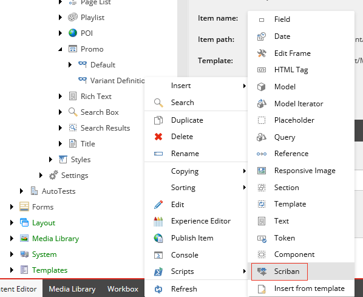

#####################################
Scriban のテンプレート
#####################################

Scriban テンプレートは SXA レンダリングバリアントに保存され、追加のレンダラーとして利用できます。たとえば、フィールド レンダラー、セクション、タグなどです。Scriban テンプレートは他のレンダラーと共存できますが、既存のレンダリングバリアントを置き換えるために使用することもできます。

Creative Exchange を使って Scriban テンプレートをエクスポートしたり、インポートしたりできます。これにより、フロントエンド開発者は、コンポーネントのマークアップと機能性について、より柔軟に対応することができます。Scriban テンプレートは、シンプルなトークンをレンダリングするものから、コンポーネントを完全に置き換えるものまで、さまざまなものがあります。たとえば、次のレンダリングバリアントは、Gallery コンポーネントのコンテンツをレンダリングします。

.. code-block:: 

    {{-
    if i_item.template_name == "Gallery Image"
        sc_editframe i_item 'Gallery Image' -}}
        <a class="field-image">
        <a title="{{ i_item.ImageTitle.raw }}" href="{{ i_item.Image.media_url }}">
        {{ i_item.Image }}
        </a>
        </a>{{
        sc_endeditframe
    end -}}

    {{-
    if i_item.template_name == "Gallery Video"
        sc_editframe i_item 'Gallery Video'
        if (i_item.VideoID.raw ) == "" &&(i_item.VideoThumbnail.raw) == "" -}}
        [Edit Gallery Video here]{{
        else -}}
        <a title="{{i_item.VideoTitle.raw }}" href="http://www.youtube.com/watch?v={{ i_item.VideoID.raw }}">
        </img>
        </a>{{
        end
        sc_endeditframe
    end }}

この例では、アイテムテンプレートに基づいて HTML コードの一部を条件付きでレンダリングする方法、レンダリングする C# モデルにアクセスする方法、アイテムのプロパティだけでなくそのプロパティを呼び出す方法を示しています。また、編集体験を向上させるために、コンポーネントの領域を Edit フレームでラップしています。

このセクションのトピックでは、Scriban テンプレート用の Sitecore 拡張機能について説明します。

.. toctree::
    :titlesonly:
    :maxdepth: 1

    the-embedded-items-and-objects-in-the-scriban-context
    the-embedded-functions-for-the-scriban-template
    item-and-field-extensions

.. note:: `Scriban GitHub リポジトリ <https://github.com/lunet-io/scriban>`_ には、`テンプレート言語 <https://github.com/lunet-io/scriban/blob/master/doc/language.md>`_  と `組み込み関数 <https://github.com/lunet-io/scriban/blob/master/doc/builtins.md>`_ に関する一般的なドキュメントがあります。

Master Sitecoreのビデオシリーズから、Scribanの使い方を実演した動画をご覧いただけます。

.. raw:: html

    <iframe width="560" height="315" src="https://www.youtube.com/embed/TcWXVrzhuTE" frameborder="0" allowfullscreen></iframe>

.. tip:: 英語版 https://doc.sitecore.com/developers/sxa/93/sitecore-experience-accelerator/en/scriban-templates.html

