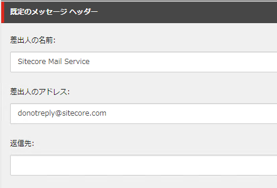
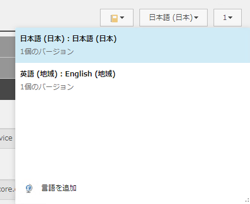

##########################################
Email Experience Manager の基本設定
##########################################

EXM で配信をする基本設定を、メールの作成前にしておきましょう。コンテンツエディターで、　`/sitecore/content/Email` のアイテムを選択してください。このアイテムが表示されていない場合は、一度 Email Experience Manager を立ち上げると、アイテムが作成されます。コンテンツタブを開くと、以下の項目を入力することができます。

===================== ========================== ==================================
フィールド名          設定値                     入力例 |
===================== ========================== ==================================
ベース URL            公開した際の URL           https://sample.com 
プレビュー ベース URL プレビュー用の URL         https://cms.sample.com 
エンコーディング      utf-8                      utf-8
購読の管理            配信停止などのページを指定 
差出人の名前          アドレスの名前             Sitecore Mail Service
差出人のアドレス      メールアドレス             donotreply@sitecore.com 
===================== ========================== ==================================

上記の項目に関しては、利用する言語（今回は英語と日本語）に関して設定をしてください。

今回はテスト用のため、既定のメッセージヘッダーだけでも設定をしておいてください。

