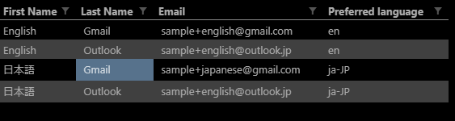
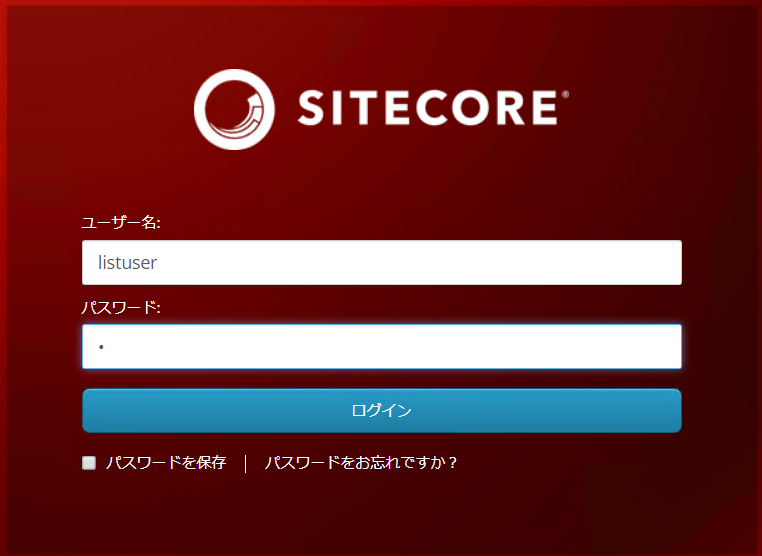
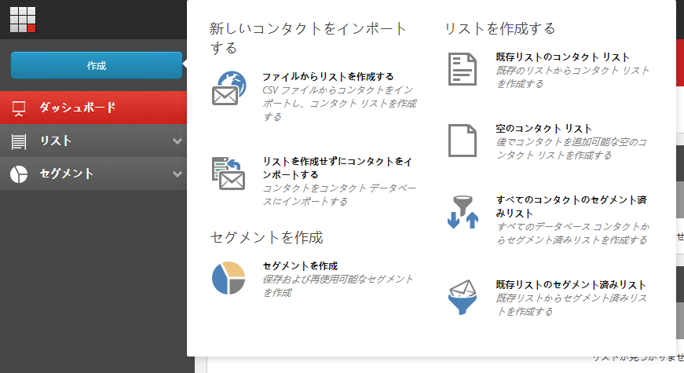
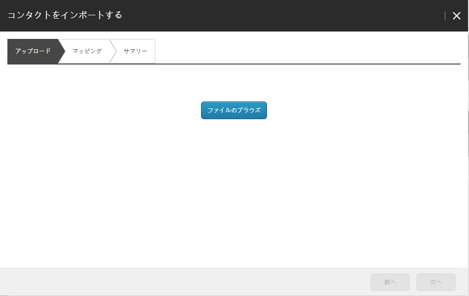
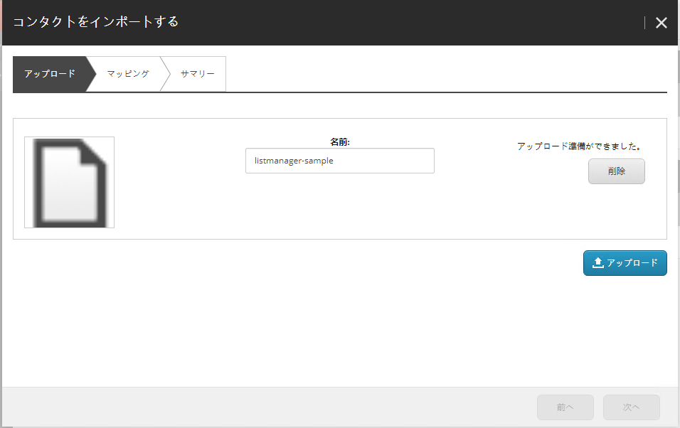
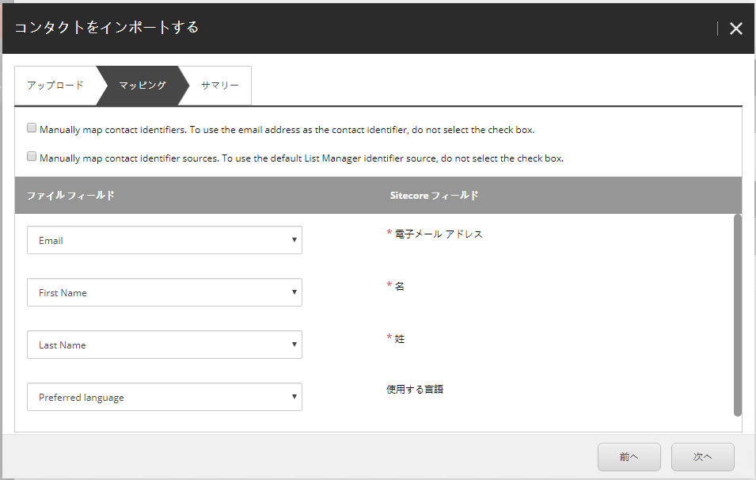
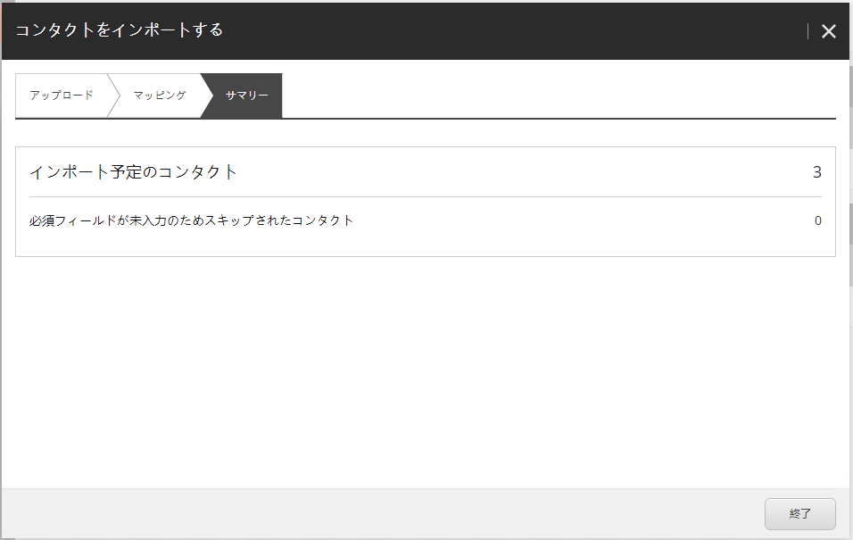
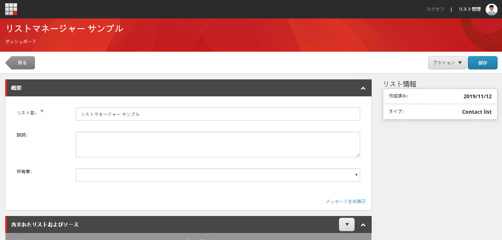

#########################
CSV ファイルのインポート
#########################

****************
データの準備
****************

準備が整いましたので、CSV ファイルのインポートを行います。CSV ファイルのサンプルは `listmanager-sample.csv <https://github.com/SitecoreJapan/Quickstart.Docs/tree/master/sample/listmanager>`_ としてダウンロード可能です。

今回は CSV ファイルは4つの項目をインポートします。

================== ================
項目名             役割
================== ================
First Name         名前の項目 
Last Name          姓の項目 
Email              メールアドレス 
Preferred language 言語
================== ================
 
今回のサンプルのデータはあくまでサンプルです。メールが届くアドレスに書き換えてください。

************************************************
リストマネージャーユーザーでログイン、起動
************************************************

既に作成しているユーザー（今回は listuser ）を利用してログインをします。

ログイン後、リストマネージャーを起動してください。

**************************
CSV ファイルのインポート
**************************

インポートをする際には、以下の手続きで進めていきます。まず、左上にある「作成」ボタンをクリックするとメニューが表示されます。左上にある「ファイルからリストを作成する」をクリックしてください。

ダイアログが表示されて、CSV ファイルをアップロードすることができる画面に切り替わります。

ファイルのブラウズをクリックして、アップロードをする CSV ファイルを指定してください。

ファイルの指定ができたことを確認して、「アップロード」のボタンをクリックしてください。

アップロードのボタンを押して完了すると、マッピングのダイアログに切り替わります。今回の CSV の項目と、Sitecore フィールドのマッピングをしてください。今回は以下のように設定をします。

マッピングが終わったあと、「次へ」のボタンをクリックするとインポートが完了となります。インポートしたリストに関して名前を付けます。ここでは「リストマネージャー サンプル」と設定をして、右上にある保存をクリックしてください。

これでインポートは完了となります。

インポートが完了したところで、ログオフをしてください。
