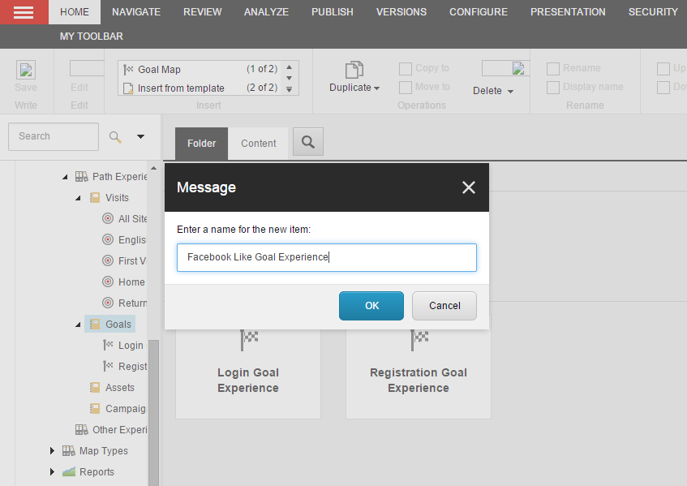
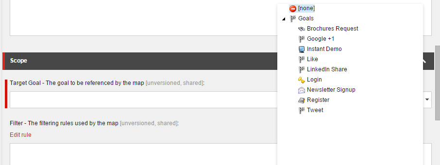
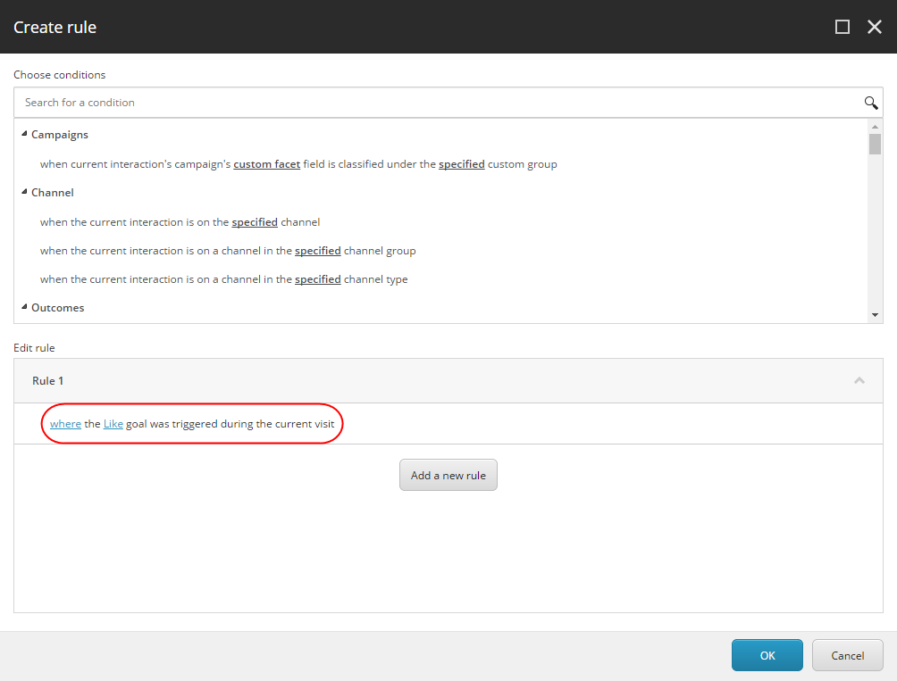

##################################################
新しい Path アナライザー マップを作成する
##################################################

Path アナライザーはコンタクトが Web サイト中を移動する時に通過した様々なパスを表示するアプリケーションです。コンタクトがゴールをコンバートしたり、キャンペーンとインタラクトした時に通過したパスを確認することができます。これによって、最も高いエンゲージメント バリューを生成するパスと、効果が低く最適化が必要なパスについて把握することができます。

コンタクトが特定のチャネルまたはキャンペーンに関連する訪問のみを含む Path や、特定のゴールやイベントにたどり着くまでに通過した Path を表示するように新しい Path アナライザー マップを作成することができます。また、Web サイトへの様々な種類の訪問をトラックするように Path アナライザーを設定できます。この情報は、コンタクトが Web サイトをどのように移動したのかを正確に把握する上で役立ちます。

また、最も高いエンゲージメント バリューを作成したPath や、最適化の候補となる Path についても把握することができます。最適化の推奨は、マーケティング ストラテジーやコンタクトに対するコンテンツの表示方法を改善する上で有用です。これによって、より有意義な方法でコンテンツを配信することが可能になります。

新しい Path アナライザー マップはマーケティング コントロール パネルで作成し設定します。

1. マーケティング管理パネルのコンテンツ ツリーで、 Path アナライザー ノードを展開します。
2. [マップ] ノードを展開して、[Path エクスペリエンス マップ] をクリックします。[Path Experience Maps] ノードを展開して、以下の 4 つのカテゴリーの中から 1 つを選択して新しい Path アナライザー マップを作成します。

============== ========================================================================================================================================================================
カテゴリー     コメント
============== ========================================================================================================================================================================
訪問数         訪問マップは、アセット、キャンペーン、ゴールなどに基づかない、初回訪問などの、サイト上でコンタクトが体験した様々なエクスペリエンスを表示するマップです。
ゴール         特定のゴールコンバージョンの訪問に関連するマップです。ユーザーは、選択されたゴールをコンバートしたインタラクションをマップ上で確認したい場合にこのマップを使用できます。
アセット       PDF または動画など、コンタクトが特定のデジタル アセットをダウンロードしたり、視聴するために通過した Path を表示するマップです。
キャンペーン   特定のキャンペーンから訪れたコンタクトの Path エクスペリエンスを表示するマップです。
============== ========================================================================================================================================================================

3. [ホーム] タブの [挿入] グループの中から作成するマップの種類を選択して、新しいPathマップを作成します。表示されるダイアログに、例えば [By Campaign] などの名前を付けて[OK]をクリックします。

4. [コンテンツ] タブの [スコープ] セクションの [ターゲットゴール/アセット/キャンペーン] フィールドをクリックします。ドロップダウンツリーが表示されます。このマップに関連付けたいアイテムを選択します。

5. [コンテンツ] タブの [スコープ] セクションで、マップの開始日と終了日を入力できます。

  * [開始] 配下にある [本日] をクリックして開始日を入力します。デフォルトでは現在の日付が設定されます。つまり、マップには現在の日付以降のすべての訪問が追加されます。別の日付を選択するには、ドロップダウンの矢印をクリックしてカレンダー ダイアログボックスを開き、カレンダーから日付を選択します。
  * マップの終了日を入力するには、[終了] 配下にある [本日] をクリックします。別の日付を選択するには、ドロップダウンの矢印をクリックしてカレンダー ダイアログボックスを開き、カレンダーから日付を選択します。

6. [コンテンツ] タブの [スコープ] セクション配下で、[ルールを編集する] をクリックして [ルール設定エディター] を開きます。[ルール設定エディター] ダイアログ ボックスで、このエクスペリエンス マップに関連付けたいルールを選択します。ルールのアクションと条件を設定し終わったら [OK] をクリックします。この例では、新しいマップに [Facebook Like] ゴールを関連付けます。

7. 新しいマップを配置するには、[レビュー] タブの [ワークフロー] グループの [配置] をクリックして保存します。

.. note::

    ワークフロー プロセスを使って新しいマップを配置します。新しいマップの配置が完了すると、xDB 内のシステム キューに入れられます。システムは新しいマップを 24 時間毎に処理するため、新しいマップが複数ある場合はワークボックスで配置アクションを使用して同時に配置させます。
    24 時間経過しても新しいマップが表示されない場合は、 Sitecore システム管理者にご連絡ください。

