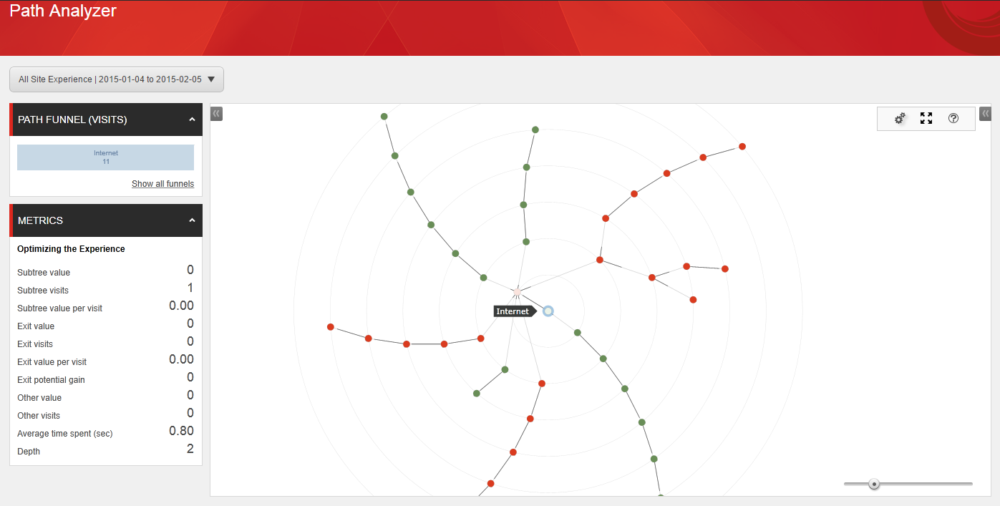
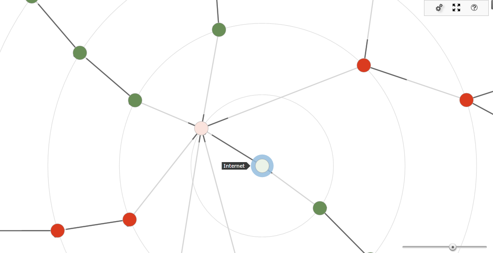
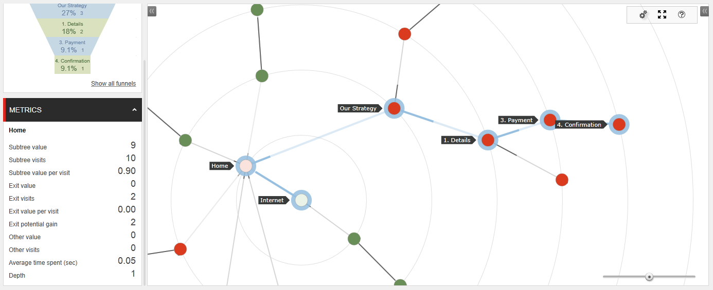

####################################
Path アナライザーマップ
####################################

Path アナライザーは、コンタクトが Web サイトを遷移する時に通過した様々な Path を表示できるアプリケーションです。コンタクトがゴールをコンバートしたり、キャンペーンとインタラクトした時に通過した Path を確認することができます。これにより、最も高いエンゲージメント バリューを提供する Path と、効果が低く最適化が必要なPath について理解することができます。
マップは、コンタクトが Web サイト中で使用した Path を視覚的に表現したものです。マップは次の 3 つの基本要素によって構成されます：

* ツリー
* Path
* ノード 

ツリーは、Path アナライザー マップの基本的なストラクチャーです。ツリーは、マップの中央ノードから放射線状に広がる多数の Path またはブランチによって構成されます。中央ノードはツリー ノードとも呼ばれます。
Path は、コンタクトが特定のチャネルまたはキャンペーンにたどり着くまでに訪問した一連のページ、もしくは特定のゴールまたはイベントをトリガーするまでに訪問した一連のページを表すノードのグループによって構成されます。Path が作成されるには、同じ一連のインタラクションを体験した 2 人以上のコンタクトが存在する必要があります。

****************************
Path について理解する
****************************

Path は、Web サイトがどの程度効果的に作用したかについての情報を提供します。この情報によって、最も高いエンゲージメント バリューを生成したコンテンツや、効果が低いコンテンツについて理解することができます。
このセクションでPath の長さとはノード間を結ぶ線の長さを表します。Path の長さはノードが受信したトラフィック量を表します。ノードとノードを結ぶ濃淡の濃い線の部分が長い程、特定のノードが受信するトラフィック量が大きいことを意味します。例えば、大量のトラフィックを受信したノードがある一方で、エンゲージメント バリューがそれ程作成されていない場合、より綿密な調査と最適化の適用対象候補になる可能性があります。

****************************
Path と効果
****************************

Path アナライザー マップを使って Web サイトの効果を測定することができます。マップ上では、マップに表示されているノードは特定のページに対する相対的なエンゲージメント バリューを意味します。ノードの色は、赤色から緑色で表示されます。Path に緑色が多く含まれる程、エンゲージメント バリューの作成という点からより効果が高いことを意味します。一方赤色のノードを含む Path は、そのページはエンゲージメント バリューが少なく最適化の対象となることを表します。
さらに、ノード サイズもまた Path の効果について理解する上で重要なカギとなります。ノード サイズは、ノードを通過したコンタクトが作成したエンゲージメント バリューが高い程大きくなります。

次の例では、赤色のノードを含んだ高トラフィックな Path を持つ Path アナライザー マップが表示されています。これは、Path が大量のコンタクトのトラフィックを受信した一方で、エンゲージメント バリュー レベルが低いことを意味します。特定ぺージ (例えば「社員の経歴」に関するページなど)を含むその他の Path は、使用頻度が高い Path よりもコンバージョン レートが高いことが分かります。
自社の Web サイトでは何が効果的に作用するのかを調査した上で訪問者を最も効果的な Path に誘導することによって、より高いエンゲージメント バリューを生成することができる可能性を高めることができます。こうすることで、より効果的な Web サイトとマーケティング ストラテジーを作成することができます。

.. image:: images/15e24554196192.png
   :align: center
   :width: 400px
   :alt: Path と効果

****************************
マップを分析する
****************************

各 Path アナライザー マップの左側には、アナリティクス情報の詳細が表示されます。Path アナライザー マップのメトリクス パネルを使用して、アナリティクスデータをフィルタリングし、様々な種類の Path アナライザー レポートを表示することができます。

メトリクス パネルには次のカテゴリーが含まれます： 

============================= ==============================================================================================================
アイテム                          説明
============================= ==============================================================================================================
サブ ツリー バリュー          この Path を訪問したコンタクトによって累積されたエンゲージメント バリュー ポイントの合計。
サブ ツリーの訪問             この Path の訪問数。
訪問毎のサブ ツリー バリュー  この Path の訪問毎のエンゲージメント バリュー ポイントの平均。
終値                          このPathのこのノードで離脱するまでにコンタクトが累積したエンゲージメント バリュー ポイントの合計。
訪問の終了                    このPathのこのノードで Web サイトを離脱したコンタクトの訪問数。
訪問毎の終了値                このPathのこのノードで Web サイトを離脱したコンタクトの訪問毎のエンゲージメント バリュー ポイントの平均。
ポテンシャルの獲得の終了      最適化によって このPath が増加可能なエンゲージメント バリュー。
平均所要時間 (秒)             コンタクトがこのノード上に滞在する平均時間。
深度                          このノードがサブツリーまたは Path のどの場所に表示されるのかを示す数値。
============================= ==============================================================================================================

Path の中からノードを選択しなかった場合、メトリクス パネルには Internet ルート ノードに関する情報が表示されます。新しいノードを選択するには、ホバーするかまたはクリックします。これによって、[サブツリーの訪問] や [サブ ツリー バリュー] などのアナリティクス情報がノードとノードを導くPath の両方に表示されます。

 

 