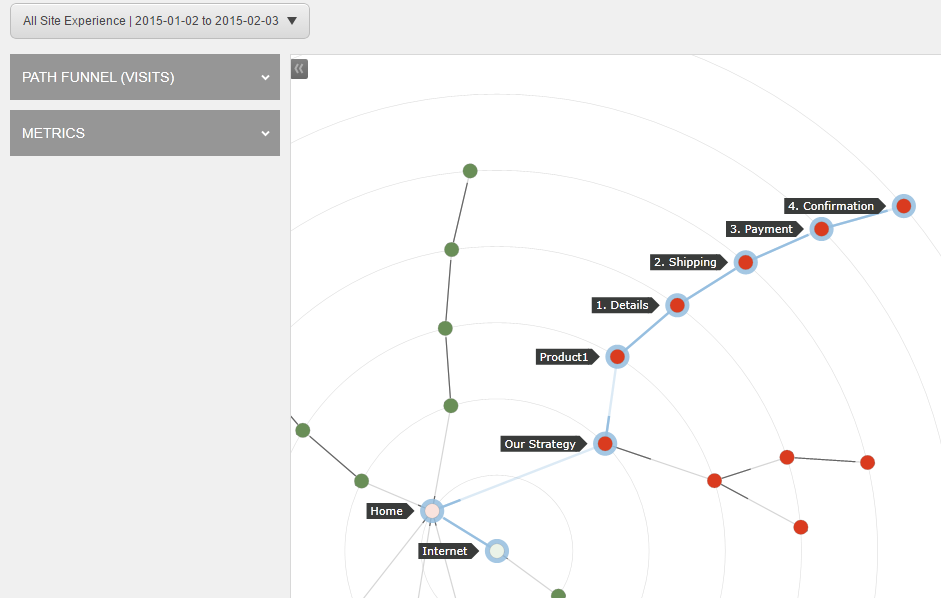
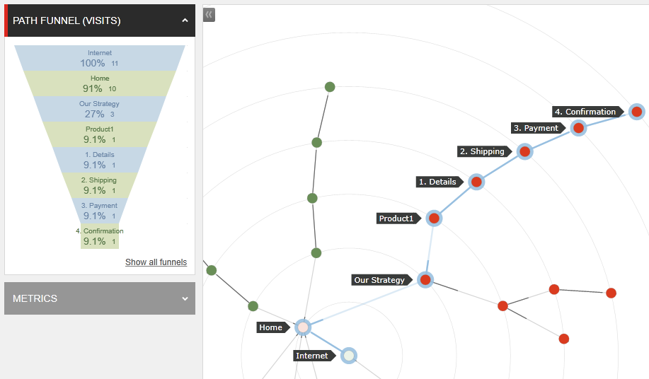
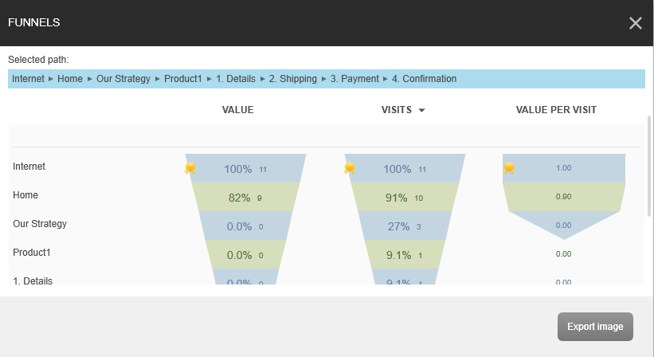

####################################
Path フィルターを表示する
####################################

Path アナライザーは、コンタクトが Web サイトを遷移する時に通過した様々な Path を表示するアプリケーションです。コンタクトがゴールをコンバートしたり、キャンペーンとインタラクトした時に通過した Path を確認することができます。これによって、コンバージョンごとに最も高いエンゲージメント バリューを生成する Path と、効果が低く最適化の候補となる Path について理解することができます。

Path フィルターは、 Path を使用したコンタクトの数と、コンタクトが終了した特定のノードを表示します。Path フィルターからフィルター レポートにアクセスすることができます。フィルター レポートは、この Path 上の訪問、訪問毎のバリュー、そしてすべてのコンタクト エクスペリエンスの訪問毎のバリューを表示します。

Path フィルターとフィルター レポートは、コンタクトが Web サイトを離脱した場所に関する有用な情報を提供するため、Web サイトのどこで潜在的にコンバージョンが失われていて、どのコンテンツ ストラテジーを最適化できるかを分析することができます。

Path フィルターを表示するには、次の手順に従います：

1. Sitecore Launchad から、Path アナライザーを開きます。
2. ドロップ ダウン メニューからサイト マップを選択します。
3. マップで、フィルターに表示したい Path の終了ノードをクリックします。

4. [Path フィルター (訪問)] レポートを展開してそのパスのフィルターを表示します。

5. [フィルターをすべて表示] をクリックして、そのフィルターの [フィルター] レポートを表示します。フィルター レポートには、この Path でのすべてのエクスペリエンスの [バリュー] 、[訪問数] 、[訪問毎のバリュー] が表示されます。また、このエクスペリエンス フィルターからコンタクトがどこでこのパスから離れたのかも確認できます。Path フィルターをローカルに保存するには、[エクスポート イメージ] をクリックします。

