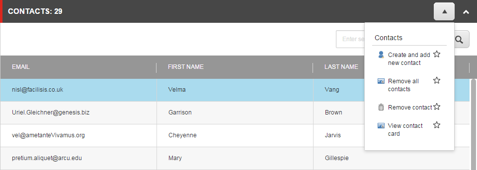
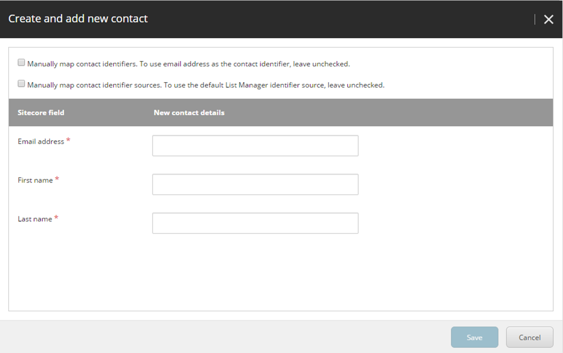

###################################################################
連絡先をリストに追加する
###################################################################

既存のリストに既存の連絡先または新規の連絡先を追加することができます。

連絡先をリストに追加するには、以下の手順に従います。

1. リストを開き、[連絡先]セクションで、ドロップダウン矢印 |icon1| をクリックして、[作成して新しい連絡先を追加]をクリックします。

2. 新しい連絡先の作成と追加ダイアログボックスで、新しい連絡先の関連する連絡先情報を入力します。既存の連絡先をリストに追加するには、連絡先の識別子と、関連する場合は既存の連絡先の識別子のソースを入力します。

    * 連絡先の識別子として電子メールアドレスを使用したくない場合は、[手動で連絡先の識別子をマップする] チェックボックスを選択し、表示される識別子で、連絡先の一意の識別子として使用するインポートファイルのフィールドを選択します。
    * 連絡先の識別子ソースとしてリストマネージャーを使用しない場合は、[手動で連絡先の識別子ソースをマップする] チェックボックスを選択し、表示される識別子ソースで、連絡先の識別子ソースとして使用するインポートファイルのフィールドを選択します。

.. note:: 既存の連絡先についてダイアログボックスに入力した情報は、すでに存在する連絡先の詳細を上書きします。これは、フィールドを空のままにした場合にも適用されます。

3. [保存] をクリックします。リストが再インデックス化されるまで、リストはロックされます。

.. tip:: 英語版 https://doc.sitecore.com/users/93/sitecore-experience-platform/en/add-a-contact-to-a-list.html