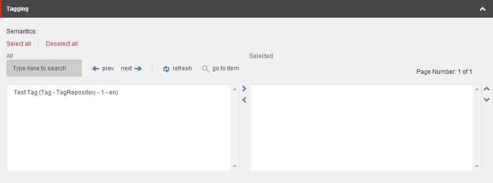
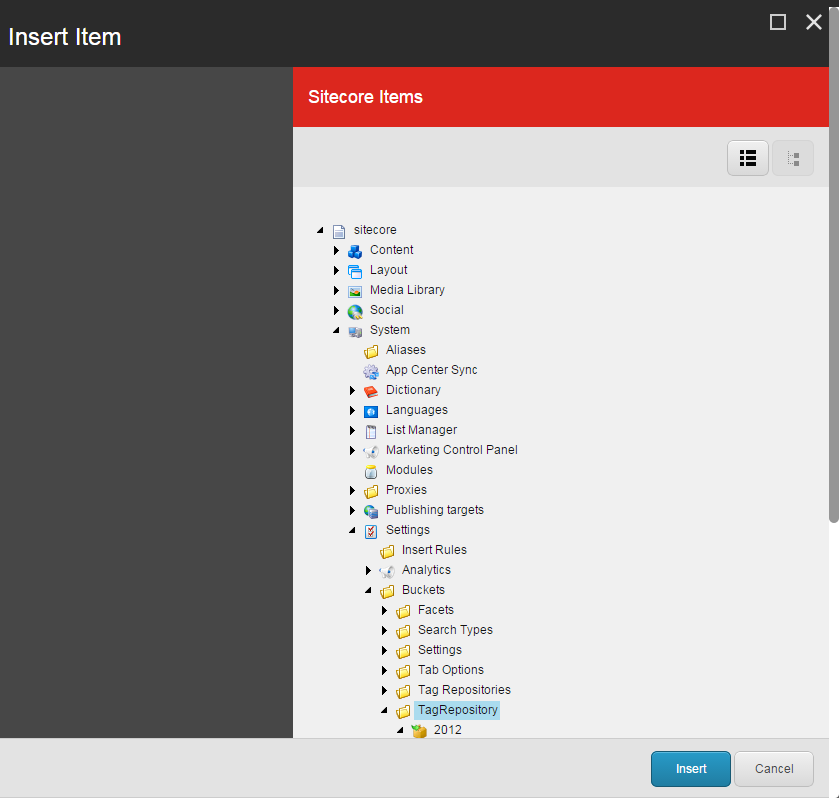

########################
アイテムにタグを追加する
########################

アイテムにタグを付けることは、アイテムを分類し、同じタグを持つアイテムを簡単に検索して見つけるのに最適な方法です。特に、アイテムバケツの中に何百万ものアイテムがある場合は、タグを使用することでアイテムを素早く見つけることができます。

.. note:: 特定のタグが付いたアイテムを検索するには、Sitecoreの検索機能にある検索フィルター ( :doc:`filter-the-search-results` )「Search by Tag」を使用することができます。

***********************************************
コンテンツエディタで単一の項目にタグを追加する
***********************************************

アイテムにタグを追加するには

1. コンテンツ エディタのコンテンツ ツリーで、タグを追加するアイテムに移動します。

2. コンテンツ エリアの [コンテンツ] タブで、[タグ付け] セクションを見つけて展開します。

.. note:: タグ付けセクションが表示されていない場合は、[表示] タブをクリックし、[表示] グループで [標準フィールド] チェックボックスを選択します。

3. [タグ付け] セクションでは、左側の利用可能なすべてのタグのリストで、検索フィールドで特定のタグを検索するか、手動でタグを選択することができます。複数のタグを選択するには、SHIFT または CTRL を使用できます。

.. note:: Sitecore管理者は、利用可能なタグを指定します。

4. アイテムに関連するタグを選択したら、右矢印 |icon1| をクリックして、選択したタグのリストに移動します。

.. |icon1| image:: images/15eafd355cedaa.png

5. 選択済みリストからタグを削除するには、左矢印 |icon2| をクリックするか、タグをダブルクリックして1つのフィールドから別のフィールドに移動します。

6. 変更を保存します。

*****************************************
検索操作で複数の項目にタグを追加する
*****************************************

検索操作を使って複数の項目に同時にタグを追加するには

1. コンテンツエディタまたはエクスペリエンスエディタで、タグを追加する項目の検索を作成します。

2. 検索結果に関連するすべての項目が表示されたら、検索フィールドの左にあるドロップダウン矢印 |icon3|  をクリックします。

3. ドロップダウンメニューで、[検索操作] をクリックし、[タグの追加] をクリックします。
 
4. Sitecore アイテムの挿入］ダイアログボックスのコンテンツツリーで、すべての検索結果に追加するタグに移動するか、［リストビュー |icon4| ］をクリックしてタグを検索します。

5. 検索に表示されているすべての項目にタグを追加するには、[挿入] をクリックします。

.. tip:: 英語版 https://doc.sitecore.com/users/93/sitecore-experience-platform/en/add-a-tag-to-an-item.html

