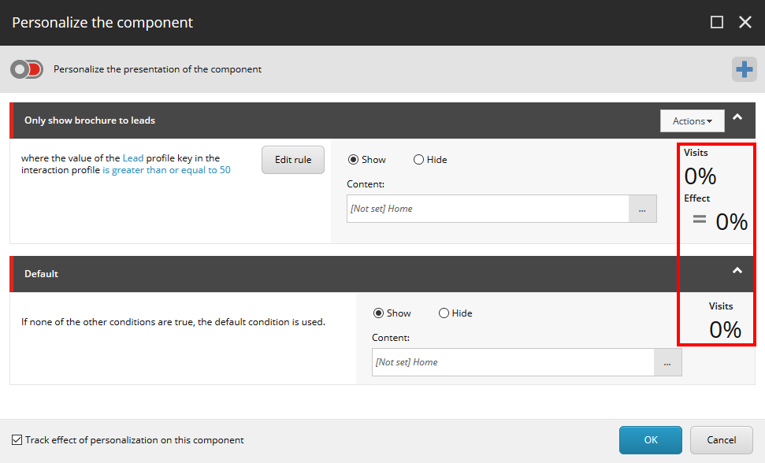

##############################################################
パーソナライゼーションがコンポーネントに与える影響の分析
##############################################################

コンポーネントの個人設定ダイアログボックスでは、コンポーネントの各バージョンの訪問と効果を表示することができます。

* 訪問数は、コンポーネントを含むすべての訪問のうち、条件を満たした訪問の割合を示します。ルールがアクティブなテストにある場合は、テストの期間に応じて計算されます。ルールがアクティブなテストに含まれていない場合は、過去 30 日間分が計算されます。

.. note:: ルールがアクティブなテストにある場合、条件を満たす訪問者の半分だけがパーソナライズされたコンポーネントを表示します。残りの半分はデフォルトバージョンのコンポーネントを見ます。パーソナライズ ルールが効果追跡を有効にして実装されている場合、条件を満たす訪問者の5%がデフォルト バージョンに割り当てられます。

* 効果は、条件を満たした訪問者のパーソナライズされたエクスペリエンスの 1 訪問あたりの追跡値 (TVV) とデフォルトのエクスペリエンスの TVV との間のパーセントの差として計算されます。
  デフォルトのバリアントの効果は常に0であるため、デフォルトのバリアントでは効果フィールドは表示されません。

現在のページのすべてのパーソナライズされたコンポーネントの統計情報は、 :doc:`パーソナライズされた体験ダイアログボックス <the-personalized-experience-dialog-box>` で見ることができます。

.. tip:: 英語版 https://doc.sitecore.com/users/93/sitecore-experience-platform/en/analyzing-the-effect-of-personalization-on-a-component.html
