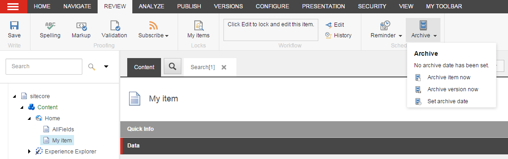
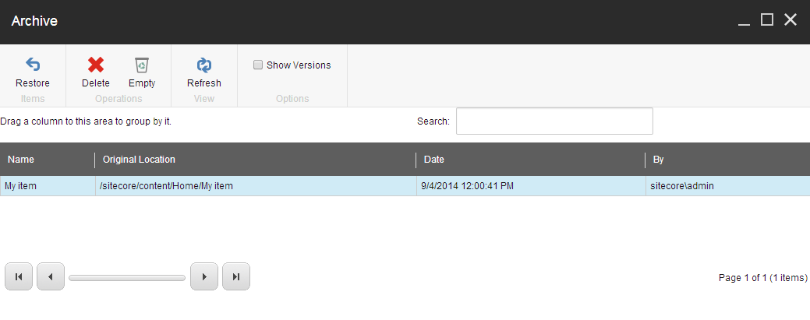

##################################
アーカイブしてアイテムを復元する
##################################

ウェブサイトに表示したくないアイテムは、コンテンツ エディターでアーカイブすることができます。アイテムをアーカイブすると、削除されるのではなく、コンテンツ ツリーの外に保存されます。アーカイブされたアイテムはいつでも復元できます。

******************************
アイテムをすぐにアーカイブする
******************************

アイテムをアーカイブするには

1. コンテンツ エディタのコンテンツ ツリーで、アーカイブするアイテムに移動します。

  * アイテムのバージョンをアーカイブする場合は、[バージョン] ボタンをクリックして、関連するバージョンを選択します。
  * 特定の言語でアイテムをアーカイブする場合は、[言語] ボタンをクリックして、該当する言語を選択します。

2. アイテムをすぐにアーカイブするには、[レビュー] タブの [スケジュール] グループで [アーカイブ] をクリックします。

  * すべてのサブアイテムを含むすべてのバージョンと言語でアイテムをアーカイブするには、[今すぐアーカイブする] をクリックします。
  * アイテムの現在のバージョンと言語をアーカイブするには、[バージョンを今すぐアーカイブ] をクリックします。

3. OKをクリックします。

.. note:: アイテムをアーカイブすると、コンテンツツリーからは削除されますが、リパブリッシュするまでは公開されたウェブサイト上に残ります。そのため、変更した内容を自分のウェブサイトに複製するには、ウェブサイトをリパブリッシュする必要があります。

********************
リンク切れを扱う
********************

アーカイブするアイテムへのリンクがある場合は、リンクの解除ダイアログボックスが開きます。

.. image:: images/15eafd3548ee85.png
   :align: center
   :width: 400px
   :alt: リンク切れを扱う

すべてのリンクに適用するオプションを選択することができます。必要であれば、リンクを個別に処理してから、残りのリンクに1つのオプションを適用することができます。

ブレーキング リンクを処理するには

1. リンク切れのリストを開くには、リンク切れダイアログ ボックスで [リンクの編集] をクリックします。

2. 各リンクに対して、以下の操作を行うことができます。

  * リンクを含むアイテムを編集します。
  * リンクの削除
  * 他のアイテムへのリンク

.. note:: リンクを個別に処理しない場合は、まとめて処理するためにリストに残っています。

3. [他のアイテムへのリンク] を選択した場合、コンテンツ ツリーで、代わりにリンクするアイテムをクリックします。リンクを更新するには、[OK] をクリックします。

4. [リンクの編集] ダイアログ ボックスで、[閉じる] をクリックします。

5. [リンクの破棄] ダイアログ ボックスで、以下のオプションのいずれかを選択して、残っているリンクに適用します。

   * リンクを削除 - このページに存在するすべてのリンクを削除します。
   * 別のアイテムへのリンク - このページへのすべてのリンクを別のアイテムへのリンクに変更します。
   * リンクを残す - このページに壊れたリンクを残します。後日、アイテムを復元した場合、リンクは復元されます。

6. 続行をクリックしてください。

********************************
後日、アイテムをアーカイブする
********************************

アイテムのアーカイブを別の日にスケジュールするには、次の手順に従います。

1. コンテンツ エディタのコンテンツ ツリーで、アーカイブするアイテムに移動します。

  * アイテムのバージョンをアーカイブする場合は、[バージョン] ボタンをクリックして、関連するバージョンを選択します。
  * 特定の言語でアイテムをアーカイブする場合は、[言語] ボタンをクリックして、該当する言語を選択します。

2. [レビュー] タブの [スケジュール] グループで [アーカイブ] をクリックし、[アーカイブの日付を設定] をクリックします。

3. アーカイブの日付の設定 ダイアログ ボックスで、アイテムをアーカイブする日時を指定します。

  * アーカイブ アイテム セクションでは、すべてのバージョンとサブアイテムを含むアイテムをアーカイブする日時を指定します。
  * アーカイブのバージョン セクションでは、現在のアイテムの特定のバージョンをアーカイブする場合に指定します。

.. image:: images/15eafd3563af1a.png
   :align: center
   :width: 400px
   :alt: 後日、アイテムをアーカイブする

日時を指定するときは、覚えておきましょう。

  * 日付のみを指定した場合、アイテムはその日の真夜中の 12:00 にアーカイブされます。

  * 時間のみを指定した場合、アイテムは現在の日付のその時間にアーカイブされます。

  * 過去の日付または時間を指定した場合、そのアイテムは、次に Sitecore がアーカイブするアイテムをチェックしたときにアーカイブされます。

4. OKをクリックして変更を保存します。

5. 変更を有効にするには、ウェブサイトをリパブリッシュします。

アーカイブの日付が過ぎると、そのアイテムはマスターデータベースとウェブデータベースにアーカイブされ、コンテンツツリーから削除されます。

.. note:: インデックスからアイテムを削除するには、アイテムがアーカイブされた後、再度ウェブサイトをリパブリッシュする必要があります。

*************************************
アーカイブされたアイテムを復元する
*************************************

アーカイブからアイテムを復元することができます。復元できるのは、自分でアーカイブしたアイテムか、管理者権限を持っている場合のみです。

アーカイブからコンテンツアイテムを復元するには、以下の手順に従います。

1. Sitecore デスクトップで、[Sitecore Start]をクリックし、[Sitecore Start]アイコン |icon1| 、[All Applications]をクリックし、[Archive]をクリックします。

2. アーカイブダイアログボックスで、復元したいアイテムを選択します。

  * サブアイテムを含むアイテムのすべてのバージョンと言語をリストアするには、リストからアイテムを選択します。一度に復元できるのは、1 つのアイテムのみです。

.. tip:: 英語版 https://doc.sitecore.com/users/93/sitecore-experience-platform/en/archive-and-restore-an-item.html
