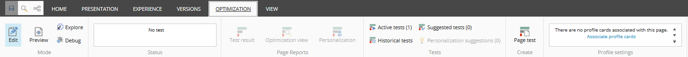
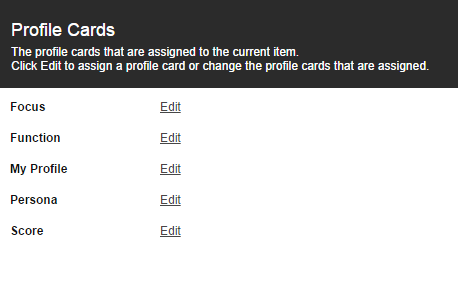
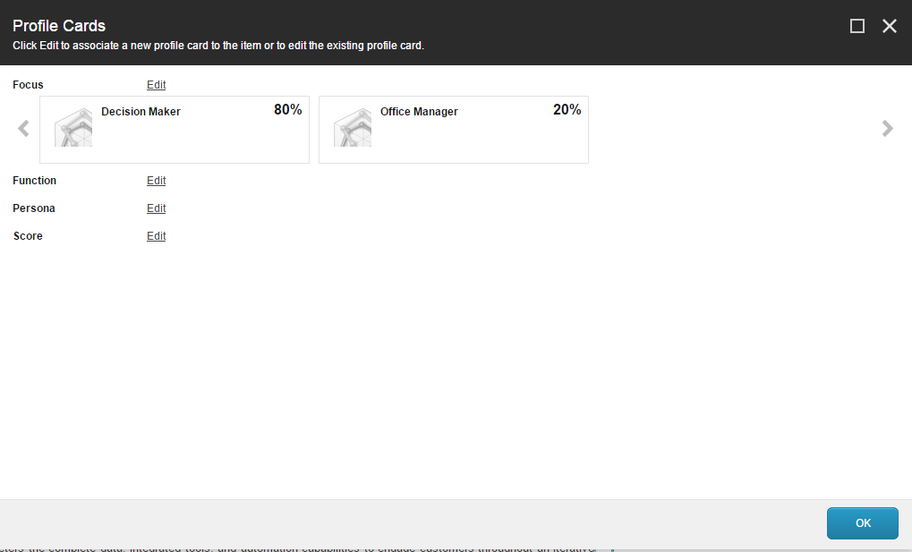
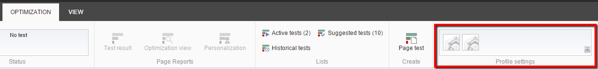

###############################################################################
プロファイル カードをエクスペリエンス エディタのアイテムに関連付ける
###############################################################################

プロファイル カードは、コンテンツに適用するプロファイル キーと値の組み合わせを保存します。プロファイル カードを使用して、Web サイト全体のアイテムに標準化されたプロファイル値を割り当てることができます。

プロファイル カードをアイテムに割り当てるには、エクスペリエンス エディタを使用します。

プロファイル カードをアイテムに割り当てるには

エクスペリエンス エディタで、プロファイル カードを関連付けるページに移動します。

1. [最適化] グループの [ページ プロファイル設定] タブで、[プロファイル カードの関連付け] をクリックします。プロファイル カード ダイアログ ボックスが表示されます。

2. [プロファイルカード］ダイアログボックスで、興味のあるプロファイルを選択し、［編集］をクリックします。プロファイル カードの選択 ダイアログ ボックスが表示されます。

   プロファイル カードの選択 ダイアログ ボックスは、プロファイル カードを作成したときに [オーサリングの選択] フィールドで選択したオプションによって異なります。これは、コンテンツ タブの [データ]、[オーサリング選択] の下にあります。

   [オーサリングの選択］フィールドのオプションは次のとおりです。

    * 単一 - 1つの項目につき1枚のプロファイル・カードのみを割り当てることができます。このオプションを選択すると、[プロフィール カードの選択] ダイアログ ボックスは次のようになります。

    .. image:: images/15ed64a21e41d5.png
        :align: center
        :width: 400px
        :alt: プロファイル カードをエクスペリエンス エディタのアイテムに関連付ける

    * 複数 - アイテムごとに複数のプロファイルカードを割り当てることができます。このオプションを選択すると、プロファイルカードの選択ダイアログボックスは以下のようになります。

    .. image:: images/15ed64a21e8f4c.png
        :align: center
        :width: 400px
        :alt: プロファイル カードをエクスペリエンス エディタのアイテムに関連付ける

    * 複数のプロファイル カードとパーセンテージ - 各コンテンツ アイテムに複数のプロファイル カードを割り当て、各プロファイル カードにパーセンテージを割り当てることができます。このオプションを選択すると、プロファイルカードの選択ダイアログボックスは次のようになります。

    .. image:: images/15ed64a21ed119.png
        :align: center
        :width: 400px
        :alt: プロファイル カードをエクスペリエンス エディタのアイテムに関連付ける

3. [プロファイル カードの選択] ダイアログ ボックスの [プロファイル カード] フィールドで、このコンテンツ アイテムに関連付けるプロファイル カードを選択します。このカードに与えたプロファイル値が、現在のコンテンツ アイテムに割り当てられます。

    * 複数選択オプションを選択した場合は、このコンテンツ アイテムに割り当てるプロファイル カードをすべて選択します。選択が終わったら、[追加] をクリックします。
    * 複数選択とパーセント表示オプションを選択した場合は、各プロファイル カードのドロップダウン ボックスで、各プロファイル カードに割り当てる重要度/関連性の割合を選択します。
    * 選択したパーセンテージの合計は 100% である必要があります。

    .. image:: images/15ed64a21f1961.png
        :align: center
        :width: 400px
        :alt: プロファイル カードをエクスペリエンス エディタのアイテムに関連付ける

4. アイテムにプロファイルカードを割り当てたら、[OK]をクリックします。プロファイルカードダイアログボックスには、変更した内容が反映されます。

5. ページに関連付けられたプロファイル カードを表示するには、エクスペリエンス エディタの [最適化] タブの [プロファイル設定] グループで、プロファイル カード アイコンの上にマウスを移動します。各プロファイルカードの名前が記載されたツールチップが表示されます。

6. OKをクリックして保存します。

.. tip:: https://doc.sitecore.com/users/93/sitecore-experience-platform/en/associate-a-profile-card-with-an-item-in-the-experience-editor.html
