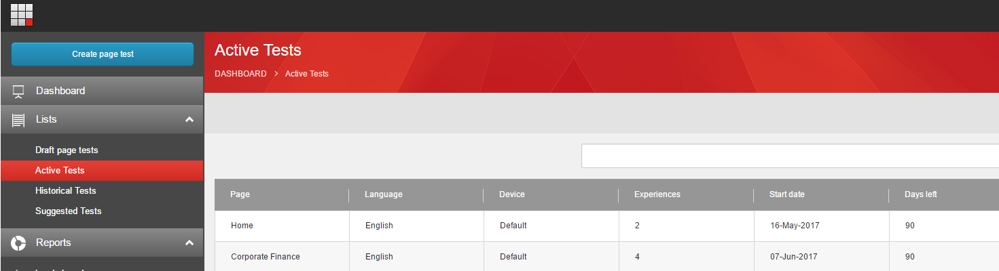
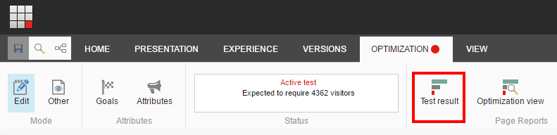
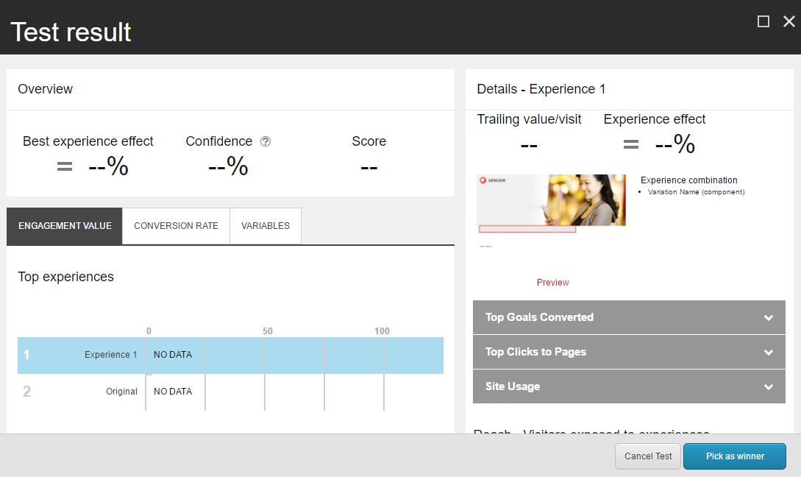

######################################################
アクティブなテストをキャンセル
######################################################

コンテンツテストは通常、勝者が選ばれるのに十分なデータが収集された後、自動的に停止します。しかし、アクティブなコンテンツテストを手動でキャンセルしたい場合もあるでしょう。例えば、Sitecore ソリューションをアップグレードする前に、アクティブなコンテンツテストをすべてキャンセルする必要があります。

アクティブなテストを停止するには

1. Experience Optimization アプリケーションで、Active Tests リストを開きます。

2. リストで、キャンセルするテストをクリックします。エクスペリエンス エディタが開きます。
3. [最適化] タブの [ページ レポート] グループで [テスト結果] をクリックします。

4. テスト結果ダイアログボックスで、元の体験を使用するには、[テストのキャンセル] をクリックします。別の体験を使用するには、[トップ体験] リストで体験を選択し、[勝者として選ぶ] をクリックします。

5. エクスペリエンス最適化アプリケーションに戻り、ステップ1～4を繰り返して、必要な数だけテストをキャンセルします。

.. tip:: 英語版 https://doc.sitecore.com/users/93/sitecore-experience-platform/en/cancel-active-tests.html
