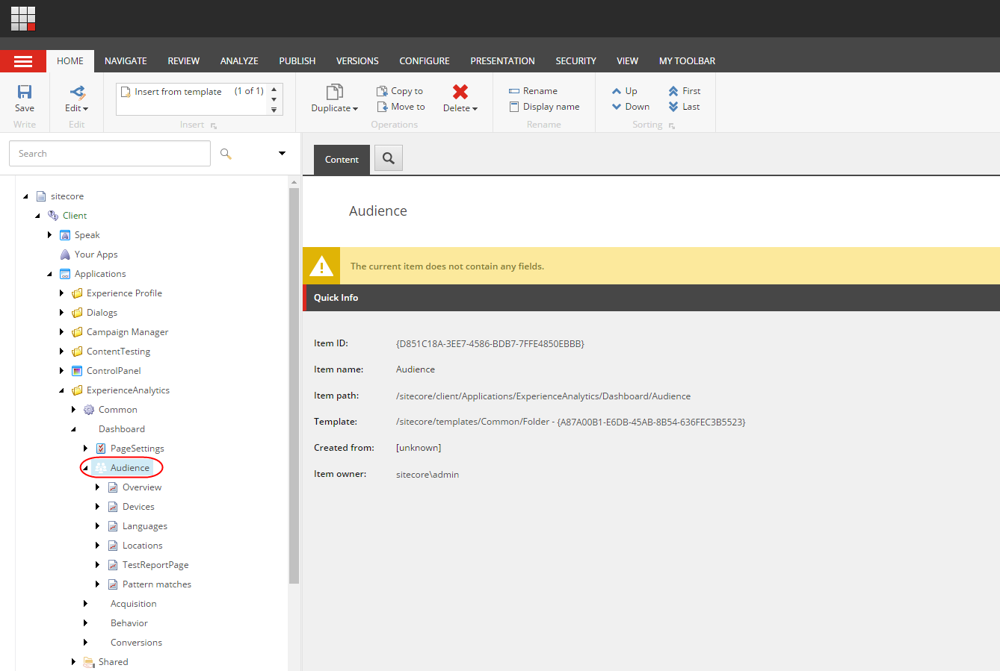
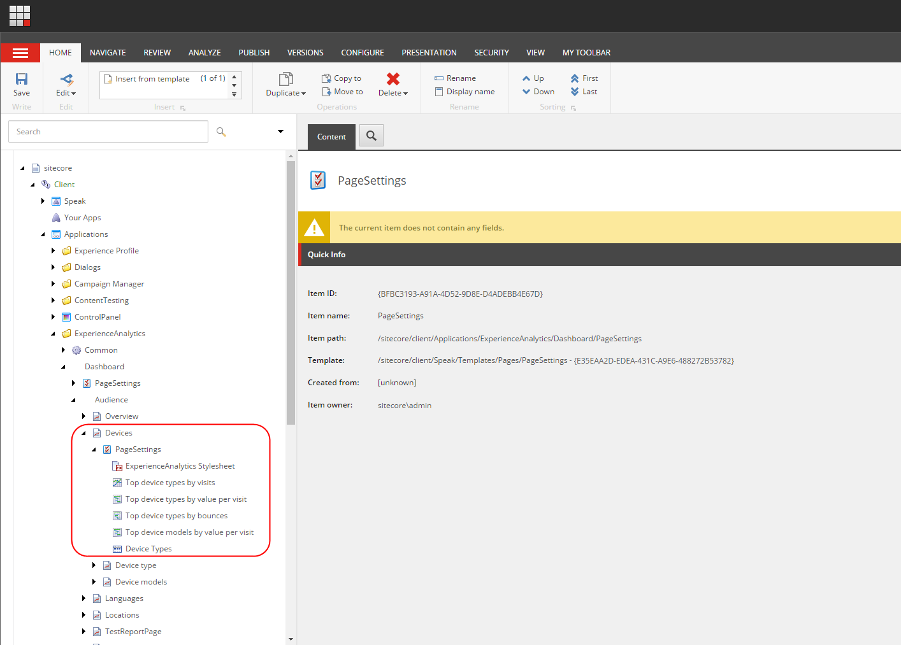

#########################################
既存の分析レポートのメトリクスを変更する
#########################################

エクスペリエンス アナリティクスでは、開発者はカスタムメトリクスを使って、カスタムアナリティクスレポートをゼロから作成することができます。ただし、既存のレポートでは、デフォルトのメトリクスが自分に合わない場合は変更することもできます。

Sitecoreでは、ディメンションと組み合わせてメトリクスを使用してレポートを作成します。メトリクスとは、ディメンジョンに対して追跡される特性の値、測定値、またはカウントのことです。メトリクスは、コンバージョンやバウンドなどの共通の基準に基づいて、レポートをさらに分解することができます。

ディメンションは、インタラクションやトリガーされたキャンペーンなど、レポートで使用されるデータをグループ化します。エクスペリエンス アナリティクスには、いくつかのデフォルトのメトリクスとディメンションが用意されています。

.. important:: エクスペリエンス アナリティクスに付属している標準レポートを変更またはカスタマイズしたい場合は、既存のレポートをコピーしてカスタマイズした後、名前を変更するのが最善の方法です。これは、Sitecoreの将来のバージョンで標準レポートが変更される可能性があるためです。

既存のレポートのメトリクスを変更するには

1. Core データベースのコンテンツ エディタで、ダッシュボードアイテム（/sitecore/Client/Applications/ExperienceAnalytics/Dashboard）に移動して展開し、カスタマイズしたいレポートがあるサブアイテムを展開します。例えば、「Audience」タブで

2. レポートが配置されているサブアイテムを展開し、その PageSettings アイテムを展開します。例えば、「デバイス」、「ページ設定」。

3. カスタマイズしたいレポートをクリックします。たとえば、訪問者別のトップデバイスの種類などです。

4. 右側のペインの [データ] セクションの [メトリック] フィールドで、ドロップダウン矢印をクリックして、レポートに表示するメトリックを選択します。たとえば、「訪問ごとの値」などです。

5. [保存] をクリックして変更を保存します。

.. note:: このような場合には、「Element Import Import」という名前を使用して、「Element Import」を選択してください。

.. tip:: 英語版 https://doc.sitecore.com/users/93/sitecore-experience-platform/en/change-the-metrics-in-an-existing-analytics-report.html