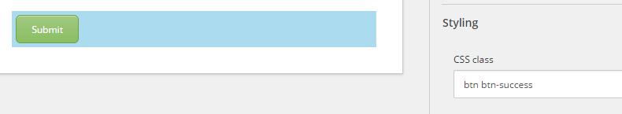
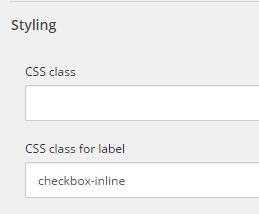

################################
フォームのスタイルを変更する
################################

例えば、会社のブランディングの色やフォントを使用するなど、フォームにスタイルを追加することができます。

テキストに追加できるHTMLスタイルの他に、すべてのフォーム要素にCSSスタイルを設定することもできます。フィールドとラベルの両方に CSS クラスを定義することができます。

フォームのスタイルを変更するには

1. スタイルを設定するフォーム フィールドをクリックします。
2. [フォーム要素] ウィンドウの [スタイル設定] セクションの [CSS クラス] フィールドに、フィールドのクラスを入力します。

   例えば、送信ボタンに色を付けるには、.btn-success クラスを使用します。

3. ラベルフィールドのCSSクラスには、ラベルのクラスを入力します。

   例えば、チェックリストのボタンをインデントするには、.checkbox-inlineクラスを使用します。

.. note:: Web サイトに公開する前に、フォームをプレビューすることをお勧めします。フォームアプリケーションでのフォームの表示方法は、ウェブページ上のフォームの実際のスタイリングを反映していない場合があります。

.. tip:: https://doc.sitecore.com/users/93/sitecore-experience-platform/en/change-the-styling-of-a-form.html

