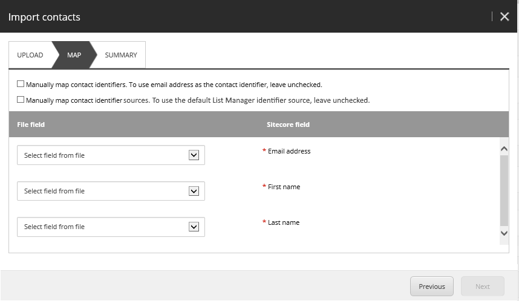
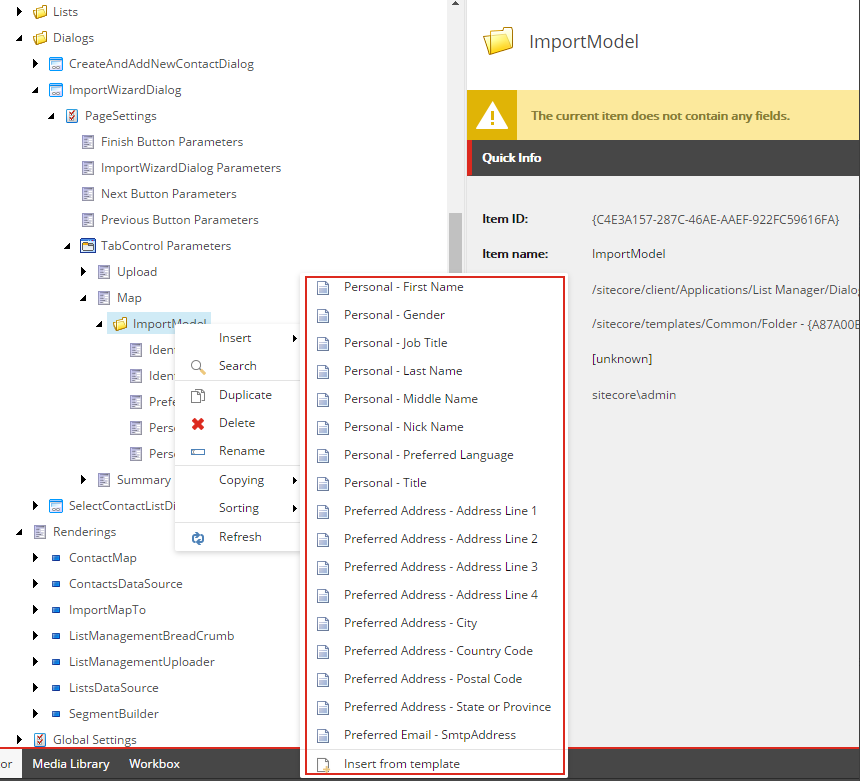
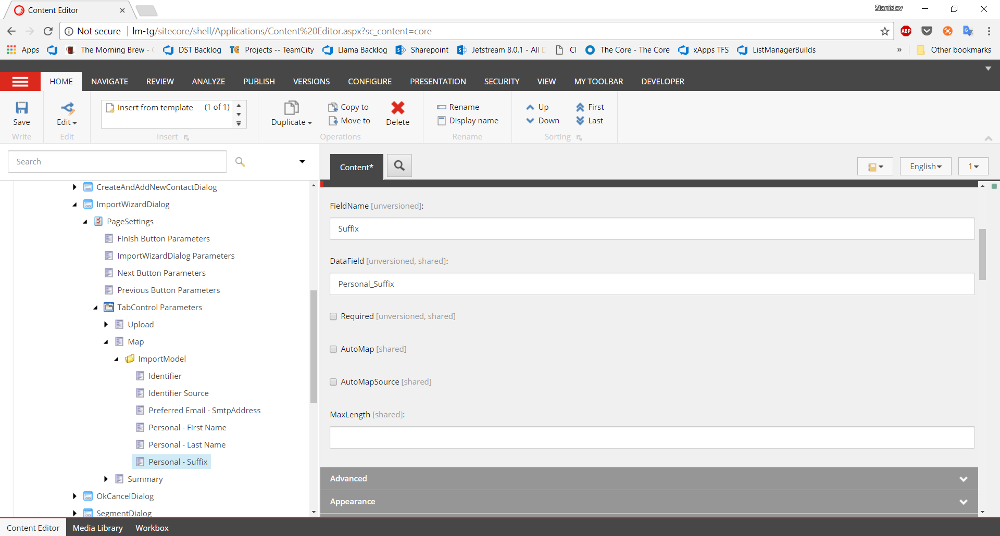

################################################################################################
連絡先のインポートウィザードにカスタムコンタクトファセットを含めるように設定します
################################################################################################

リストマネージャーでは、CSVファイルから連絡先をインポートする際に、インポートしたファイルのフィールドを以下のデフォルトのSitecoreフィールドにマッピングすることができます。

* 識別子
* 識別子のソース
* メールアドレス
* ファーストネーム
* 苗字

インポートしたファイルフィールドをマッピングするために、追加のSitecoreフィールドが必要な場合は、連絡先のイン ポートウィザードを拡張して追加することができます。

* 定義済みコンタクトファセット - 連絡先のインポートウィザードに追加できる定義済みコンタクトファセットは以下の通りです。

    * 個人情報
    * 電子メールアドレスリスト
    * アドレスリスト
    * 電話番号リスト
    * 同意情報
    * リストサブスクリプション
    * オートメーションプラン終了
    * オートメーションプラン登録キャッシュ
    * アバター

* 新しいカスタム連絡先ファセット - カスタムファセットを作成し、モデル構成を更新して連絡先のインポートウィザードに含めることができます。

***********************************************************
定義済みのファセットをマッピングフィールドとして追加する
***********************************************************

リスト マネージャには、定義済みの連絡先マッピング フィールドのリストがあります。連絡先のインポート ウィザードを拡張するには、コア データベースでブランチを使用して、利用可能なマッピング フィールドの 1 つを追加します。

定義済みのマッピング フィールドを追加するには

1. Core データベースのコンテンツ エディタで、/sitecore/client/Applications/List Manager/Dialogs/ImportWizardDialog/PageSettings/TabControl Parameters/Map/ImportModel フォルダに移動します。

2. ImportModelフォルダを右クリックし、[挿入]をクリックしてから、事前に定義された連絡先マッピングフィールドの1つをクリックします。

***********************************************************
マッピングフィールドとして新しいファセットを追加する
***********************************************************

連絡先のインポートウィザードを拡張して、定義済みのファセットをSitecoreマッピングフィールドとして表示するには、コンテンツエディタで定義済みのファセットのインポートモデルフィールドを新規に作成します。

新しいファセットをマッピングフィールドとして追加するには、以下の手順に従います。

1. Coreデータベースで、Content Editorで、/sitecore/client/Applications/List Manager/Dialogs/ImportWizardDialog/PageSettings/TabControl Parameters/Map/ImportModel フォルダに移動します。

2. /sitecore/client/Applications/List Manager/Templates/ImportModelField テンプレートに基づいて、新しいImportモデルフィールドアイテムを作成します。これを行うには、ImportModelフォルダ内で、既存のアイテムの1つを複製します。

3. 新しいアイテムを変更するには、FieldNameフィールドで、Import contactsウィザードで表示するSitecoreマッピングフィールドの名前を指定します。

4. DataField フィールドでは、インポートされた値を格納する場所の xConnect ファセット プロパティを認識するために Facet Mapper が使用するキーを指定します。例えば、Personal_Suffix という名前を付け、後でこのキーを使用して Personal ファセットの Suffix フィールドを埋めるようにします。

必須フィールドは、連絡先のインポート ウィザードのマップ タブでフィールド マッピングを指定する必要があるかどうかを指定します。これはUIの検証のみです。マッピングフィールドを必須フィールドとしてマークしたい場合は、Sitecore.ListManagement.Import.RequiredFieldsの設定で、Sitecore.ListManagement.Configファイルの必須フィールドのリストにマッピングフィールドを追加する必要があります。

.. code-block:: xml

    <!-- REQUIRED MAPPING FIELDSThe list of the required mapping fields. 
        If at least one of these fields is missing in a CSV fileor is not mapped properly, 
        the entire contact is skipped and not imported.Please note that 
        the field names below should correspond to the Import Dialog 
        mapping fields configured in the 'core' database 
        (you may use predefined Branches to add new mapping fields):
        '/sitecore/client/Applications/List Manager/Dialogs/ImportWizardDialog/PageSettings/TabControl Parameters/Map/ImportModel'-->
        
        <setting name="ListManagement.Import.RequiredFields" value="Identifier|PreferredEmail_SmtpAddress|Personal_FirstName|Personal_LastName" />

.. note:: インポート中、必須フィールドが空の場合、インポート ファイルからの行全体がスキップされます。リスト マネージャのデフォルトの必須フィールドは以下の通りです。識別子、電子メール、姓、名。

***************************************
既存のインポートマッパーを拡張する
***************************************

リストマネージャは、デフォルトのファセットマッパーの範囲を提供していますが、必要に応じて、これらのファセットマッパーを拡張することができます。例えば、EmailAddressList ファセットには、Others と呼ばれる電子メールの高度な辞書が含まれています。

次の例では、既存の PreferredEmailMapper クラスを装飾して、個人用および仕事用の電子メールを EmailAddressList.Others 辞書に追加できるようにしています。

既存のImportマッパーを拡張するには

1. 既存の PreferredEmailFacetMapper クラスを装飾するために、ExtendedEmailFacetMapperSample クラスを作成して実装します。

.. code-block:: c#

    public class ExtendedEmailFacetMapperSample : IFacetMapper
    {
    private readonly PreferredEmailFacetMapper mapper;
    // Decorate the existing PreferredEmailMapper
    public ExtendedEmailFacetMapperSample(
        PreferredEmailFacetMapper mapper)
    {
        this.mapper = mapper;
    }
    public MappingResult Map(
        string facetKey,
        Facet facet,
        ContactMappingInfo mappings,
        string[] data)
    {
        // Call the existing email mapper to map all the basic email fields
        var result = this.mapper.Map(facetKey, facet, mappings, data);
        var facetMappedResult = result as FacetMapped;
        if (facetMappedResult == null)
        {
        return result;
        }
        var partiallyMappedFacet = facetMappedResult.Facet as EmailAddressList;
        if (partiallyMappedFacet == null)
        {
        return result;
        }
        // Set Personal email
        var personalEmail = mappings.GetValue("Emails_Others_Personal", data);
        if (!string.IsNullOrWhiteSpace(personalEmail))
        {
        partiallyMappedFacet.Others["Personal"] = new EmailAddress(personalEmail, false);
        }
        // Set Work email
        var workEmail = mappings.GetValue("Emails_Others_Work", data);
        if (!string.IsNullOrWhiteSpace(workEmail))
        {
        partiallyMappedFacet.Others["Work"] = new EmailAddress(workEmail, false);
        }
        return result;
    }
    }

2. Sitecore.ListManagement.config ファイルの sitecore/import/facetMapper セクションにファセットマッパーを登録します。

.. code-block:: xml

    <configuration xmlns:patch="http://www.sitecore.net/xmlconfig/">
    <sitecore>
        <import>
        <facetMapper type="Sitecore.ListManagement.XConnect.Web.Import.CompositeFacetMapperCollection, Sitecore.ListManagement.XConnect.Web">
            <param resolve="true" type="Sitecore.Abstractions.BaseLog, Sitecore.Kernel"/>
            <facetMappers hint="list:Add">
            <facetMapper type="Sitecore.ListManagement.XConnect.Web.Import.ListSubscriptionMapper, Sitecore.ListManagement.XConnect.Web" />
            <facetMapper type="Sitecore.ListManagement.XConnect.Web.Import.PreferredAddressFacetMapper, Sitecore.ListManagement.XConnect.Web" />
            <facetMapper type="Sitecore.ListManagement.XConnect.Web.Import.PreferredEmailFacetMapper, Sitecore.ListManagement.XConnect.Web" />
            <facetMapper type="Sitecore.ListManagement.XConnect.Web.Import.PersonalInformationFacetMapper, Sitecore.ListManagement.XConnect.Web" />
            </facetMappers>
        </facetMapper> 
        </import>
    </configuration>

****************************************
新しいインポートマッパーを作成します
****************************************

既存のインポートマッパーを使用できない場合は、カスタムのインポートマッパー、例えば PreferredAddressFacetMapper を作成することができます。

新しいインポートマッパーを作成するには

1. Sitecore.ListManagement.XConnect.Web.Import.IFacetMapperSitecore.ListManagement.Import.IFacetMapper を実装した新しい PreferredAddressFacetMapper を作成します。

.. code-block:: c#

    public class PreferredAddressFacetMapper : IFacetMapper
    {
    public PreferredAddressFacetMapper()
        : this(CollectionModel.FacetKeys.AddressList)
    {
    }
    public PreferredAddressFacetMapper(string facetName)
    {
        Assert.ArgumentNotNull(facetName, nameof(facetName));
        this.FacetName = facetName;
    }
    public string FacetName { get; }
    public MappingResult Map(
        string facetKey,
        Facet source,
        ContactMappingInfo mappings,
        string[] data)
    {
        if (facetKey != this.FacetName)
        {
        return new NoMatch();
        }
        var preferredAddress = new Address();
        var addressLine1 = mappings.GetValue(nameof(preferredAddress.AddressLine1), data);
        var addressLine2 = mappings.GetValue(nameof(preferredAddress.AddressLine2), data);
        var addressLine3 = mappings.GetValue(nameof(preferredAddress.AddressLine3), data);
        var addressLine4 = mappings.GetValue(nameof(preferredAddress.AddressLine4), data);
        var city = mappings.GetValue(nameof(preferredAddress.City), data);
        var country = mappings.GetValue(nameof(preferredAddress.CountryCode), data);
        var postalCode = mappings.GetValue(nameof(preferredAddress.PostalCode), data);
        var stateProvince = mappings.GetValue(nameof(preferredAddress.StateOrProvince), data);
        if (!string.IsNullOrWhiteSpace(addressLine1)) { preferredAddress.AddressLine1 = addressLine1; }
        if (!string.IsNullOrWhiteSpace(addressLine2)) { preferredAddress.AddressLine2 = addressLine1; }
        if (!string.IsNullOrWhiteSpace(addressLine3)) { preferredAddress.AddressLine3 = addressLine1; }
        if (!string.IsNullOrWhiteSpace(addressLine4)) { preferredAddress.AddressLine4 = addressLine1; }
        if (!string.IsNullOrWhiteSpace(city)) { preferredAddress.City = city; }
        if (!string.IsNullOrWhiteSpace(country)) { preferredAddress.CountryCode = country; }
        if (!string.IsNullOrWhiteSpace(postalCode)) { preferredAddress.PostalCode = postalCode; }
        if (!string.IsNullOrWhiteSpace(stateProvince)) { preferredAddress.StateOrProvince = stateProvince; }
        var facet = source as AddressList ?? new AddressList(preferredAddress, "Preferred");
        return new FacetMapped(facetKey, facet);
    }
    }

2. Sitecore.ListManagement.config ファイルの sitecore/import/facetMapper セクションで、マッパーを登録します。

.. code-block:: xml

    <configuration xmlns:patch="http://www.sitecore.net/xmlconfig/">  <sitecore>
        <import>
        <facetMapper type="Sitecore.ListManagement.XConnect.Web.Import.CompositeFacetMapperCollection, Sitecore.ListManagement.XConnect.Web">
            <param resolve="true" type="Sitecore.Abstractions.BaseLog, Sitecore.Kernel"/>
            <facetMappers hint="list:Add">
            <facetMapper type="Sitecore.ListManagement.XConnect.Web.Import.ListSubscriptionMapper, Sitecore.ListManagement.XConnect.Web" />
            <facetMapper type="Sitecore.ListManagement.XConnect.Web.Import.PreferredAddressFacetMapper, Sitecore.ListManagement.XConnect.Web" />
            <facetMapper type="Sitecore.ListManagement.XConnect.Web.Import.PreferredEmailFacetMapper, Sitecore.ListManagement.XConnect.Web" />
            <facetMapper type="Sitecore.ListManagement.XConnect.Web.Import.PersonalInformationFacetMapper, Sitecore.ListManagement.XConnect.Web" />
            <!-- New extended address mapper registration -->
            <facetMapper type="MyProject.PreferredAddressFacetMapper, MyProject" />
            <!-- New extended address mapper registration -->
            </facetMappers>
        </facetMapper>
        </import>
    </configuration>

3. Sitecore.ListManagement.configファイルにAddressesファセット名を追加して、マッピング先のファセットリストを拡張します。

.. code-block:: xml

    <!--  FACETS TO MAP
        The list of contact facets retrieved from XConnect to map data from a CSV file.
        Only fields that belong to facets listed here are mapped. All other fields are skipped.
    -->
    <setting name="ListManagement.Import.FacetsToMap" value="Emails|Personal|Addresses" />

.. note::

    この例では、コンテンツ・エディタの DataField セクションの PreferredAddressFacetMapper アイテムには、AddressList ファセットのプロパティの 1 つに関連するキー、例えば、City、AddressLine1、CountryCode などが含まれている必要があります。

.. tip:: 英語版 https://doc.sitecore.com/users/93/sitecore-experience-platform/en/configure-the-import-contacts-wizard-to-include-custom-contact-facets.html