######################################################
コンテンツテストの結果
######################################################

Sitecoreは、コンテンツ制作者が開始したテストが終了すると、コンテンツ制作者にメールメッセージを送信します。メールメッセージには、クリックしてテスト結果を見ることができるリンクが含まれています。また、エクスペリエンスエディタのページに移動して、エクスペリエンスエディタのリボンの最適化タブからテスト結果を開くこともできます。

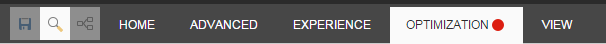

タブの赤い点は、そのページにアクティブなテストがあることを示しています。以下は、最適化タブのリボンの例です。

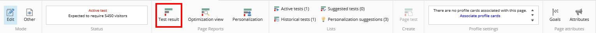

アクティブなテストがある場合、ステータスは、テストが終了するまでに何人の訪問者が必要かを示します。この例では、ステータスはテストを終了するのにさらに5450人の訪問者が必要であることを示しています。十分な履歴データがある場合、ステータスは代わりに、テストが終了するまでにかかる日数を示します。

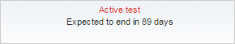

***************
テスト結果
***************

エクスペリエンス エディタ リボンで、最適化タブのテスト結果をクリックすると、そのページの現在のテスト結果レポートを見ることができます。

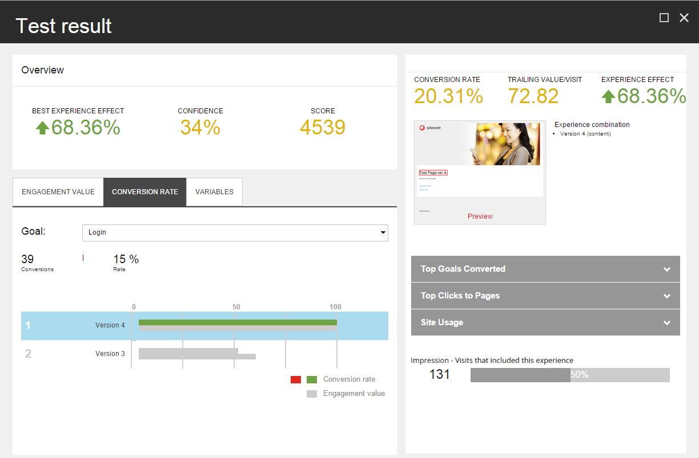

概要に示されています。

* 最高の体験効果 - 最高の体験のパフォーマンス。元の体験とテストの最高の体験の1回の訪問あたりの後続値との間のパーセンテージの差として計算されます。
* 信頼度 - テストが到達した統計的信頼度。
* スコア - 得られたエンゲージメント値とテストページの重要度に基づいて、テストの作成者に割り当てられるテストスコア。

.. note:: 

    元の経験が訪問ごとに最も高い末尾の値を持つ場合、効果はなく、したがってスコアは計算されません。次に、最高の経験の効果とスコアのフィールドには、-が表示されます。

    訪問回数が100回未満の場合、信頼度は0で、フィールドには-が表示されます。

    .. image:: images/15ed64a2551df5.png
        :align: center
        :width: 400px
        :alt: テスト結果

エンゲージメント値、コンバージョン率、変数タブには、テストしたエクスペリエンスの棒グラフが表示されます。エクスペリエンスを1つ選択すると、詳細パネルにそのエクスペリエンスの詳細が表示されます。

詳細パネルの下には、現在選択されている体験に関する詳細情報を表示する3つの拡張可能なセクションがあります。

*************************
エンゲージメントバリュー
*************************

エンゲージメント値タブには、エンゲージメント値で測定されたテストの経験をパフォーマンスの高い順に並べたグラフが含まれています。エンゲージメント値が最も高い体験には100の値が割り当てられ、チャートのバーは残りの体験の相対的なパフォーマンスを示しています。

バーの長さは、その体験の相対的なエンゲージメント価値を示しており、次のように計算されます。

(その体験のエンゲージメントバリュー/最もパフォーマンスの高い体験のエンゲージメント値)×100

バーの色は以下のことを示しています。

* グレー - オリジナルの体験。
* 緑 - 元の体験よりもパフォーマンスが高い体験。
* 赤 - 元のエクスペリエンスよりもパフォーマンスが低いエクスペリエンス。

エクスペリエンスを選択すると、[詳細] パネルにこの情報が表示されます。

    .. image:: images/15ed64a2555a4b.png
        :align: center
        :width: 400px
        :alt: エンゲージメントバリュー

選択されたエクスペリエンスには、一般的に2つの測定値があります。

* 追跡値/訪問 - 訪問者がテスト対象のページに遭遇した後に発生したページビューのみをカウントしたエンゲージメントの合計値を、体験にさらされた訪問者数で割ったもの。
* 体験効果 - ネガティブ、ポジティブ、またはニュートラルな体験効果の合計。これは、選択したエクスペリエンスの後続値/訪問数とデフォルトのエクスペリエンスとの間のパーセンテージの差です。

詳細パネルには、エクスペリエンスのプレビューも表示されます。プレビューをクリックして、選択した経験を編集することができます。

1回の訪問での末尾の値の例
==========================-=

例えば、あるブラウザ セッションでは、訪問者は次のようなことをします。

* テストされているコンポーネントのあるページを表示します。この訪問者には、コンポーネントのバリアント B が表示されます。
* 訪問者がパンフレットをダウンロードするページへのリンクをクリックします。パンフレットのダウンロードは、値が 10 のゴールです。
* サイト上のいくつかの他のページを閲覧しました。これらのページにはトラッキング目的で関連するページイベントがありますが、これらのイベントに割り当てられたエンゲージメント値は0です。
* 訪問者が見積もりを依頼するページに移動しました。これは値50のゴールです。
* ブラウザを閉じます。

この訪問のバリアント B の末尾の値は 60 (10+50) です。

トレイリング値/訪問は、訪問者がコンポーネントのバリアントBを閲覧したすべての訪問のトレイリング値の平均です。

詳細パネルには、エクスペリエンスのプレビューも表示されます。プレビューをクリックして、選択したエクスペリエンスを編集することができます。

*******************
コンバージョン率
*******************

コンバージョン率タブには、すべてのエクスペリエンスのコンバージョン率が表示されます。[ゴール] ドロップダウンリストからゴールを選択すると、ゴールが何回トリガーされたかを確認できます。レート］フィールドは、選択したエクスペリエンスのコンバージョン率を、選択したエクスペリエンスが表示された訪問数に対する割合で表します。1回の訪問につき1回以上のコンバージョンがある場合は、100%を超えます。

棒グラフは、コンバージョン率で測定されたパフォーマンスの順に体験を一覧表示します。

テストの各エクスペリエンスには2つのバーがあります。

* 最初のバーは、最もパフォーマンスの高い体験と比較した体験の相対的なコンバージョン率を示しています。コンバージョン率が最も高い経験には100の値が割り当てられます。バーの色は以下を示します。

    * ライトグレー - オリジナルの体験。
    * 緑 - 元の体験よりもパフォーマンスが高い体験。
    * 赤 - 元の体験よりもパフォーマンスが低い体験。

  バーの値は次のように計算されます。

  (その体験の1回の訪問あたりのコンバージョン数 / 最もパフォーマンスの高い体験の1回の訪問あたりのコンバージョン数) x 100.

* 2 番目のバーは、最高のパフォーマンスを発揮したエクスペリエンスと比較したエクスペリエンスの相対的なエンゲージメント値を示しています。このバーは常に濃いグレーです。

目標がバリエーションに対してトリガーされなかった場合、バーの代わりに「NO DATA」というテキストが表示されます。

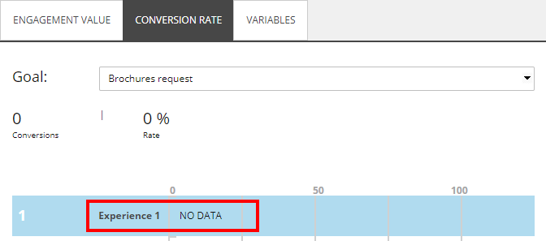

バーチャートで経験を選択すると、詳細パネルには、訪問ごとの後続値と経験効果に加えて、選択した経験のコンバージョン率パーセンテージが表示されます。

********
変数
********

変数タブには、テストの各変数のエンゲージメント値を示すグラフが表示されます。

詳細パネルには、訪問ごとのトレーリング値とエクスペリエンス効果が表示されます。

******************************************
コンバージョン達成済みトップゴール
******************************************

コンバージョンされたトップゴールのセクションを展開して、選択した経験のゴールコンバージョン結果を確認します。

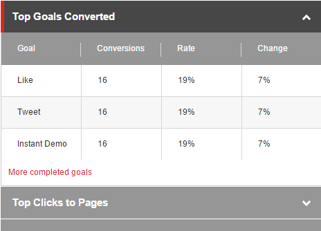

表は以下のメトリクスを示しています。

* ゴール - テストに晒された訪問者によって引き起こされたゴール。
* コンバージョン - コンバージョン数。
* 率 - 選択したエクスペリエンスを表示した後のゴールコンバージョン数を訪問者数で割ったものに100を乗じたもの。
* 変化 - オリジナルのエクスペリエンスと選択されたエクスペリエンスの間の変化。

******************************************
ページへのトップクリック
******************************************

[ページへのトップクリック]セクションを展開して、選択したエクスペリエンスのトップクリック数を確認できます。

表には、以下のメトリクスが表示されます。

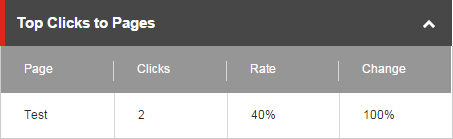

* Page - セッションでクリックされた次のページの名前。
* クリック数 - ページへのクリック数の合計。
* レート - 選択したエクスペリエンスを表示した後のページへのクリック数を訪問数で割ったものに 100 を乗じたもの。
* 変化 - 元のエクスペリエンスと選択されたエクスペリエンスの間の変化。

******************************************
サイトのご利用について
******************************************

[サイト使用状況] セクションを展開して、選択したエクスペリエンスのサイト使用状況のサマリーを表示します。

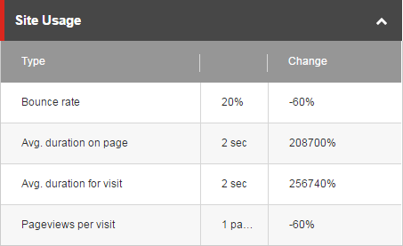

表には、以下のメトリクスが示されています。

* タイプは2列目の値を定義します。

    * Bounce rate (%) - このページを訪問した訪問者のうち、他のページを閲覧せずにサイトを去っていく訪問者の割合。
    * ページ上の平均滞在時間（秒/分単位の数値） - 訪問者がページ上に滞在する平均時間。
    * 平均訪問時間（秒/分単位の数値） - 訪問者がサイトに滞在する平均時間。
    * 訪問ごとのページビュー数（ページビュー数） - 訪問者が1回の訪問で見るさまざまなページの平均数。

* 変化は、元の測定値と比較して、この測定値の変化を示しています。

******************************************
インプレッション
******************************************

インプレッションには、この経験を含んだ訪問数と、この訪問数が全体の訪問数に占める割合が記載されています。

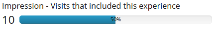

******************************************
テストの勝者
******************************************

テストを作成したユーザーは、テスト結果ダイアログボックスで経験値を選択し、「勝者として選ぶ」をクリックしてテストを終了し、経験値をテストの勝者として宣言することができます。これは、テストに定義されたテストの目的を上書きします。そうでなければ、Sitecore は勝者を見つけます。

テストの勝者が見つかると、Test Summary ダイアログボックスが表示されます。

インプレッションには、この経験を含んだ訪問数と、この訪問数が全体の訪問数に占める割合が記載されています。

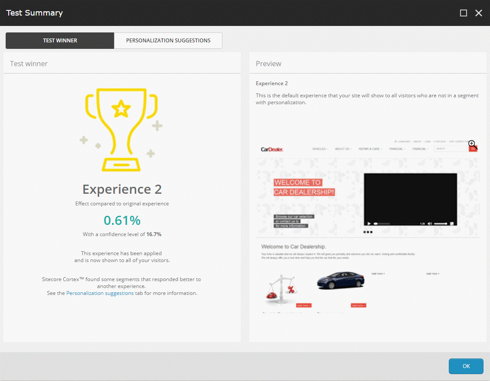

テスト勝者タブには、パーソナライゼーションによってターゲットにされていないすべての訪問者のデフォルトのエクスペリエンスとなるエクスペリエンスのプレビューが含まれています。また、テスト結果には、テスト勝者とは異なる体験に対してより良い反応を示す特定の訪問者セグメントに関する情報も含まれています。パーソナライゼーションの提案] タブをクリックして、提案されたパーソナライゼーションのルールを確認して適用します。

******************************************
パーソナライゼーションの提案
******************************************

コンポーネントテストの間、Sitecoreはデータを収集し、Sitecore CortexTM機械学習を適用して、テストの勝者とは異なる体験に対してより良い反応を示すセグメントがあるかどうかを判断します。

パーソナライゼーションの提案タブには、ページに推奨されるパーソナライゼーションルールのリストがあります。ここでは、提案されたパーソナライゼーションルールを表示し、適用することができます。

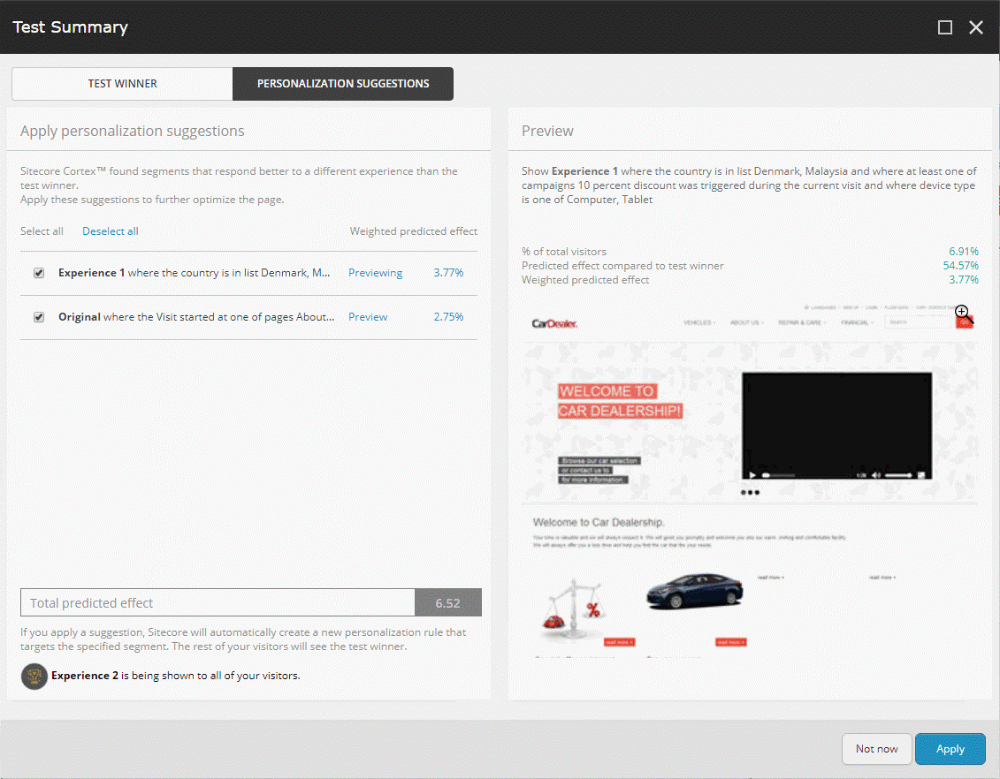

.. note:: テストがコンポーネントテストではない場合（例えば、基本的なコンテンツテストやページテストなど）、Sitecore はテストサマリーダイアログボックスを表示しますが、Personalization suggestions タブは表示しません。

個人設定の提案を適用せずにテスト サマリー ダイアログ ボックスを閉じるには、[今はしない] をクリックします。最適化リボンから :doc:`パーソナライズの提案ダイアログボックスを開く <view-and-apply-personalization-suggestions-for-a-page>` ことで、後で提案を適用することができます。

.. tip:: 英語版 https://doc.sitecore.com/users/93/sitecore-experience-platform/en/content-test-results.html