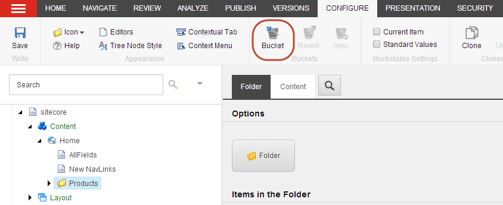

##################################
アイテムをアイテムバケツに変換する
##################################

アイテムバケットを使用すると、コンテンツツリー内の大量のアイテムを管理することができます。アイテムバケットとは、無数のアイテムを隠しておいても、それらのアイテムを簡単に取得して作業することができるコンテナのことです。バケットアイテムを見つける唯一の方法は、Sitecoreの検索エンジンを使用することです。

新しいアイテムでも既存のアイテムでも、どんなアイテムでもアイテムバケットに変換することができます。

アイテムをアイテムバケットに変換すると、アイテムバケットはそのサブアイテムがバケット可能なアイテムであるか、バケット可能なテンプレートに基づいている場合は、すべてのサブアイテムを整理して非表示にします。多くのサブアイテムを含むアイテムをアイテムバケットに変換すると、アイテムを整理するのに時間がかかることがあります。プログレス バーが表示され、処理中のアイテムの進行状況が表示されます。バケット化中は、処理が完了する前にキャンセルすることができます。

.. note:: 標準的なPCでは、1000個のアイテムをアイテムバケツに整理するのに約5～10分かかります。

************************************
アイテムをアイテムバケツに変換する
************************************

アイテムをアイテムバケットに変換するには

1. コンテンツ エディタで、アイテム バケットに変換するアイテムをクリックします。

2. [ホーム] タブで [編集] をクリックしてアイテムをロックします。

3. [設定] タブをクリックし、[バケット] グループで [バケット] をクリックして、アイテムをアイテム バケットに変換します。

.. note:: アイテムバケットを作成するプロセスが失敗した場合、アイテムバケットを同期させることができ、プロセスが中断したところから再開することができます。

コンテンツ エディタでどのアイテムがアイテム バケットであるかを確認するには、コンテンツ ツリーの左にあるクイック アクション バーを右クリックしてアイテム バケットを選択すると、コンテンツ ツリーの各アイテム バケットの横にアイコンが表示されます。また、コンテンツ ツリーでアイテム バケットを展開すると、そのアイテムがアイテム バケットであることを示す目に見える手掛かりが表示されます。アイテムバケット内のアイテムが非表示になっている場合は、コンテナ内に非表示のアイテムがあることを小さな通知でお知らせします。

.. image:: images/15eafd356ee87e.png
   :align: center
   :width: 400px
   :alt: アイテムをアイテムバケツに変換する

************************************
アイテムバケツを通常のアイテムに戻す
************************************

アイテムバケツにアイテムを追加した後でも、いつでもアイテムバケツを通常のアイテムに戻すことができます。

アイテム バケットを通常のアイテムに戻すには、以下の手順に従います。

1. コンテンツ エディタで、通常のアイテムに戻したいアイテム バケットに移動します。
2. [設定] タブの [バケット] グループで [元に戻す] をクリックします。アイテム バケットに多くのサブアイテムがある場合は、この作業に時間がかかる場合があります。

アイテム バケットが通常のアイテムに戻り、そのサブアイテムはすべて通常のアイテムとして表示され、先祖や子孫との親子関係が維持されます。

.. important:: アイテムバケットを削除すると、バケット内のアイテムが非表示であるか表示であるかにかかわらず、すべてのアイテムが削除されます。削除されたアイテムバケットとそのアイテムを復元するには、Sitecore のゴミ箱でアイテムバケットを選択し、Restore をクリックします。

.. tip:: 英語版 https://doc.sitecore.com/users/93/sitecore-experience-platform/en/convert-an-item-into-an-item-bucket.html
