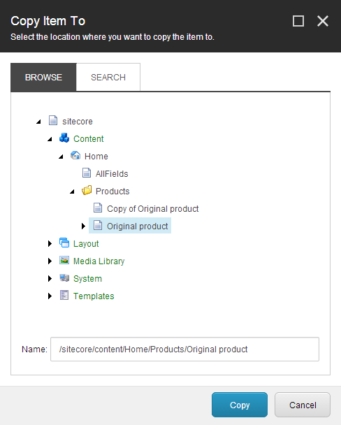

##################################
アイテムをコピーまたは複製する
##################################

コンテンツ エディタでは、既存のアイテムをコピーまたは複製して新しいアイテムを作成することができます。

* アイテムのコピー - 選択したアイテムとそのすべてのコンテンツおよびサブアイテムを、指定したコンテンツ ツリーの場所にコピーします。
* アイテムの複製 - 選択したアイテムとそのすべてのコンテンツおよびサブアイテムを、コンテンツ ツリー内の同じ場所にコピーします。

.. note:: Internet Explorerでは、クリップボードにアイテムをコピー、カット、ペーストすることもできます。クリップボードの機能は、ホームタブのクリップボードグループにありますが、他のブラウザではJavaScriptの制限により、クリップボードグループはInternet Explorerでのみ表示されます。

*********************
アイテムをコピーする
*********************

アイテムを別の場所にコピーするには

1. コンテンツ ツリーで、コピーするアイテムを探して選択します。
2. [ホーム] タブの [操作] グループで [コピー先] をクリックします。または、コンテンツ ツリーでアイテムを右クリックし、[コピー] をクリックしてから [コピー先] をクリックすることもできます。
3. [アイテムのコピー先］ダイアログ ボックスで、コピーしたアイテムを保存する場所を選択します。

.. note:: [参照] タブのコンテンツ ツリーからその場所に移動したり、[検索] タブで場所を検索したりできます。

4. [コピー］をクリックすると、指定した場所にアイテムのコピーが作成されます。

これで、新しいアイテムを編集したり、サブアイテムを追加したり、アイテムを別の場所に移動することができます。

.. note:: 複数のアイテムを同時にコピーするには、コピーしたいアイテムをすべて検索( :doc:`search-for-an-item` )して、検索結果のコピー操作を利用する必要があります。

*********************
アイテムを複製する
*********************

アイテムを複製するには

1. コンテンツ ツリーで、複製するアイテムを探して選択します。
2. [ホーム] タブの [操作] グループで [複製] をクリックします。または、アイテムを右クリックして [複製] をクリックすることもできます。
3. 新しいアイテムの名前を入力し、[OK] をクリックします。

これで、新しいアイテムを編集したり、サブアイテムを追加したり、アイテムを別の場所に移動することができます。

.. tip:: 英語版 https://doc.sitecore.com/users/93/sitecore-experience-platform/en/copy-or-duplicate-an-item.html
