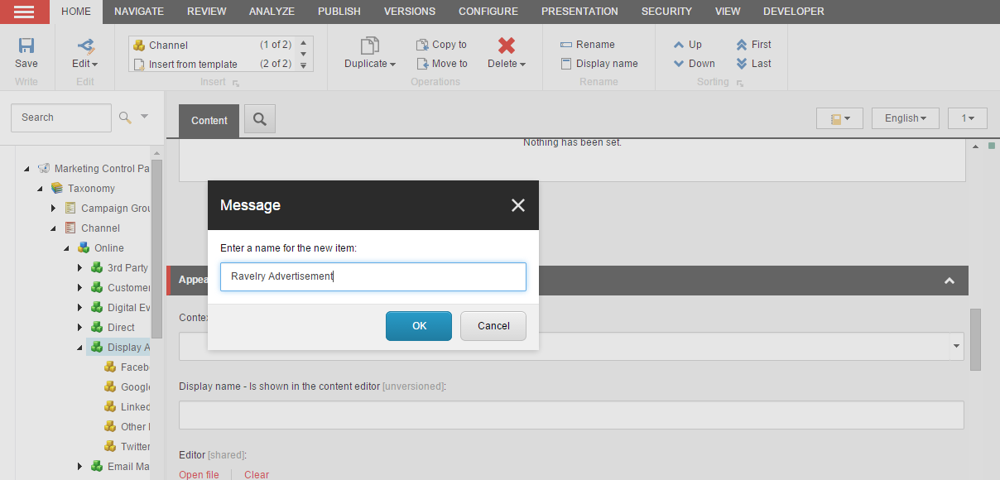

##########################
チャンネルを作成する
##########################

チャンネルを介して、接触者がブランドとどのように交流しているかを追跡することができます。チャネルをキャンペーン活動と関連付けることができるので、コンタクトがどのようにブランドとインタラクションしたかを追跡することができます。チャネル間のゴールコンバージョン率を比較することで、どのチャネルがコンタクトのエンゲージメントを高めているかを知ることができます。エクスペリエンスアナリティクスでは、チャネルのトラフィックと参照ページに関するレポートを見ることができます。

また、チャネルを使用して、コンタクトがウェブサイトを訪問する際に使用したチャネルに基づいてコンポーネントの条件付きレンダリングを実装するパーソナライゼーションルールを作成することもできます。これにより、コンタクトがブランドとの交流に使用したチャネルに基づいて、ターゲットを絞った関連性の高いコンテンツをコンタクトに提供することができます。

Sitecore Experience Platformには、あらかじめ定義された多数のチャンネルが含まれていますが、独自のチャンネルを作成して、自社に関連する他の形態のトラフィックを特定することもできます。

新しいチャネルを作成するには

1. マーケティングコントロールパネルのコンテンツツリー、タクソノミーグループで、チャンネルを選択します。
2. 新しいチャネルが属するチャネルタイプを選択します。チャネルタイプは以下の通りです。

  * オフライン - オフラインでのインタラクションをトラッキングします。
  * オンライン - オンラインでのインタラクションを追跡するためのもの

3. チャンネルが属するチャンネル グループを選択します。ホーム］タブの［挿入］グループで［チャンネル］を選択します。
4. ダイアログボックスで、新しいチャンネルの名前を入力して、[OK]をクリックします。

5. [保存] をクリックします。チャネルを配置するには、[レビュー] タブの [ワークフロー] グループで [配置] をクリックします。
6. [発行] タブの [発行] グループで [発行] を選択して、サイト発行を実行します。

.. tip:: https://doc.sitecore.com/users/93/sitecore-experience-platform/en/create-a-channel.html
