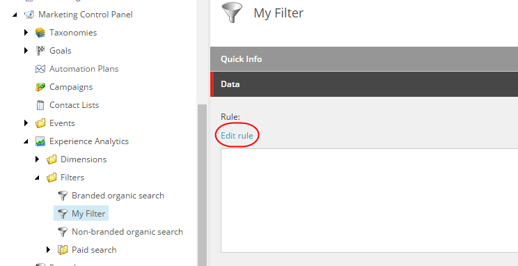
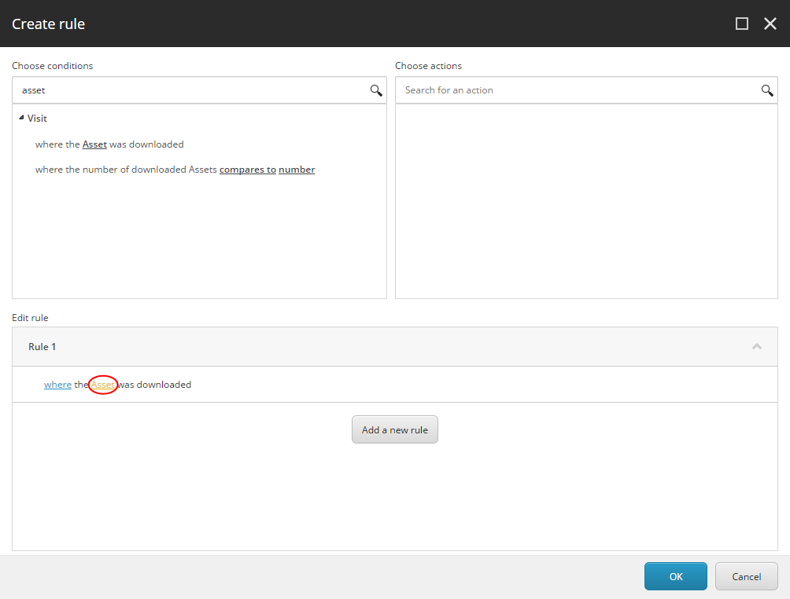
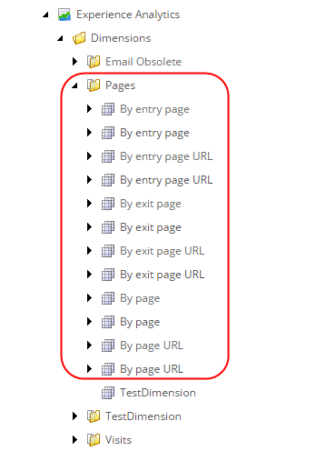
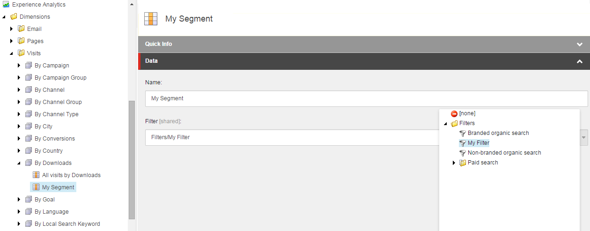

################################################
カスタムレポートフィルタとセグメントの作成
################################################

Experience Analyticsでは、ディメンジョンとセグメントを使用して、レポートで使用するチャートを作成します。

ディメンジョンとセグメントは、レポートで利用可能なデータを定義するために連携します。ディメンジョンは訪問の分析方法を決定し、セグメントはどの訪問を分析するかを制御します。たとえば、「目標別」という名前のディメンジョンと、「目標別のすべての訪問」という名前のセグメントを持つことができます。

Experience Analyticsには、いくつかのデフォルトのディメンジョンとセグメントが用意されていますが、必要に応じて独自のディメンジョンを作成することもできます。ディメンジョンとフィルタを組み合わせてセグメントを作成します。

************************
カスタムフィルタの作成
************************

コンテンツエディタでは、セグメントで使用するカスタムフィルタを作成することができます。これを行うには、Sitecore で新しいアイテムを作成してから、ルールを作成します。

新しいフィルター項目を作成するには

1. コンテンツエディタで、Filtersフォルダ（/sitecore/System/Marketing Control Panel/Experience Analytics/Filters）に移動してクリックします。

2. リボンの［ホーム］タブの［挿入］グループで、［フィルタ］をクリックします。

3 [メッセージ］ダイアログボックスで、［マイフィルタ］などのフィルタの名前を入力し、［OK］をクリックします。

4. [保存] をクリックします。

5. 新しいフィルタ項目を設定するには、右ペインの [データ] セクションで、[ルールの編集] をクリックします。

6. [ルールの作成] ダイアログ ボックスの [条件の選択] フィールドで、関連する条件を検索するか、リストをスクロールダウンしてから、条件をクリックします。たとえば、ウェブサイトからパンフレットをダウンロードした連絡先の統計情報を表示するフィルタ用のルールを作成するには、「アセット」を検索してから、「アセットがダウンロードされた場所」というルールを選択します。

7. ルールのオプションを設定および構成するには、[ルールの編集] セクションで下線部の単語をクリックして値を入力するか、代替キーワードを選択するか、または値を選択します。
   たとえば、アセットを選択するには、[ルールの編集]セクションの[ルール 1]フィールドで、下線付きの単語[アセット]をクリックします。アイテムの選択 ダイアログ ボックスの [参照] タブで、アセットを保存しているフォルダに移動し、関連するアセットを選択します。

8. ルールの設定が完了したら、[OK] をクリックします。

9. [保存] をクリックします。

************************************************
カスタムセグメントを作成してフィルタにリンクする
************************************************

カスタムフィルタを作成したら、新しいフィルタにリンクするセグメント項目を作成します。

カスタムフィルタのセグメントを作成するには

1. コンテンツ エディタのコンテンツ ツリーで、ディメンション フォルダ（/sitecore/System/Marketing Control Panel/Experience Analytics/Dimensions）を展開し、ディメンションを保存しているフォルダを展開します。例えば、Pagesフォルダ。

2. カスタム・セグメント定義項目を作成するには、関連するディメンジョンをクリックします。例えば、[エントリ・ページ別] ディメンジョンなどです。

3. カスタム・セグメント項目を作成するには、リボンの [ホーム] タブの [挿入] グループで [セグメント] をクリックします。

4. [メッセージ] ダイアログ・ボックスで、カスタム・セグメントの名前を入力し、[マイ・セグメント] などと入力してから [OK] をクリックします。

5. カスタムセグメントをカスタムフィルタにリンクするには、右ペインの [データ] セクションの [フィルタ] フィールドでドロップダウン矢印をクリックして、カスタムフィルタ (例: My Filter) を選択し、[保存] をクリックします。

6. 変更を保存して、このセグメントのデータ収集を開始するには、リボンの [レビュー] タブの [ワークフロー] グループで [配置] をクリックします。

   デフォルトでは、デプロイ後 30 分後にデータ収集が開始されます。

.. note:: 新しいセグメントをデプロイしてデータ収集を開始したら、収集したデータに矛盾が生じる可能性があるため、セグメントを変更することはできません。

.. tip:: 英語版 https://doc.sitecore.com/users/93/sitecore-experience-platform/en/create-a-custom-report-filter-and-segment.html