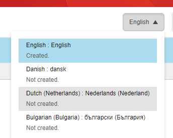
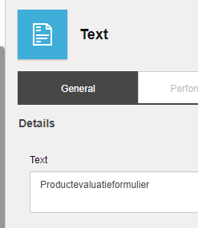
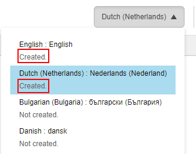

##################################################
Sitecore フォームの異なる言語バージョンを作成する
##################################################

Sitecore Formsモジュールでは、複数の言語でフォームのバージョンを作成して、連絡先が好みの言語でフォームを読めるようにすることができます。

.. note:: 複数の言語でフォームを作成するには、関連する言語が Sitecore ソリューションで利用可能である必要があります。必要な言語が利用できない場合は、Sitecore管理者にお問い合わせください。

異なる言語バージョンのフォームを作成するには

1. Sitecore Forms モジュールで、新しい言語バージョンのフォームを作成したいフォームを開きます。

   .. note:: 新しいフォームから始める場合は、まずデフォルトの言語でフォームを保存することをお勧めします。そうしないと、フォームダッシュボードにはデフォルト言語のフォームしか表示されないため、フォームを見つけるのが困難になる可能性があります。

2. [言語] ドロップダウンメニューで、必要な言語をクリックします。

3. これで、フォーム内のフィールドに翻訳されたテキストを入力することができます。

4. フォームを保存します。フォームはデフォルトの言語版と翻訳版の両方で利用できるようになりました。

.. tip:: https://doc.sitecore.com/users/93/sitecore-experience-platform/en/create-a-different-language-version-of-a-sitecore-form.html

