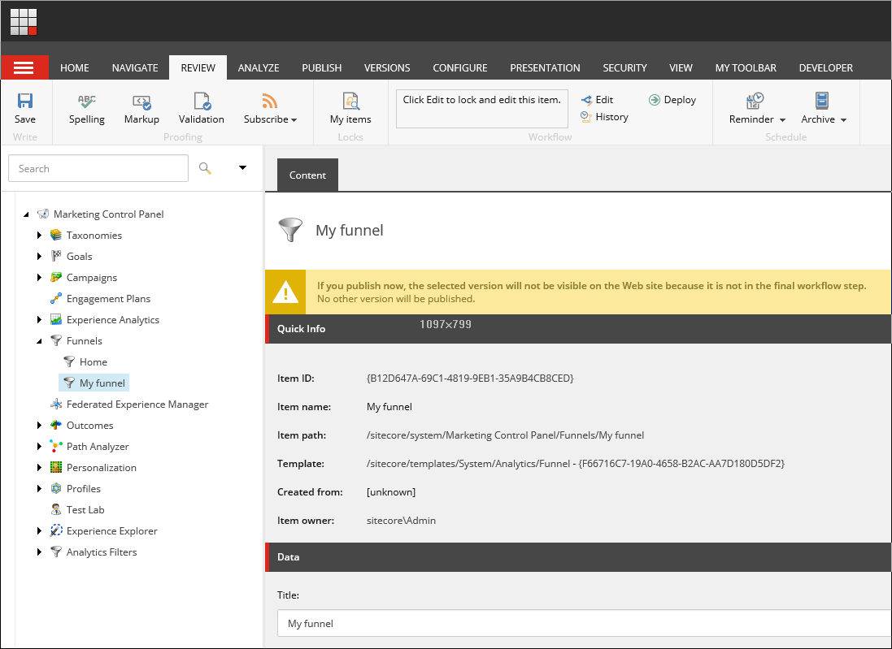

######################################################
ファネルの作成
######################################################

パスアナライザでマップに :doc:`ファネル <path-analyzer-funnels>` を適用する前に、マーケティングコントロールパネルでファネルを作成する必要があります。

ファネルを作成するには、以下の手順に従います。

1. マーケティングコントロールパネルを開き、[ファネル] 項目を選択します。

2. Funnel をクリックして、新しいファネルに適切な名前を付けます。

3. new funnel項目で、ファネルの説明を追加します。

4. Sequence（シーケンス）フィールドで、Edit（編集）をクリックし、Select Items（アイテムの選択）ダイアログで、定義したビジネス目的を達成するために訪問者が訪問しなければならないページを追加します。

   ページが正しい順番でリストされていることを確認して下さい。

   ファネルを作成したら、ワークフローにプッシュしてデプロイする必要があります。

5. レビュータブをクリックし、ワークフローグループで、デプロイをクリックします。

.. tip:: 英語版 https://doc.sitecore.com/users/93/sitecore-experience-platform/en/create-a-funnel.html
