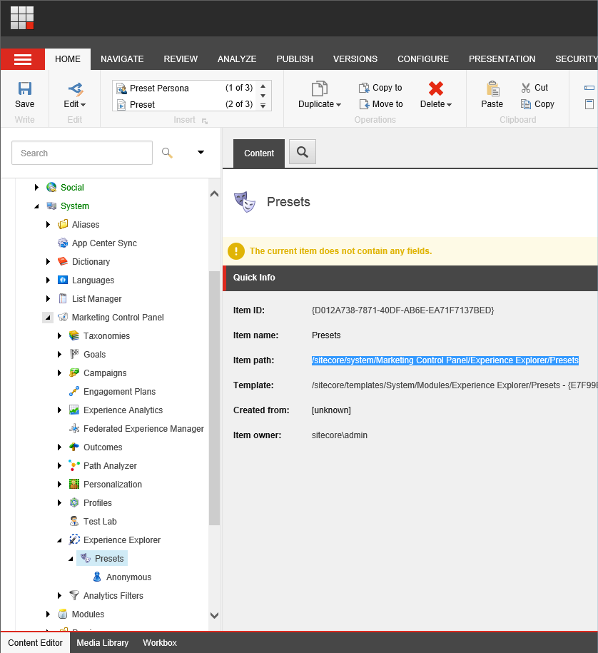
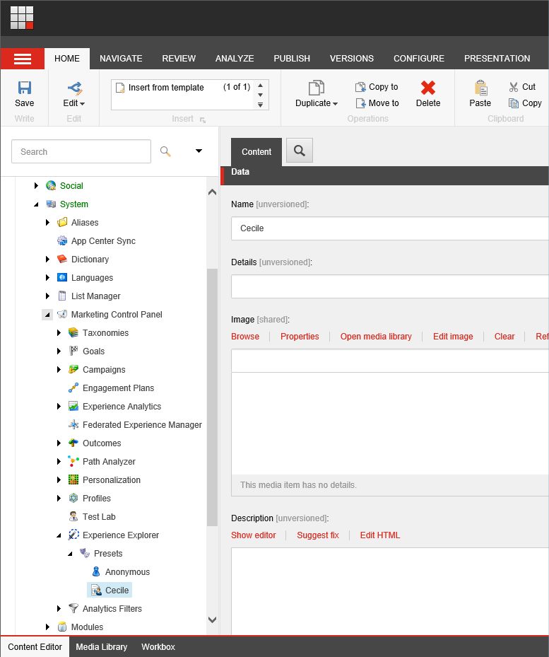
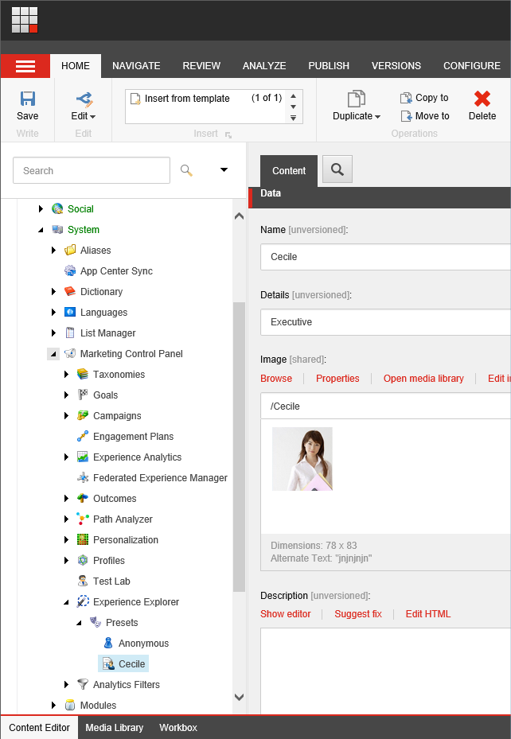
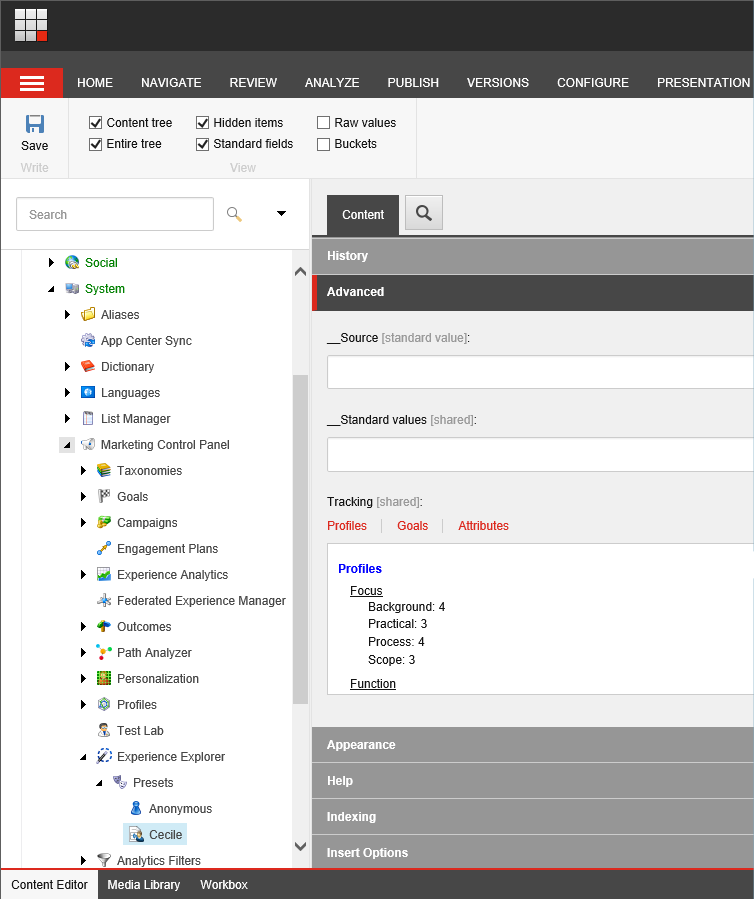
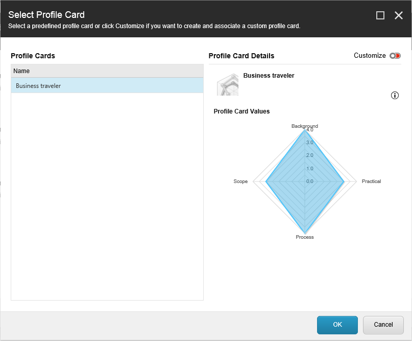
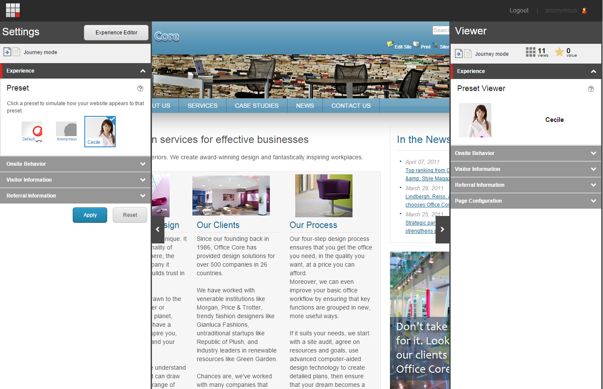

######################################################
エクスプローラーモードのプリセットを作成する
######################################################

Exploreモードで最初にウェブサイトを開いたときには、Anonymousという名前のプリセットが1つあります。プリセットを作成することは、通常、エクスペリエンスマーケティングの全体的なプロファイリング戦略の一環として行われます。Exploreモードでウェブサイトの分析を始める前に、独自のプリセットセットを作成する必要があります。

********************
プリセットの作成
********************

独自のプリセットセットを作成するには

1. コンテンツエディタのコンテンツツリーで、/sitecore/system/Marketing Control Panel/Experience Explorer/Presetsノードに移動します。
   デフォルトのプリセットは、Anonymous（匿名）という名前のものが1つだけ表示されます。

2. リボンの[ホーム]タブで[テンプレートから挿入]をクリックし、/sitecore/templates/System/Experience Explorer/Preset Personaに移動し、プリセットの名前を「Cecile」とします。

.. note:: 2種類のアイテムを作成することができます。プリセット - ペルソナ」と「プリセット」です。プリセット - ペルソナのアイテムには、プリセットのアイテムよりも、プリセットを説明するために使用できるフィールドが多く含まれています。

3. 名前とその他の関連する詳細を入力します。
   プリセットの正確な描写を作成するために十分な情報を入力する必要があります。含めるべき最も重要なフィールドは以下の通りです。

+--------------+-----------------------------------------------------------------------------------------------+
| フィールド名 | 概要                                                                                          |
+--------------+-----------------------------------------------------------------------------------------------+
| 名前         | プリセットの名前。例えば、セシル。                                                            |
+--------------+-----------------------------------------------------------------------------------------------+
| 詳細         | ビジネス訪問者のタイプ。例えば、エグゼクティブ。                                              |
+--------------+-----------------------------------------------------------------------------------------------+
| 画像         | プリセットを表現するのに適した画像を添付してください。                                        |
+--------------+-----------------------------------------------------------------------------------------------+
| 概要         | このプリセットが表すビジネス訪問者のタイプを詳細に説明してください。                          |
|              | 例えば、セシールはファーストクラスの旅行と高水準のビジネス宿泊施設を探している会社のCEOです。 |
+--------------+-----------------------------------------------------------------------------------------------+

他のフィールドは今のところ空欄で構いません。

4. プロファイリング戦略の一環として用意した他のプリセットを作成します。
5. 変更内容を保存します。

**********************
プリセットの設定
**********************

プリセットを作成した後、それを特定のエクスペリエンスマーケティング機能に関連付けることができます。

プリセットを設定するには

1. コンテンツエディタで、/sitecore/system/Marketing Control Panel/Experience Explorer/Presets ノードに移動し、設定したいプリセットを選択します。
2. 詳細グループでは、このプリセットに関連付けられたプロファイル、目標、キャンペーンを見ることができます。

3. プロファイル、ゴール、または属性をクリックして、これらの値を編集します。
   例えば、[プロフィール]をクリックしてから[編集]をクリックすると、セシルのプリセットに割り当てられたプロフィールカードの値を表示または編集することができます。

4. [カスタマイズ] をクリックして、これらの値を変更します。
5. [OK] をクリックして変更を保存します。

*****************************************
エクスペリエンスモードでプリセットを表示
*****************************************

エクスプローラー モードでサイトにプリセットを適用すると、プリセットのプロファイルと一致するプロファイルを持つ訪問者に自分のウェブサイトがどのように見えるかを確認することができます。

1. エクスプローラモードでウェブサイトを開くには、エクスペリエンス エディタのリボンで、エクスプローラをクリックします。
2. [設定] パネルで [エクスペリエンス] セクションをクリックします。
   利用可能なプリセットがプリセットカルーセルに表示されます。
3. プリセットを選択し、[適用] をクリックします。

.. tip:: 英語版 https://doc.sitecore.com/users/93/sitecore-experience-platform/en/create-an-explore-mode-preset.html

