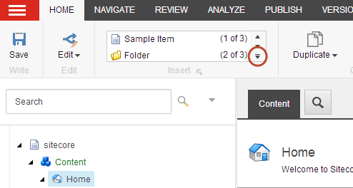
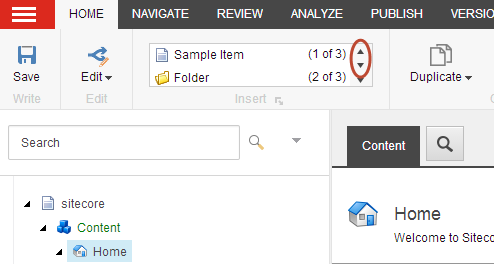
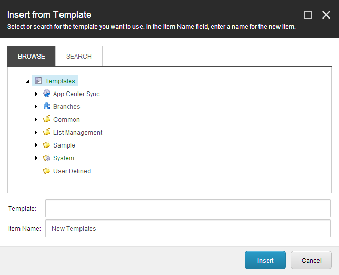

#########################################
コンテンツエディタで項目を作成する
#########################################

コンテンツ エディタで新しいアイテムを作成する場合は、まず、コンテンツ ツリーでアイテムを選択して、新しいアイテムを配置する場所を指定する必要があります。新しいアイテムは、選択したアイテムの兄弟アイテムまたはサブアイテムとして作成できます。

* 姉妹とは、選択したアイテムと同じレベルで作成するアイテムのことです。
* サブアイテムは、選択したアイテムの下に作成するアイテムです。

.. note: また、既存のアイテムをコピーしたり、複製したりして新しいアイテムを作成することもできます。 :doc:`copy-or-duplicate-an-item`

******************
新規項目の挿入
******************

新しいアイテムを挿入するには

1. コンテンツ エディタで、新しいアイテムを配置するアイテムに移動します。

  * 選択したアイテムの兄弟を挿入するには、[ホーム] タブの [挿入] グループでドロップダウン矢印 27363645D8DA41C29070794B3B899758.png をクリックし、[新しい兄弟の挿入] セクションで、挿入するアイテムの種類を選択します。

* 選択した項目にサブ項目を挿入するには、[ホーム] タブの [挿入] グループで、上下の矢印を使用して、使用するタイプを探して選択し、新しい項目の名前を入力し、[OK] をクリックします。

または、コンテンツ ツリー内の項目を右クリックして [挿入] をクリックし、提案されている項目タイプのいずれかをクリックすることもできます。

2. 新しいアイテムの名前を入力し、[OK] をクリックします。
   作成した新しいアイテムは、自動的にロックされ、コンテンツ エディタで開きます。他のユーザーが作業する前に、アイテムのロックを解除して保存する必要があります。

3. 必要に応じて、新しいアイテムを編集したり、サブアイテムを追加したり、アイテムを別の場所に移動したりします。

************************************
テンプレートに基づいて項目を挿入する
************************************

十分なアクセス権を持っている場合は、Sitecore インストールで利用可能なテンプレートから新しいサブアイテムを作成することができます。

テンプレートからアイテムを挿入するには

1. このような場合には、テンプレートからアイテムを挿入することはできません。
2. [ホーム] タブの [挿入] グループで、ドロップダウン矢印 2737F5FCD0DB49C3AB22AF39D40F624B.png をクリックし、[テンプレートから挿入] をクリックします。
3. [テンプレートから挿入] ダイアログ ボックスで、新しいアイテムをベースにするテンプレートに移動します。

または、コンテンツ ツリー内の項目を右クリックして [挿入] をクリックし、[テンプレートから挿入] をクリックすることもできます。

.. note:: テンプレートを見つけるには、[参照] タブのコンテンツ ツリーをナビゲートするか、[検索] タブを使用して :doc:`search-for-an-item` することができます。

4. [項目名] フィールドに新しい項目の名前を入力し、[挿入] をクリックします。
5. 必要に応じて、新しいアイテムを編集したり、サブアイテムを追加したり、別の場所に移動したりします。

.. important:: :doc:`item-buckets` にアイテムを作成する方法は、通常のアイテムを作成するのと全く同じです。複製したアイテムのテンプレートがバケツ可能な場合、またはアイテムをバケツ可能にした場合、そのアイテムはアイテムバケツに隠れます。アイテムまたはアイテムのテンプレートがバケツ可能でない場合、アイテムはアイテムバケツに表示されます。その結果、隠しアイテムと可視アイテムのハイブリッドなアイテムバケットを持つことができます。

.. tip:: 英語版 https://doc.sitecore.com/users/93/sitecore-experience-platform/en/create-an-item-in-the-content-editor.html
