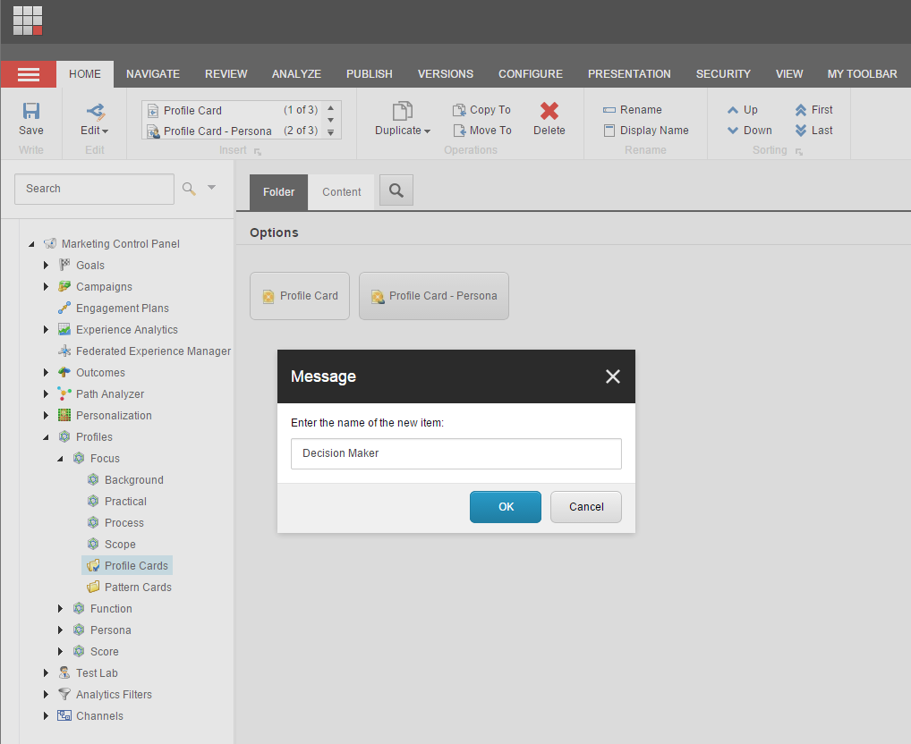
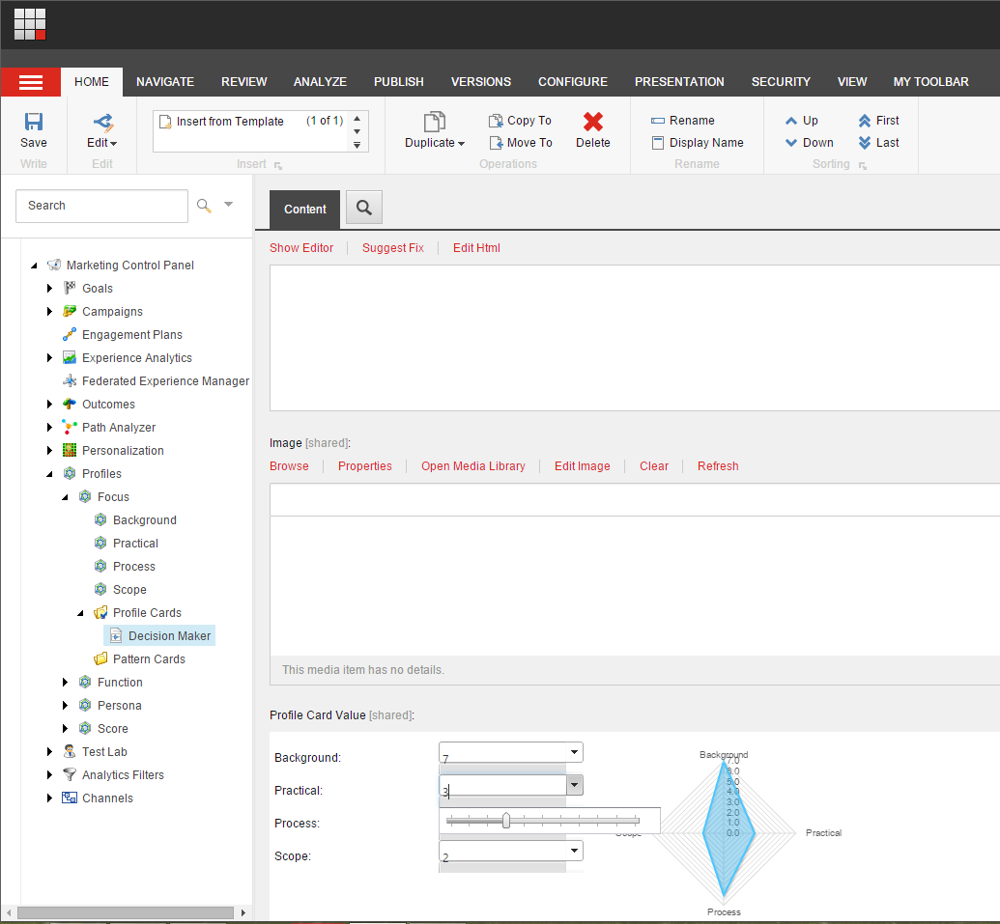

##############################################
プロファイルカードの作成と値の割り当て
##############################################

プロファイル カードを使用して、連絡先を識別してセグメント化したり、パーソナライズ ルールを実装したりすることができます。プロファイルカードとは、保存されたプロファイルキーとプロファイル値を含むカードのことです。このカードを使用すると、Web サイトのすべてのアイテムに一貫してプロファイル値を割り当てることができます。

プロファイルカードを作成するには

1. スタート画面で、Marketing Control Panelを開きます。
2. マーケティングコントロールパネルで、コンテンツツリーを展開し、プロファイルをクリックします。興味のあるプロフィールをクリックして、「Profile Cards」フォルダをクリックします。
3. [ホーム] タブの [挿入] グループで [プロファイルカード] をクリックして、新しいプロファイルカードを作成します。

4. プロファイルカードの名前を入力し、[OK] をクリックします。

****************************************************
プロファイルカードにプロファイル値を割り当てる
****************************************************

プロファイル・カードを作成した後、このカードに関連するプロファイル値を割り当てることができます。

プロファイル カードにプロファイル値を割り当てるには

1. マーケティング・コントロール・パネルで、新しいプロファイル・カードを選択します。
2. [コンテンツ] タブで、[プロファイル カードの値] フィールドまでスクロールします。
3. プロファイル・カードの値フィールドで、このカードに割り当てるプロファイル値を選択します。

4. 保存をクリックします。

.. tip:: https://doc.sitecore.com/users/93/sitecore-experience-platform/en/create-and-assign-values-to-a-profile-card.html
