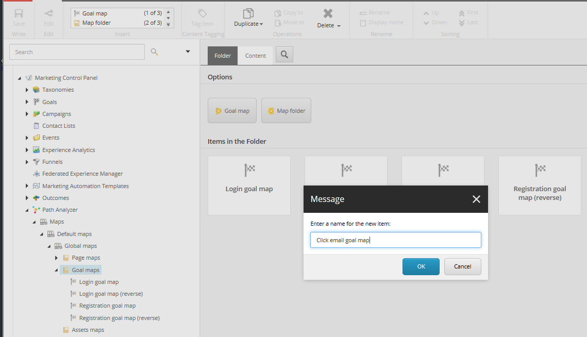
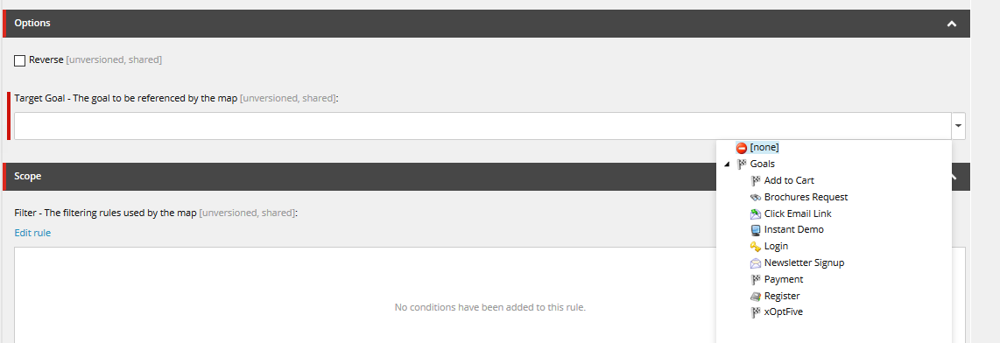
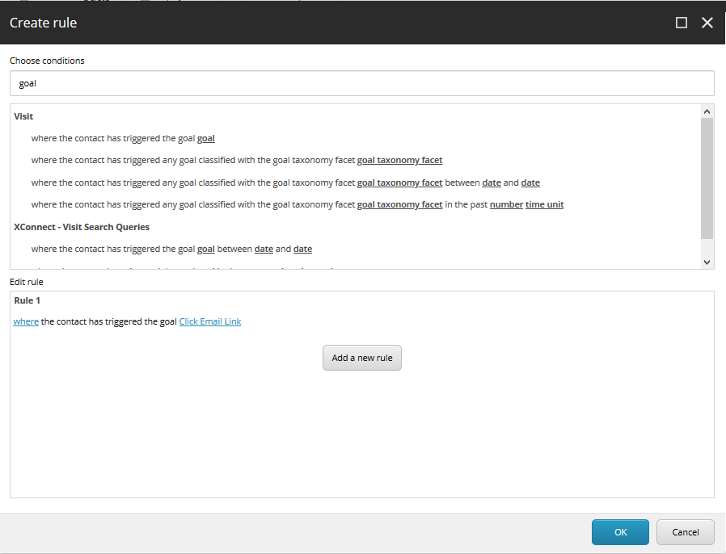

######################################################
新しいPath アナライザーマップの作成と設定
######################################################

この手順では、マーケティング・コントロール・パネルのデフォルトのマップ・タイプの 1 つに基づいて新しい Path Analyzer マップを作成し、特定のタイプの訪問のみを含めるようにマップを設定する方法について説明します。

新しいマップを作成するには、以下の手順に従います。

1. コンテンツ ツリーの [マーケティング コントロール パネル] で、[Path Analyzer] ノードを展開します。

2. [マップ] ノードを展開し、[既定のマップ] をクリックします。[グローバル マップ] ノードを展開し、作成する :doc:`マップの種類 <path-analyzer-map-types>` のフォルダを選択します。

3. フォルダを選択したら、[ホーム] タブの [挿入] グループで、作成するマップの種類 (目標マップなど) をクリックします。メッセージ] ダイアログ ボックスで、マップの名前を入力してから [OK] をクリックします。

4. 右ペインの [コンテンツ] タブの [オプション] セクションで、[ターゲット ゴール/アセット/キャンペーン/アウトカム/チャンネル] フィールドをクリックします。これにより、コンテンツ ツリー ディレクトリが開きます。新しいマップに関連付けるアイテムをクリックします。

.. note:: すべてのマップにオプション セクションがあり、アイテムをマップに関連付けることができるわけではありません。

5. [コンテンツ] タブの [スコープ] セクションで [ルールの編集] をクリックして、[ルール セット エディタ] を開きます。ルール セット エディタ] ダイアログ ボックスで、エクスペリエンス マップに関連付けるルールを選択します。ルールのアクションと条件を設定したら、[OK] をクリックします。この例では、[電子メール リンクをクリック] ゴールが新しいマップに関連付けられています。

6. 新しいマップを配置するには、[レビュー] タブの [ワークフロー] グループで [配置] をクリックしてから [保存] をクリックします。

.. note:: ワークフロー プロセスを使用して新しいマップを展開します。新しいマップを配置すると、そのマップは xDB 内のシステム キューに入ります。システムは 24 時間ごとに新しいマップを処理するため、複数の新しいマップがある場合は、[ワークボックス] 内の [デプロイ] アクションを使用して、それらを同時にデプロイする必要があります。24 時間経過しても新しいマップのデータが表示されない場合は、Sitecore システム管理者にお問い合わせください。

.. tip:: 英語版 https://doc.sitecore.com/users/93/sitecore-experience-platform/en/create-and-configure-a-new-path-analyzer-map.html
