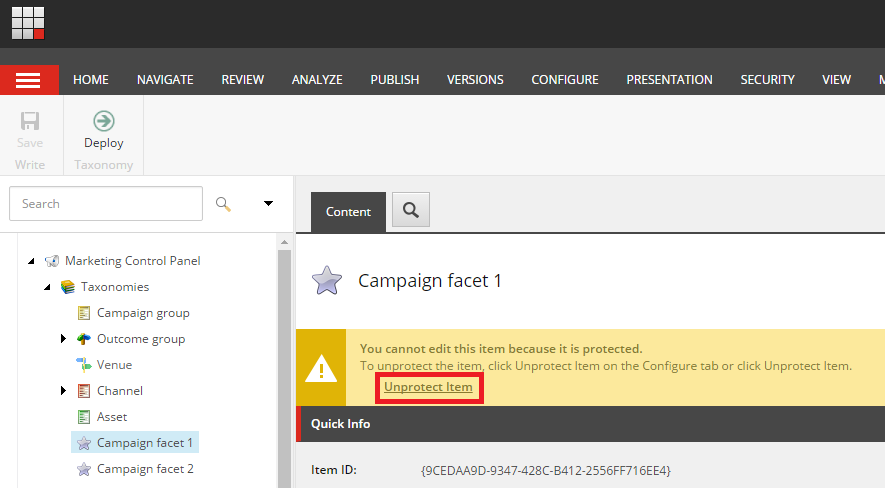
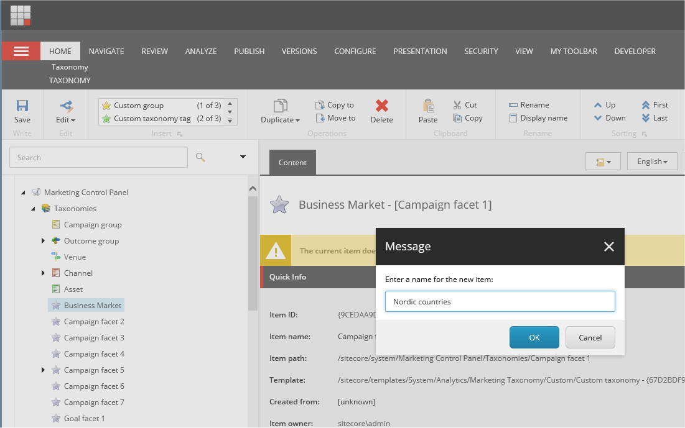
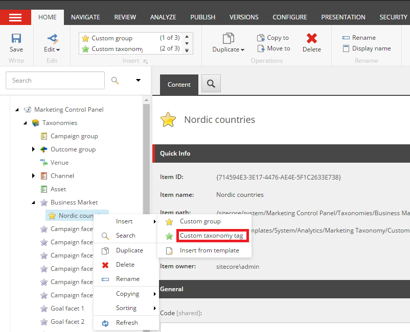
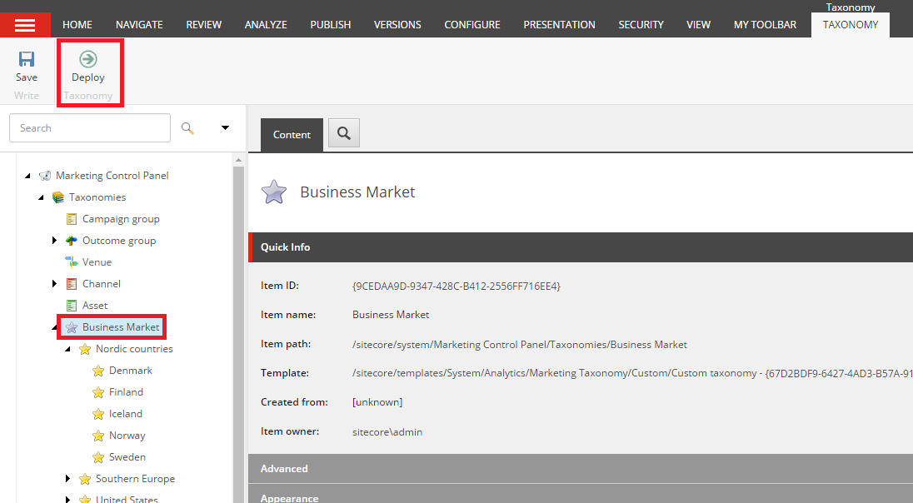

##############################################
カスタムマーケティングタクソノミーの作成と実装
##############################################

Sitecore Experience Platformでは、タクソノミーとはアイテムを整理するための方法です。タクソノミータグを適用して、キャンペーン、参照チャネル、その他のマーケティング活動に関する情報を識別します。これにより、さまざまなマーケティング活動間の関係性を特定して追跡することができ、キャンペーンの効果やコンタクト先がブランドとどのように相互作用しているかについて、より深い洞察を得ることができます。

Sitecore XPにはチャネル、キャンペーン、アセットのタクソノミーが含まれていますが、ビジネスニーズに基づいてカスタムマーケティングタクソノミーを定義することもできます。異なるビジネス市場、ビジネスユニット、地理的ユニット、組織内の個々のブランドなどを識別するカスタムタクソノミーを作成することができます。

************************************************
カスタムマーケティングタクソノミーを作成する
************************************************

カスタムマーケティングタクソノミーを作成するには

1. マーケティングコントロールパネルのコンテンツツリーで、タクソノミーノードを展開し、使用するタクソノミーを選択します。

   例えば、[キャンペーンファセット1]を選択します。

2. コンテンツ領域の警告で、[アイテムの保護解除]をクリックして、タクソノミーのアイテムを編集できるようにします。

.. note:: 特定のアクセス権を持つユーザーのみがアイテムの保護を解除することができます。

3. [ホーム] タブで [表示名] をクリックし、新しいタクソノミーに名前を付けて [OK] をクリックします。
4. アイテムを再び保護するには、[構成] タブをクリックし、[属性] グループで [アイテムの保護] をクリックします。
5. 保存をクリックします。

************************************************************
新しいタクソノミーグループと新しいタクソノミータグを作成する
************************************************************

マーケティングタクソノミーを作成したら、独自のタクソノミーグループとタグを作成することができます。

新しいタクソノミーグループとタグを作成するには、以下の手順に従います。

1. マーケティングコントロールパネルのコンテンツツリーで、前の手順で名前を変更したタクソノミーを選択します（例：ビジネスマーケットタクソノミー）。
2. [ホーム] タブの [挿入] グループで、[カスタム グループ] をクリックします。
3. 表示されるメッセージダイアログボックスで、新しいタクソノミーグループの名前を入力して、[OK]をクリックします。

4. [保存] をクリックして、新しいタクソノミーグループを保存します。
5. 新しいタクソノミータグを作成するには、コンテンツツリーで、新しいタグが属するタクソノミーグループを右クリックし、[挿入]をクリックし、[カスタムタクソノミータグ]をクリックします。

6. [メッセージ］ダイアログボックスで、タグの新しい名前を入力し、［OK］をクリックします。
7. [保存] をクリックして、新しいタクソノミータグを保存します。

*****************************************
マーケティングタクソノミーを展開する
*****************************************

新しいマーケティングタクソノミーを作成し、既存のタクソノミーに新しいタグを追加する場合は、新しいタクソノミーのタグにキャンペーンの関連付けを開始する前に :doc:`タクソノミーを展開 <deploy-marketing-definitions-and-taxonomies>` する必要があります。

マーケティング タクソノミーを展開するには

1. コンテンツ ツリーで、新規または変更したタクソノミーのルート ノード、例えばビジネス マーケット タクソノミーを選択します。
2. タクソノミータブで、デプロイをクリックします。

カスタムタクソノミーを展開したら、新しいタグをキャンペーンに適用することができます。これにより、キャンペーンを分類し、エクスペリエンスアナリティクスでキャンペーンの側面をトラッキングすることができます。

.. tip:: https://doc.sitecore.com/users/93/sitecore-experience-platform/en/create-and-implement-a-custom-marketing-taxonomy.html

