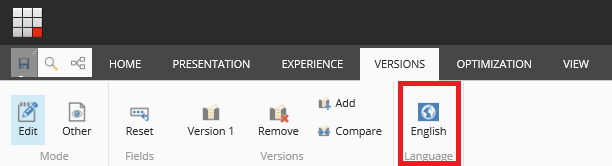
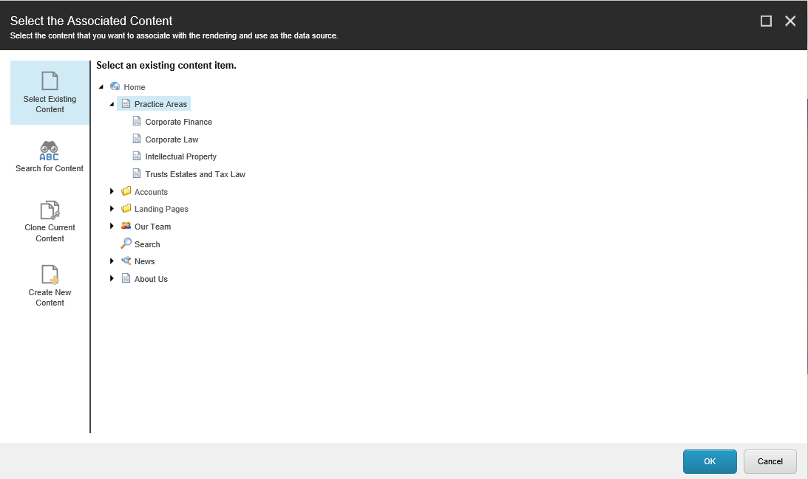
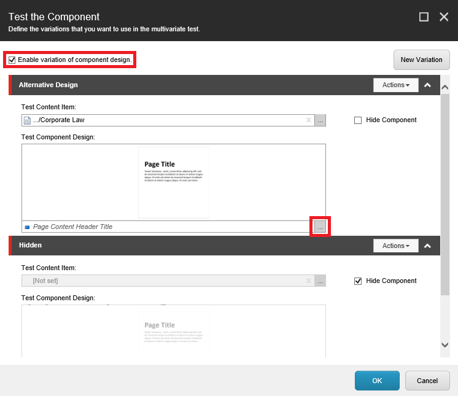

######################################################
コンポーネントのバリアントを作成する
######################################################

コンポーネントテストでは、ウェブサイトのコンテンツの代替的な組み合わせをテストして、どのコンポーネントやコンポーネントの組み合わせが訪問者に最も効果的であるかを調べることができます。テスト結果を素早く評価して、訪問者に最も効果的なコンテンツを把握することができます。これにより、目標コンバージョン率の高いキャンペーンをより成功させることができます。

テストが終了したら、各テストのバリエーションとその横にある累積値を見て、勝利したコンテンツを選ぶことができます。

このトピックでは、その方法について説明します。

:doc:`コンポーネントをパーソナライズ <walkthrough--personalizing-components>` して、パーソナライズされたコンポーネントをコンポーネントテストに含めることもできます。

*******************************************************
コンポーネントの新しいバリエーションを作成する
*******************************************************

Web サイトにコンポーネントの新しいバリエーションを作成するには、次の手順に従います。

1. エクスペリエンス エディタの [バージョン] タブで、テストを作成する言語バージョンを選択します。

.. important:: コンポーネント・テストを実行するときは、一度に1つの言語バージョンでのみテストを実行する必要があります。複数の言語で同じテストを同時に実行する場合、最初に勝者として選択したバリエーションは、テストを実行したすべての言語バージョンでも勝者として選択されます。

2. テストするWebサイトのコンポーネントを選択し、フローティング ツール バーで、[Test the Component |icon1| ]をクリックします。

3. コンポーネントのテスト]ダイアログ ボックスで、新しいテスト バリエーションを作成するには、[新しいバリエーション]をクリックします。

    .. image:: images/15ed64a24c3c35.png
        :align: center
        :width: 400px
        :alt: コンポーネントの新しいバリエーションを作成する

4. バリエーション名を、追加するテスト・バリエーションの名前に置き換えます。

これで、コンテンツ・テストを開始する前に、新しいバリエーションの内容とデザインを指定できるようになりました。

************************************
バリエーションの内容を指定する
************************************

新しいテスト バリエーションの内容を指定するには

1. コンテンツ ツリー内の既存のコンテンツを参照するには、[テスト コンテンツアイテム] フィールドで、[参照 |icon2| ] をクリックします。

2. 関連付けられたコンテンツの選択 ダイアログ ボックスが表示されます。

    * Sitecore コンテンツ ツリー内のアイテムを参照するには、「既存のコンテンツの選択 |icon3| 」をクリックします。
    * テストに追加するアイテムを検索するには、Search for Content |icon4| をクリックします。
    * 既存のアイテムを複製してから編集するには、[現在のコンテンツの複製 |icon5| ]をクリックします。
    * 新しいコンテンツアイテムを挿入するには、[新しいコンテンツの作成] |icon6| をクリックします。

3. 使用するコンテンツを選択したら、[OK]をクリックします。

.. note:: または、ページ上のコンポーネントを非表示にするには、「コンポーネントを隠す」を選択します。

*************************************
バリエーションのデザインを指定する
*************************************

新しいバリエーションのレンダリングを選択するには

1. コンポーネントのテスト]ダイアログボックスで、コンポーネントのデザインをテストするために、[コンポーネントのデザインのバリエーションを有効にする]チェックボックスを選択します。
2. コンポーネントのデザインのテスト] フィールドで、[参照 |icon7| ] をクリックして、別のレンダリングを選択します。

*************************************
新しいバリエーションを保存
*************************************

テストに含めるすべてのバリエーションを追加したら、テストを開始する前に変更内容を保存しておく必要があります。

1. コンポーネントのテストダイアログボックスで、OKをクリックします。
2. 変更を保存します。

これで、:doc:`コンテンツテストを開始 <preview-and-start-a-content-test>` する準備が整いました。

.. tip:: 英語版 https://doc.sitecore.com/users/93/sitecore-experience-platform/en/create-variants-of-a-component.html