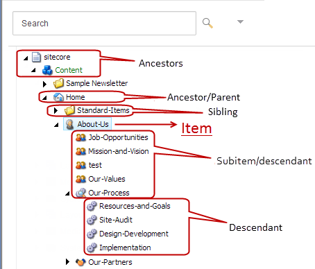

####################################
アイテムの作成と編集
####################################

アイテムは、Sitecoreウェブサイトの基本的な構成要素です。アイテムは、テキスト、メディアファイル、レイアウトなど、ウェブページを構成するあらゆる種類の情報を表すことができます。

アイテムは常に名前と、そのアイテムを一意に識別するIDを持ち、アイテムに含まれるフィールドを定義するテンプレートに基づいています。また、アイテムは複数のバージョンと複数の言語バージョンを持つことができます。

アイテムの編集、作成、挿入は、コンテンツ エディタまたはエクスペリエンス エディタを使用して行うことができます。

* コンテンツ エディタでは、ウェブサイト上のすべてのアイテムがコンテンツ ツリーに格納され、階層内の特定のアイテムに移動することができます。

   * コンテンツ ツリーでは、アイテムと関連するアイテムの関係は以下の通りです。
   * 親 - アイテムの真上にあるアイテム
   * シブリング - アイテムと同じレベルのアイテム
   * 小アイテム - アイテムの直下にあるアイテム
   * 祖先 - アイテムの上にあるすべてのアイテム
   * 子孫 - アイテムの子孫となるすべてのアイテム

* :doc:`the-experience-editor` では、ウェブサイト上で見たままのアイテムが表示されます。エクスペリエンス エディターはWYSIWYG（What You See Is What You Get）エディタで、ページ上のアイテムを直接編集することができます。

.. note:: Sitecoreでアイテムを作成したり編集したりする方法は、セキュリティ設定やWebサイトの設定方法によって異なります。

コンテンツエディタとエクスペリエンス エディターの両方で、アイテムを編集するには、アイテムが編集状態になっていなければなりません。アイテムの編集を開始する前にアイテムをロックすることで、他のコンテンツ作成者が同時にアイテムの編集を行わないようにすることができます。

.. tip:: 英語版 https://doc.sitecore.com/users/93/sitecore-experience-platform/en/creating-and-editing-items.html

.. toctree::
    :hidden:
    :maxdepth: 1
    
    create-an-item-in-the-content-editor
    create-a-page-in-the-experience-editor
    copy-or-duplicate-an-item
    editing
    linking
    versioning