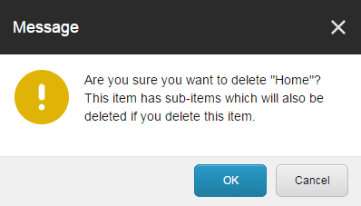
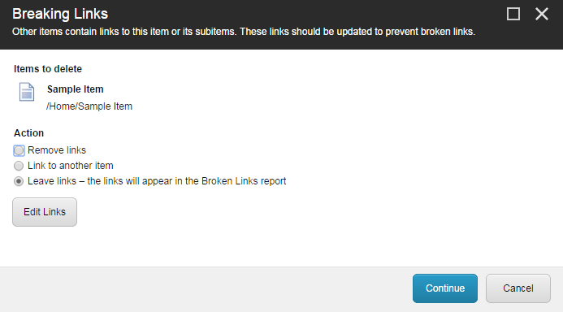
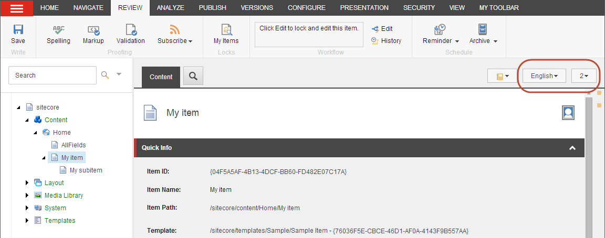
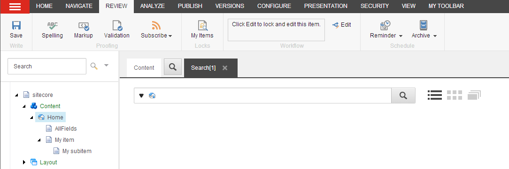
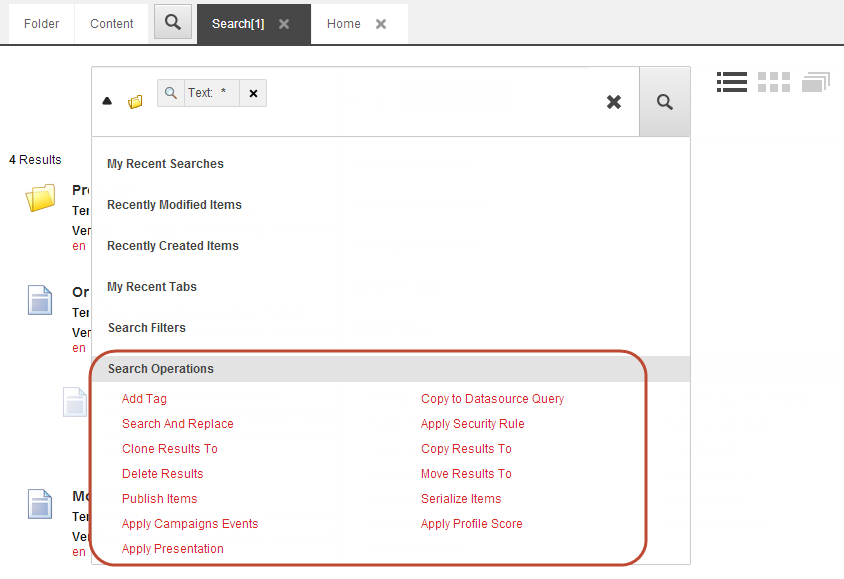

#########################################
アイテムを削除する
#########################################

必然的に、コンテンツのアイテムを削除する必要があります。コンテンツ エディタまたはエクスペリエンス エディタでは、アイテムとそのすべてのバージョンとサブアイテムを削除することも、アイテムの単一バージョンを削除することもできます。

.. note:: 

    ウェブサイトから一時的にアイテムを削除したい場合は、 :doc:`アイテムをアーカイブ <archive-and-restore-an-item>` ) することができます。アイテムをアーカイブすると、削除されるのではなく、コンテンツ ツリーの外に保存されます。アーカイブされたアイテムはいつでも復元できます。

    アイテムを削除すると、そのアイテムはごみ箱に移動します。ごみ箱からアイテムを doc:`復元したり、永久に削除したり <restore-or-remove-a-deleted-item>` することができます。

************************************************
アイテム、そのサブアイテム、バージョンを削除する
************************************************

アイテムとそのすべてのサブアイテムとバージョンを削除するには、次の手順に従います。

1. コンテンツ エディタまたはエクスペリエンス エディタで、削除する項目またはページに移動します。

  * コンテンツ エディタの [ホーム] タブの [操作] グループで [削除] をクリックします。または、コンテンツ ツリーでアイテムを右クリックし、[削除] をクリックすることもできます。
  * エクスペリエンス エディタの [ホーム] タブの [編集] グループで [ページの削除] をクリックします。

2. アイテムにサブアイテムが含まれている場合は、そのアイテムにサブアイテムが含まれていることと、そのアイテムも削除されることを知らせるメッセージが表示されます。

* サブアイテムを保存するには、[キャンセル] をクリックして別の場所に移動します。
* アイテムとそのサブアイテムを削除するには、[OK] をクリックします。これにより、すべての言語のアイテムのすべてのバージョンが削除されます。

**********************
リンク切れを扱う
**********************

削除する項目へのリンクがある場合は、リンクの解除ダイアログボックスが開きます。

すべてのリンクに適用するオプションを選択することができます。必要に応じて、リンクを個別に処理し、残りのリンクに 1 つのオプションを適用することもできます。

1. リンク切れのリストを開くには、リンク切れダイアログ ボックスで [リンクの編集] をクリックします。

2. 各リンクに対して、以下のことができます。

  * リンクを含む項目の編集
  * リンクの削除
  * 他の項目へのリンク

.. note:: リンクを個別に処理しない場合は、まとめて処理するためにリストに残っています。

3. 他のアイテムへのリンクを選択した場合は、［リンク］ダイアログで、リンク先のアイテムをクリックします。リンクを更新するには、[OK] をクリックします。

4. [リンクの編集] ダイアログ ボックスで [閉じる] をクリックします。

5. リンクの削除ダイアログで、以下のオプションのいずれかを選択して、残っているリンクに適用します。

  * リンクを削除 - このページに存在するすべてのリンクを削除します。
  * 別の項目へのリンク - このページへのすべてのリンクを別の項目へのリンクに変更します。
  * リンクを残す - このページに壊れたリンクを残します。後日、アイテムを復元した場合、リンクは復元されます。

6. 続行をクリックしてください。

***************************************
アイテムの単一バージョンを削除する
***************************************

アイテムの複数の異なるバージョンを作成している場合、そのアイテムや他のバージョンまたはサブアイテムを削除せずに、そのアイテムの個々のバージョンを削除することができます。

アイテムのバージョンを削除するには

1. コンテンツ ツリーで、削除するバージョンを持つアイテムを探します。
2. アイテムが複数の言語またはバージョンで利用できる場合。

  * [言語] ボタンの |icon1| をクリックして、削除する言語のバージョンを選択します。

* バージョン」ボタン |icon2| をクリックし、削除するバージョンを選択します。

3. バージョン] タブの [バージョン] グループで [削除] をクリックします。選択したバージョンが削除されます。

***************************************
複数の項目を削除する
***************************************

コンテンツエディタでは、Sitecoreの検索機能を利用して、複数のアイテムを同時に削除することができます。

複数のアイテムを検索して削除するには

1. コンテンツエディタで、削除したいアイテムを探して選択します。
2. [検索」タブをクリックし、「検索」フィールドに削除したい項目の検索キーワードを入力します。

3. 必要な検索ファセットまたはフィルタを使用して検索を絞り込み、削除する項目のみが検索結果に表示されるようにします。
4. 検索フィールドの左側にあるドロップダウン矢印 |icon3| をクリックし、[検索操作]をクリックし、[結果の削除]をクリックします。

.. warning:: 

    結果の削除をクリックすると、結果の項目は警告も確認もなく削除されます。しかし、項目を削除して後悔した場合は、:doc:`Sitecore のゴミ箱を開いて <restore-or-remove-a-deleted-item>` 、削除した項目を復元することができます。

.. tip:: 英語版 https://doc.sitecore.com/users/93/sitecore-experience-platform/en/delete-an-item.html
