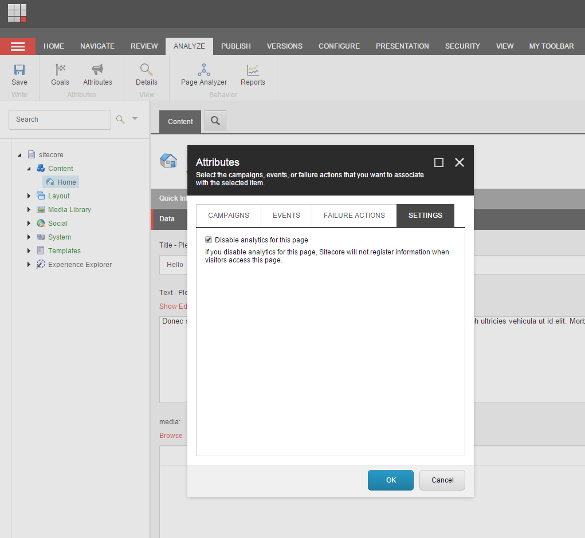

####################################
アイテムのアナリティクスを無効にする
####################################

Analytics属性を使用すると、エクスペリエンス アナリティクスで特定のアイテムのユーザー アクティビティに関するデータを表示できます。アナリティクスは、アイテムのデフォルトで有効になっていますが、コンテンツエディタでアナリティクスの設定をオフにすることができます。これは、例えば、訪問者を自動的に別のアイテムにリダイレクトするアイテムがある場合に便利です。そのようなアイテムをレポートやセッショントレイルに表示したくない場合があります。

アイテムの分析を無効または有効にするには、以下の手順に従います。

1. コンテンツ エディターで、コンテンツ ツリーを展開し、分析設定を変更するコンテンツアイテムに移動します。

2. リボンで、[分析] タブの [属性] グループで、[属性] をクリックします。

3. 属性ダイアログで、設定タブをクリックして、この設定をコンテンツアイテムに割り当てるために、このアイテムのアナリティクスを無効にするチェックボックスを選択またはクリアします。

   Disable Analytics for this Itemを選択すると、そのアイテムは訪問者のセッショントレイルやSitecoreのその他のレポートに表示されなくなります。

4. OKをクリックして変更を保存し、Attributesダイアログを閉じます。

.. tip:: 英語版 https://doc.sitecore.com/users/93/sitecore-experience-platform/en/disable-analytics-on-an-item.html