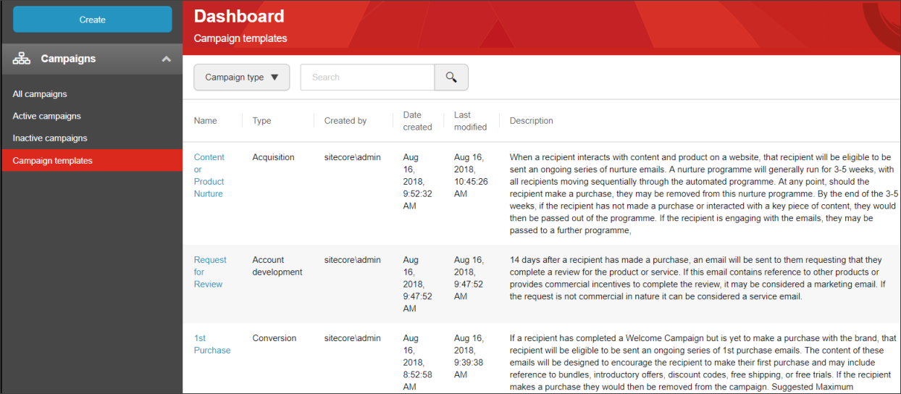

################################################
マーケティングオートメーションキャンペーンの編集
################################################

自動化キャンペーンは、非アクティブなときとアクティブなときに編集することができます。しかし、アクティブなキャンペーンを編集する場合、コンタクトが処理され、キャンペーンを通して移動されている間にキャンペーンを変更するリスクがあります。これは、キャンペーンの正確なレポートを表示したり、連絡先が意図した経験を持つことを保証したりするなどの問題を引き起こす可能性があります。

.. important:: 有効化された後、連絡先が登録された後にキャンペーンを編集したい場合は、キャンペーンをコピーして、関連する変更を加えた新しいキャンペーンを作成するのが最善の方法です。

マーケティングオートメーションキャンペーンを編集するには

1. マーケティングオートメーションのダッシュボードで、編集したいキャンペーンに移動します。
2. キャンペーンを開くには、名前をクリックします。
3. キャンバス上で、キャンペーンの要素に関連する変更を行います。

    * 特定の要素の詳細を編集するには、要素をクリックして、キャンバスの右にある詳細ペインで変更を行います。変更を保存するには、[適用]をクリックします。
    * キャンペーンに新しい要素を追加するには、ツールボックスペインから関連する要素をドラッグ＆ドロップします。

    .. tip:: キャンペーンを2つのパスに分割する要素、例えば決定点などを追加すると、新しい要素の下にある既存の要素をどちらのパスに配置すべきかを尋ねる通知が表示されます。

    * 要素を削除するには、要素の上にマウスポインタを移動し、表示される削除アイコンをクリックします。

    .. note:: キャンペーンを2つのパスに分割する要素を削除すると、どちらのパスを削除するかを尋ねる通知が表示されます。リスナーからのパスに決定ポイントが添付されている場合、リスナーからのすべてのパスが削除されます。

4. 自動化キャンペーンがキャンバスに対して大きすぎる場合、自動化キャンペーンをキャンバス上で移動したり、ズームインまたはズームアウトしたり、ツールボックスペインを非表示にしたりして、キャンペーンで作業するためのスペースを確保することができます。

5. アクションメニューからは、以下のことができます。

    * 名前、説明、開始日と終了日などのキャンペーンの詳細を表示または編集します。
    * キャンペーンの有効化/無効化。
    * キャンペーン全体を削除する。
    * キャンペーンをコピーして新しいキャンペーンを作成する。
    * キャンペーンに行った変更を元に戻す/やり直す。

.. note:: アクションの横にある星印をクリックすると、リボンに直接表示されます。

6. [保存] をクリックして変更を保存します。

.. tip:: https://doc.sitecore.com/users/93/sitecore-experience-platform/en/edit-a-marketing-automation-campaign.html
