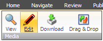
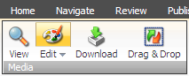
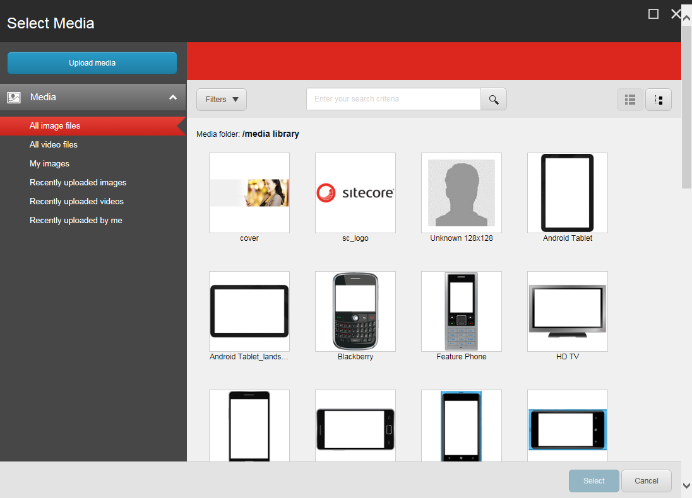
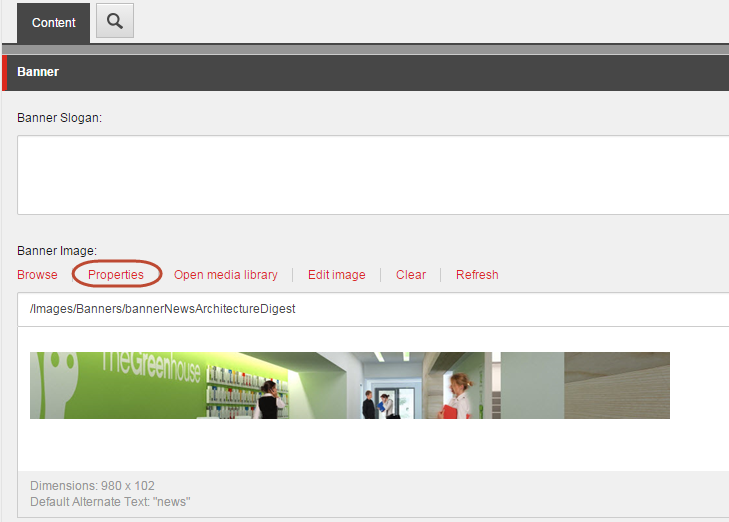
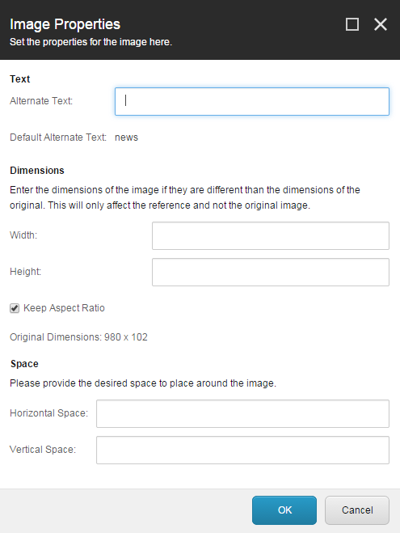
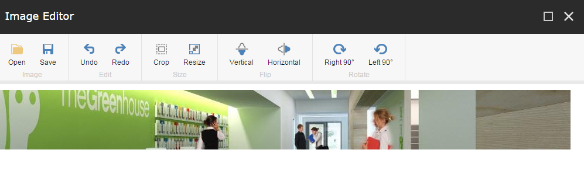

###########################################
メディアアイテムの編集
###########################################

メディアライブラリでは、画像用のイメージエディタなどのSitecoreツールや、ドキュメント用のMicrosoft Wordや画像用のPhotoshopなど、コンピュータにインストールされている他のアプリケーションを使用して、画像やドキュメント、ビデオなどのメディアアイテムを編集することができます。

****************************************************
メディア ライブラリからメディア アイテムを編集する
****************************************************

メディア ライブラリからメディア アイテムを編集するには

1. `メディア ライブラリ <the-media-library>`_ で、編集するアイテムに移動します。
2. [メディア] タブの [メディア] グループで [編集] をクリックします。選択したメディア アイテムの種類に応じて、アイコンが変わります。たとえば、次のようになります。

  * メディア アイテムが Word ドキュメントの場合、関連するアイコンとして鉛筆が表示されます。これにより、Microsoft Word でドキュメントが開きます。

メディアアイテムが画像の場合は、アーティストパレットが表示されます。これは、Sitecore Image Editorで画像を開きます。

3. メディア アイテムの編集が終わったら、変更内容を保存してエディタを閉じます。
4. メディアライブラリで、[保存] をクリックします。

*************************************
画像エディタから画像を開いて編集する
*************************************

画像エディタで編集用の画像を開くには

1. Sitecore のスタートメニューをクリックします。
2. すべてのアプリケーション」をクリックし、「イメージエディタ」をクリックします。
3. イメージエディタのリボンで、「Open」をクリックします。
4. メディアの選択ダイアログボックスで、編集したい画像を選択し、選択をクリックします。
   左メニューから編集する画像を見つけるか、フィルタや検索機能を使用することができます。または、[メディアをアップロード] をクリックして新しい画像をアップロードすることもできます。

**********************************
画像フィールドで画像を編集する
**********************************

画像フィールドで画像を編集するには

1. コンテンツエディタまたはエクスペリエンスエディタで、編集したいアイテムまたはページに移動します。画像のプロパティを編集するには

  * コンテンツ エディタの [コンテンツ] タブで、画像を含むフィールドまでスクロールして [プロパティ] をクリックします。

エクスペリエンス エディタで、編集する画像をクリックし、表示されるフローティング ツールバーで、[画像の外観の変更 |icon1| ]をクリックします。

2. 画像のプロパティダイアログボックスで、以下のアイテムを変更します。

  * 代替テキストフィールド - 画像が表示できないときに表示されるテキストを入力します。
  * 寸法のセクション - 画像の実際のサイズと異なる場合は、画像を表示する寸法を指定します。
  * スペースセクション - 画像の周りにどのくらいのスペースを置くかを指定します。

3. 画像自体を編集するには、画像エディタで画像を開いて、画像の切り抜き、サイズ変更、反転、回転を行う必要があります。画像エディタを開くには

  * コンテンツ エディタの [コンテンツ] タブで、画像を含むフィールドまでスクロールし、[画像の編集] をクリックします。

* エクスペリエンス エディタで、編集する画像をクリックし、表示されるフローティング ツールバーで [詳細] をクリックして、関連するアイテムを編集します。コンテンツ エディタでアイテムが開き、画像を含むフィールドまでスクロールして、[画像の編集] をクリックします。

.. note:: また、ローカルコンピュータで利用可能な画像エディタを使って画像を編集することもできます。

4. 画像の編集が終わったら、変更内容を保存します。
5. 画像の変更点を確認するには
   * コンテンツ エディタで、変更内容を保存します。
   * エクスペリエンスエディタで、システムメニューの |icon2| をクリックし、「終了」をクリックしてエクスペリエンスエディタに戻ります。

.. important:: あなたが行った変更はすべて、メディアライブラリに保存されている画像のバージョンに適用され、Webページに表示されているコピーだけには適用されません。

.. tip:: 英語版 https://doc.sitecore.com/users/93/sitecore-experience-platform/en/edit-a-media-item.html

