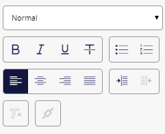

#######################################################
Horizon エディタでリッチ テキスト フィールドを編集する
#######################################################

Horizon エディタでページ上のリッチ テキスト フィールドを選択すると、リッチ テキストの書式設定ツールが右側のペインに表示されます。

.. note:: あなたのウェブサイトのスタイルシートやテンプレートは、どのようなフォーマットやスタイルを適用できるかを決定します。

段落にスタイルを適用するには

* 段落をクリックし、[スタイル] フィールドのドロップダウン メニューからスタイルを選択します。

段落に整列、箇条書き、番号付けなどの書式設定を適用するには、次の手順に従います。

* 段落をクリックしてから、右側のペインで該当するボタンをクリックします。

テキストに太字や斜体などのフォント形式を適用するには。

* フォーマットするテキストを選択してから、右側のペインの該当するボタンをクリックします。

書式を削除するには。

* フォーマットされたテキストを選択し、[フォーマットの削除] |icon1| をクリックします。

リッチ テキスト フィールドにリンクを作成することもできます。 

.. tip:: 英語版 https://doc.sitecore.com/users/93/sitecore-experience-platform/en/edit-a-rich-text-field-in-the-horizon-editor.html