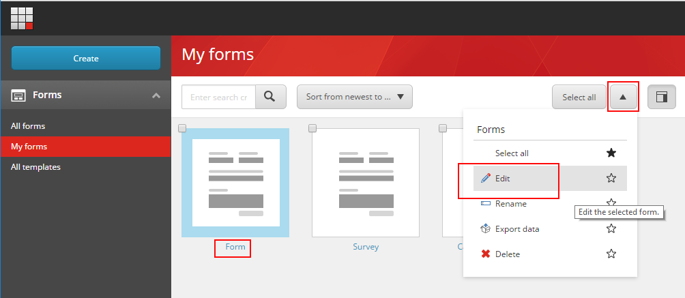
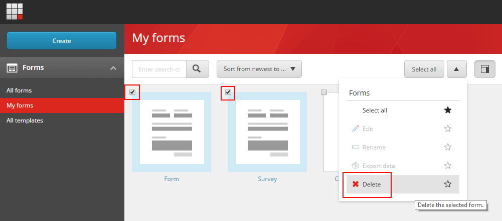

################################
フォームの編集と削除
################################

Webサイトの訪問者に関する情報を収集するためにフォームを使用します。Sitecore Forms アプリケーションを使用すると、フォームを素早く作成することができます。いつでもフォームを編集することができます。時には、フォームを削除したい場合もあるでしょう。

********************
フォームの編集
********************

フォームの名前、フォームフィールド、スタイルはいつでも変更できます。

既存のフォームを編集するには

1. フォーム ダッシュボードで、[すべてのフォーム] または [自分のフォーム] をクリックして、編集するフォームをクリックします。
2. 編集用のフォームを開くには、タイトルをクリックするか、ドロップダウン矢印をクリックしてから、[編集] をクリックします。

.. note:: Webページで使用しているフォームを編集した場合、変更内容を確認するためには、その項目をSitecoreでリパブリッシュする必要があります。

********************
フォームの削除
********************

必然的に、時々フォームを削除したくなります。

.. note:: Web ページで使用されているフォームや参照されているフォームを削除することはできません。

既存のフォームを削除するには

1. フォーム ダッシュボードで、[すべてのフォーム] または [マイフォーム] をクリックして、削除するフォームをクリックします。

   .. note:: 複数の帳票を同時に削除するには、左上で削除する帳票を選択します。

2. ドロップダウン矢印をクリックし、[削除]をクリックします。

3. OKをクリックすると確認メッセージが表示されます。

.. tip:: https://doc.sitecore.com/users/93/sitecore-experience-platform/en/edit-and-delete-a-form.html

