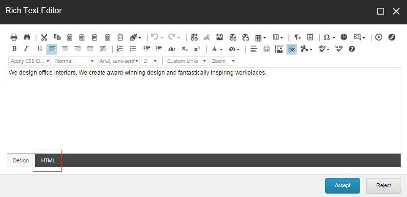

###################################################
ウェブサイトの内容を編集する
###################################################

リッチ テキスト フィールドでコンテンツを編集する場合は、リッチ テキスト エディタまたは Microsoft Word の高度な編集機能を利用することができます。

.. note:: 最小限の編集機能であれば、リッチテキストフィールドを項目やページ上で直接編集することができます。

***********************
リッチテキストエディタ
***********************

リッチテキストエディタは、Sitecoreの標準的なテキストエディタです。このエディタでは、リッチテキストフィールド内のすべてのコンテンツを編集することができます。

リッチテキストエディタでは、以下のことができます。

* Microsoft Wordからテキストを貼り付ける。
* テキストを検索して置き換える。
* 画像や他のメディアアイテムを挿入する。
* ウェブサイトの他の部分や外部のウェブサイトへのリンクを挿入したり削除します。
* 記号を挿入する。

.. note:: リッチテキストエディタは標準的なワープロツールですが、Sitecoreでは、Webサイトのスタイルシートやテンプレートでコンテンツ作成者が作成・編集する項目のフォーマットが決まるため、フォーマット機能のほとんどが削除されています。

**********************************
リッチテキストフィールドの編集
**********************************

コンテンツ エディタまたはエクスペリエンス エディタでテキスト フィールドを編集するには、次の手順に従います。

1. コンテンツエディタまたはエクスペリエンスエディタで、編集したい項目またはページに移動します。アイテムの関連するバージョンと言語を選択してください。

2. リッチエクステンドエディタを開くには

  * コンテンツエディタから - コンテンツエリアで、編集するリッチテキストフィールドを探して、[エディタを表示]をクリックします。
  * エクスペリエンスエディタで、編集するフィールドをクリックし、表示されるフローティングツールバーで、[テキストの編集]をクリックします（DE6E2B5C5398474A9665DD72DAEAFB5B.png）。

.. note:: アイテムの異なるバージョン間で共有されているフィールドを編集できます。リボンの [プレゼンテーション] タブの [レイアウト] グループで [最終レイアウト] をクリックし、ドロップダウン メニューで [共有レイアウト] をクリックします。これにより、アイテムの共有レイアウトがロードされ、共有されている内容を編集することができます。

3. テキスト フィールドの内容を適切に変更します。
   リッチテキストエディタで、HTML形式でコンテンツを編集したい場合は、HTMLをクリックします。

.. note:: Sitecore システム管理者は、利用可能な機能を管理しています。より多くの機能が必要な場合は、管理者に依頼して利用できるようにしてください。

4. コンテンツの編集が終了したら、[承諾] をクリックして変更内容を保存します。

.. tip:: 英語版 https://doc.sitecore.com/users/93/sitecore-experience-platform/en/edit-the-website-content.html
