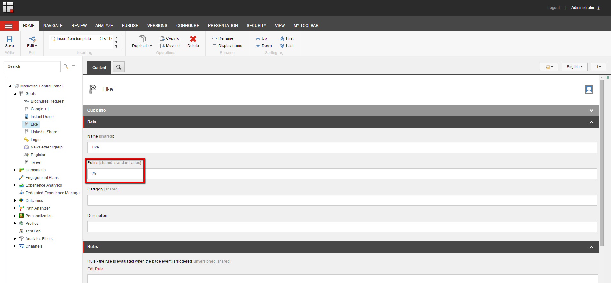

##############################################
エンゲージメントバリューポイント
##############################################

目標の達成やページイベントのトリガーなど、特定のコンタクトアクションや行動をスコア化するために、エンゲージメントバリューポイントを割り当てます。これらのエンゲージメントバリューポイントは、特定のコンタクトアクションに関連付けるビジネス価値とコミットメントのレベルを反映しています。実際の数値は、イベントに割り当てる相対的な価値よりも重要ではありません。エンゲージメント・バリュー・ポイントは、単一または複数のコンタクト・セッションに渡って蓄積されます。

例えば、ニュースレターの登録時にメールアドレスを送信すると、コミットメントのレベルが低いことを示しています。デモをリクエストすることは、より高いレベルのエンゲージメントと信頼を示しているため、このコンタクトアクションは、ニュースレターに登録するよりも高いエンゲージメント価値ポイントを受け取るべきです。

******************************************
エンゲージメントバリューポイントの活用
******************************************

エンゲージメントバリューポイントを使用すると、ウェブサイト全体の相対的な接触エンゲージメントを簡単に測定することができます。エンゲージメントバリューポイントを使用して、以下のことができます。

* 連絡先のパーソナライズルールの作成と実装
* コンタクトが達成したエンゲージメントの価値ポイント数を評価して、どのようなアクションを取るべきかを決定するマーケティングオートメーションキャンペーンを作成する
* エクスペリエンスアナリティクスの長期的なトレンドを見ることで、コンタクトエンゲージメントを生み出すためのキャンペーンの効果を確認することができます。

.. tip:: https://doc.sitecore.com/users/93/sitecore-experience-platform/en/engagement-value-points.html

