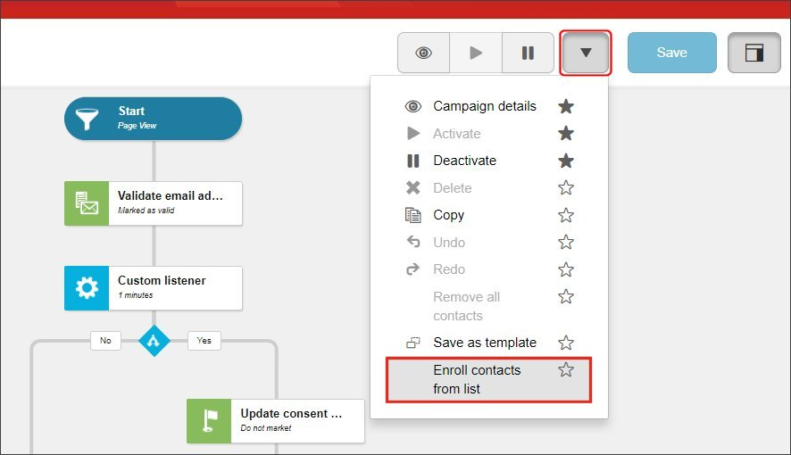

##############################################################################
マーケティングオートメーションキャンペーンでリストから連絡先を登録する
##############################################################################

マーケティングオートメーションキャンペーンに連絡先を追加するプロセスを簡単にするために、リストマネージャーで連絡先のリストを作成し、リストに含まれるすべての連絡先を1つのステップでキャンペーンに登録することができます。

************************************************************************
マーケティングオートメーションキャンペーンに連絡先を登録するには
************************************************************************

マーケティングオートメーションキャンペーンに複数のコンタクトを素早く簡単に登録するには

1. スタート画面でリストマネージャーをクリックし、コンタクトリストを作成します。

   分割されたリストはサポートされていません。

2. スタート画面で、マーケティングオートメーションをクリックします。
3. キャンペーンダッシュボードで、コンタクトを登録するキャンペーンを選択します。
4. Action（アクション）ドロップダウンメニューのコマンドを使用して、キャンペーンを有効にします。
5. 連絡先を登録するには、Actions（アクション）、Enroll contacts from list（リストから連絡先を登録）をクリックします。

6. [リストの選択] ウィンドウで、使用するリストを選択し、[OK] をクリックします。

.. tip:: https://doc.sitecore.com/users/93/sitecore-experience-platform/en/enroll-contacts-from-a-list-in-a-marketing-automation-campaign.html

