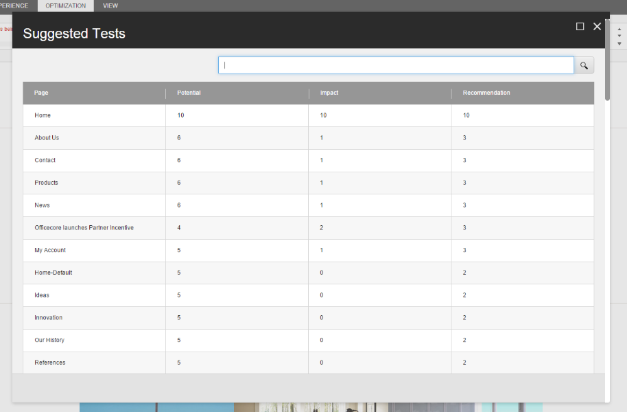
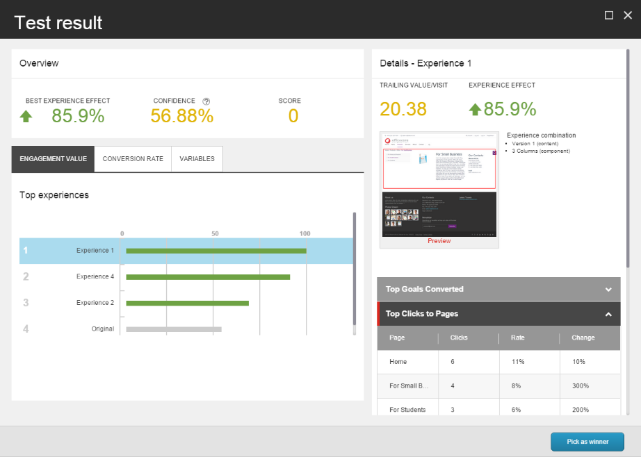
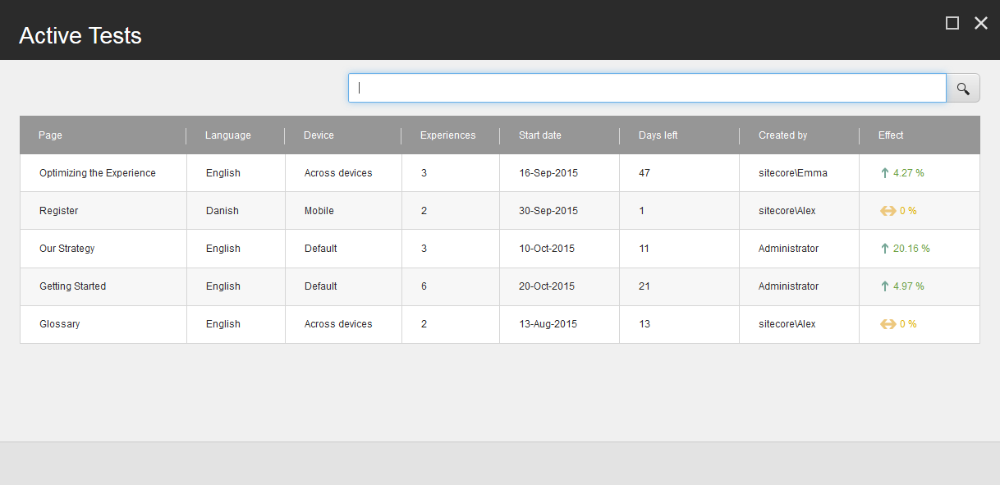

###################################################################
エクスペリエンス オプティマイゼーションとコンテンツテスト FAQ
###################################################################

エクスペリエンス最適化とコンテンツテストを利用したコンテンツテストの作成と実行について、よくある質問をご紹介します。

************************************************************************************************
最適化ウィンドウでは、Suggested Tests とは何を意味し、メトリクスは何を測定するのでしょうか？
************************************************************************************************

Suggested Tests ダイアログには、最も潜在的な価値を得るためにテストすべきページが表示されます。

以下のメトリクスは、1から10の間の正規化されたスコアを使用して、ページをテストするのが良いかどうかを判断します。

* ポテンシャル - どのページがそのページを訪れたユーザーのエンゲージメントを高める可能性が高いかを示すスコアです。
* インパクト - 試験の影響の予想されるレベル
* レコメンデーション - 可能性とインパクトの組み合わせ。これは、レコメンデーションがページの最適化にどれだけ強いかを示しています。

***************************************************************************************************************
エクスペリエンス最適化は、統計的に有意になるまでにテストを実行する時間をどのように計算しているのでしょうか？
***************************************************************************************************************

Sitecore は、テストの検証に必要な訪問者数を計算します。この数は、テストを行うエクスペリエンスの数と、テストの予測される信頼度によって異なります。

テストを開始すると、統計的に有意な結果を得るために必要な訪問者数を確認することができます。ページの過去の訪問者データがある場合は、テストが有効な結果に到達するまでにテストが実行されると予想される日数が表示されます。

先月の履歴データから、テストで有意な結果を得るために必要な訪問数を予測することができます。しかし、ウェブサイトのトラフィックは時間の経過とともに変化するため、予測の精度に影響を与える可能性があります。

この方法は、経験のいずれかがオリジナルよりも有意に良い結果を出したことを検証し、必要な訪問者数に達した場合に勝者を宣言します。

************************************************************************************************************************
テストの終了日に達する前に、テストが統計的に有意になるために必要な訪問者数に達した場合、テストはまだ実行されますか?
************************************************************************************************************************

はい、テストはまだ実行されます。推奨される終了日までテストを実行させるべきです。これにより、テスト結果に影響を与える可能性のある曜日ごとのデータを持っていることが保証され、ウェブサイト上のアクティビティを把握することができます。

テストの終了日を過ぎても統計的に有意な結果が得られない場合、テストは中断されます。

*************************************************************************************************************************************************
Experience Optimization がテストを実行する時間をすでに提案しているのに、なぜ手動でテストの最小と最大の時間を設定しなければならないのでしょうか？
*************************************************************************************************************************************************

Experience Optimization はテストの実行時間を予測していますが、設定ファイルでテストの時間枠を調整したい場合があります。例えば、テスト対象のページへのトラフィックに影響を与えるような大幅な変更をウェブサイトに加えた場合などです。例えば、ページへのトラフィックを増加させるような新しいキャンペーンを追加して、テスト結果に影響を与えることができます。

検索エンジンの中には、無期限にテストされたコンテンツを検索結果に悪影響を及ぼすと解釈するものがあるため、一般的には、テストの最大期間を指定することが最善の方法です。

*****************************************************************
テスト結果の概要のメトリクスについて説明してください。
*****************************************************************

テスト結果の概要では、テストがどのように実行されているかについての情報を提供します。テストのパフォーマンスを把握するための 3 つのメトリクスがあります。それは以下の3つです。

* エクスペリエンス効果 - テスト開始後のエンゲージメント価値の相対的な変化
* 信頼度 - 統計的信頼度
* スコア - 1ヶ月間の効果と訪問数の積

この例では、テストでは85.9%の体験効果があります。これは、コンテンツによって生成されたエンゲージメント価値が、オリジナルよりも85.9%上昇したことを意味します。信頼度は56.88%で、この結果は統計的に有意ではなく、テストが未完成である可能性が高いことを示しています。

***************************************************************************************************************************************************************************************************
エクスペリエンス エディタの [最適化] タブで [アクティブ テスト] を選択すると、テストがどのように実行されているかを確認できます。効果がどのように計算されるか説明していただけますか？
***************************************************************************************************************************************************************************************************

効果は、テストされたコンテンツにさらされたコンタクトのエンゲージメント値がどの程度変化したかを示します。元のバージョンのページのエンゲージメント値が最も高い場合、テストは何も影響を与えていないため、効果スコアは0となります。

******************************************************************************
特定のデバイスでA/Bテストと多変量解析テストを実行できますか？
******************************************************************************

はい。デバイス固有のA/Bテストと多変量テストを作成することができます。ただし、コンテンツ・テストは、関連するすべてのデバイスで実行されます。

***************************************************************************************
1つのページで複数の異なるパーソナライズされたコンポーネントをテストできますか？
***************************************************************************************

はい、可能です。

***************************************************
ワークフローなしでテストを開始できますか？
***************************************************

はい。ワークフローなしでコンポーネントやパーソナライゼーションのテストを開始することができます。組織がウェブサイトのコンテンツやテストを承認するためにワークフローを使用していない場合は、これを行うことをお勧めします。

******************************************************************************************************
Experience Optimizationへのアクセスを提供するさまざまなセキュリティロールがありますか？
******************************************************************************************************

はい。Experience Optimizationには、異なるレベルの機能へのアクセスを提供するいくつかのセキュリティロールがあります。

* オーサリング - テストの作成、実行、編集を可能にします。
  通常、この役割はコンテンツの作成者やマーケッターに割り当てられます。

* Analytics Advanced Testing - オーサリングロールと同じアクセス権に加え、追加のタブとコントロールが含まれています。
  通常、このロールはマーケティングアナリストに割り当てられます。

* Analytics Management Reporting - すべてのコンテンツ テスト ダッシュボードと履歴レポートへのフルアクセスが可能で、テストを作成することはできません。
  通常、このロールはマーケティング担当者に割り当てられます。

管理者は、個々のユーザーにセキュリティロールを追加して、エクスペリエンス最適化にアクセスできるようにすることもできます。

.. tip:: 英語版 https://doc.sitecore.com/users/93/sitecore-experience-platform/en/experience-optimization-and-content-testing-faq.html