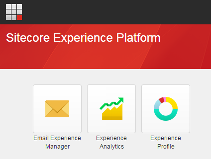
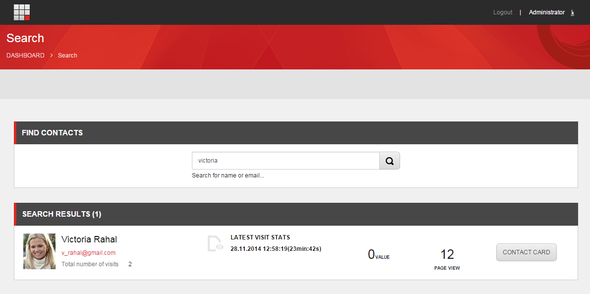
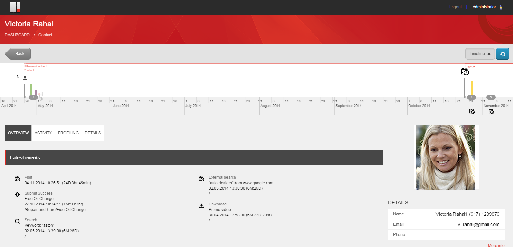
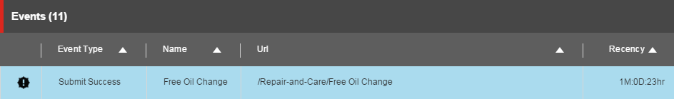
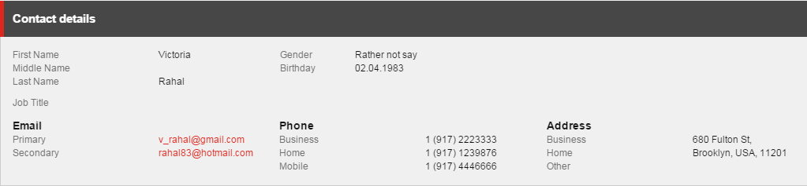

#######################################################
エクスペンスプロフィール カスタマーサービス シナリオ
#######################################################

顧客サービス担当者は、接触者がそのブランドで体験した経験の概要を把握し、電話での問い合わせに対応するために、連絡先情報に素早くアクセスできなければなりません。

この例のシナリオでは、自動車販売会社のカスタマーサービス担当者は、既知の顧客であるヴィクトリア・ラハルから電話で問い合わせを受けます。ビクトリアは、自動車販売会社のウェブサイトで無料のオイル交換オファーにサインアップしたが、確認のメールを受け取ったことがないと言います。今、彼女はサインアップが実際に正常に完了したかどうかを確認したいと考えています。

**********************************************************************************************************************
エクスペリエンスプロファイル（エクスペリエンス・プロファイル）ダッシュボードを開き、名前のついた連絡先を見つける
**********************************************************************************************************************

エクスペリエンスプロファイルを開き、名前のついた連絡先を見つけるには、以下の手順に従います。

1. Webブラウザで、SitecoreウェブサイトのURLを入力します。

2. ログイン資格情報を入力し、「ログイン」をクリックします。

3. 連絡先を検索するには、[エクスペリエンスプロファイル]をクリックします。デフォルトでは、ウェブサイトへの最新の訪問者のリストが表示されます。

4. 連絡先のリストから直接名前を選択することもできますし、検索ボックスを使用して名前やメールアドレスで既知の連絡先を検索することもできます。

5. 例えば、[連絡先の検索] ボックスに Victoria Rahal の名前、メールアドレス、または名前の一部を入力すると、その連絡先が貴社のブランドを利用した経験についての詳細が表示されます。または、連絡先リストに表示されている場合は、その名前をクリックします。

6. 検索結果から該当する連絡先を探し、「コンタクトカード」をクリックすると、この連絡先の xFile が表示されます。

この例では、Victoria Rahalのエクスペリエンスプロファイルが表示されます。デフォルトでは、Overview タブが最初に表示されます。

*************************************************
連絡先がオファーにサインアップしたことを確認する
*************************************************

この例では、連絡先はすでに注文をしているので、顧客とみなされています。顧客からの要求に迅速かつ満足のいく回答ができることが重要です。

顧客の連絡先が正しいことを確認し、システムでオファーイベントが発生したことを確認するには、[詳細] タブをクリックして、連絡先が正しいことを確認します。

1. [詳細] タブをクリックして、連絡先の詳細が正しいことを確認するように連絡先に依頼します。

2. オファー フォームが正常に送信されたかどうかを確認するには、[アクティビティ] タブをクリックし、[訪問] サブタブをクリックして、[イベント] セクションまでスクロールダウンします。 イベント] セクションでは、顧客がオファー（無料のオイル交換など）のリクエスト フォームを正常に送信したかどうかと、それが送信されたのが最近かどうかを確認できます。

*************************************************
顧客にオファーの詳細情報をPDFで送信する
*************************************************

連絡先は、オファーに関する詳細情報（例えば、無料のオイル交換オファーの利用方法など）を尋ねてきます。この情報が記載されたPDFファイルをお持ちなので、このPDFファイルを連絡先の希望するメールアドレスに送信することを説明してください。

連絡先のメールアドレスを見つけて、PDFファイルを送信するには。

1. [詳細]タブで、連絡先にプライマリおよびセカンダリの電子メールアドレスがあることがわかります。プライマリ電子メールアドレスを選択します。

2. デフォルトのメールプログラムが開きます。オファーの詳細が記載されたPDFを添付して、メールメッセージを送信してください。

*************************************************
お客様のつぶやきを見て生年月日を探す
*************************************************

彼女の体験プロフィールを見ていると、顧客がツイッターを使って購入した製品を擁護していることに気づきます。ビクトリアが電話を終える前に、彼女はあなたに、あなたの製品についてもブログを書いていることを伝えます。この良好な関係を維持するために、あなたは彼女の誕生日にプレゼントを贈ることにします。Facebookからのソーシャルネットワークの情報は、彼女の誕生日を見つけるのに役立つかもしれませんし、適切なプレゼントのためのインスピレーションを提供してくれるかもしれません。

.. note:: エクスペリエンスプロファイルで連絡先のソーシャルネットワークデータを表示するには、連絡先からの許可が必要で、ソーシャルコネクテッドモジュールが正しく設定されている必要があります。

Twitter のツイートを表示したり、Facebook の情報にアクセスしたりするには。

1. エクスペリエンスプロファイルで、ソーシャルタブのTwitterサブタブをクリックします。

2. [最近の活動]パネルで、その顧客の最近のツイートを見ることができます。

3. お客様のブランドへの忠誠心へのご褒美として、お客様の生年月日を検索して、適切な誕生日プレゼントをご褒美としてお送りください。彼女の誕生日を見つけるには、Facebookサブタブで彼女のFacebook情報を表示します。

************
まとめ
************

このシナリオでは、顧客がサポートを受けるためにカスタマーサービス担当者に連絡し、詳細な情報を要求してきたとします。電話を受けたカスタマーサービス担当者が、顧客の連絡先の詳細をすばやく見つけ、顧客のニーズにすぐに対応できるようにすることが重要です。

エクスペリエンスプロファイル ダッシュボードには、この連絡先に関連するすべてのインタラクションに関する xDB からのデータが入力されているため、電話などのオフラインインタラクションのインパクトを最大化することができます。エクスペリエンスプロファイル Social タブを表示すると、この顧客が貴社のブランドについてブログを書いているだけでなく、ソーシャルネットワークに投稿し、他の人にブランドを推奨していることがすぐにわかります。

この顧客があなたの組織とどのようなオンライン体験をしたのかを知るために、エクスペリエンス・プロフィールを使用することができます。この顧客をブランドの支持者にするだけでなく、生涯の顧客にすることを目的に、顧客との交流や忠誠心を高めるための迅速な行動をとることができます。

.. tip:: 英語版 https://doc.sitecore.com/users/93/sitecore-experience-platform/en/experience-profile-customer-service-scenario.html