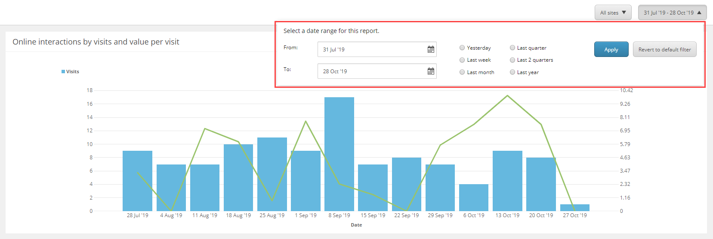
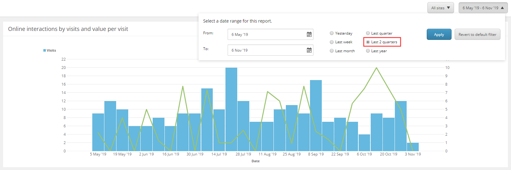
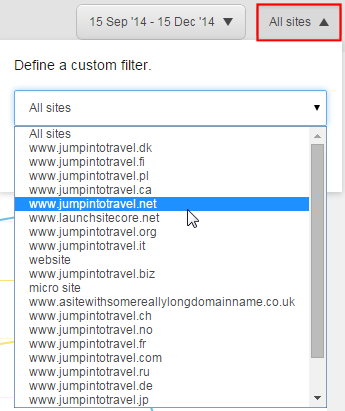
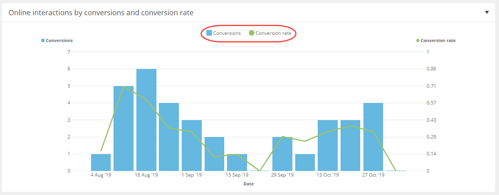

######################################################
エクスペリエンスアナリティクスレポートのフィルタリング
######################################################

エクスペリエンスアナリティクスでは、マーケッターやマーケティング最適化アナリストは、エクスペリエンスアナリティクスデータのパターンや傾向を素早く理解するために、選択したダッシュボードやレポートを表示することができます。

また、日付範囲やウェブサイト別などの基本的なフィルタを適用したり、チャートやグラフのラインやバーを表示または非表示にすることもできます。

**************************************
日付範囲によるレポートのフィルタリング
**************************************

レポートでより多くのデータを表示するには、フィルタを使用してより広い日付範囲を選択することができます。

エクスペリエンス アナリティクスレポートを日付範囲でフィルタリングするには、以下の手順に従います。

1. エクスペリエンス アナリティクスダッシュボードで、レポート（例えば、Audience Overview）を開きます。

2. 現在選択されている日付範囲をクリックして、日付範囲フィルタダイアログボックスを開きます。

3. デフォルトでは、1ヶ月分のデータが表示されます。カレンダーを使用して、開始日と終了日を選択するか、ラジオボタンを使用して事前に定義された時間範囲を選択します。たとえば、「過去2四半期」などです。

4. [適用] をクリックします。

フィルタを適用すると、レポートにはさらに多くのデータが表示されます。

5. フィルタをクリアするには、[デフォルトのフィルタに戻す] をクリックします。

*****************************************
ウェブサイトでレポートをフィルタリング
*****************************************

ウェブサイト フィルタ リストを使用して、1 つのウェブサイトまたはすべてのサイトのデータを同時に表示します。

ウェブサイトごとにレポートをフィルタリングするには

1. エクスペリエンス アナリティクスダッシュボードで、フィルタリングするレポート（例：Audience Overview）を開きます。
2. ウェブサイト フィルタ リストを開くには、［すべてのサイト］をクリックします。

すべてのウェブサイトのデータを同時に表示することも、単一のウェブサイトを選択することもできます。

3. ウェブサイトを選択して、例えば www.jumpintotravel.net を選択し、[適用] をクリックします。

4. これで、www.jumpintotravel.net ウェブサイトからの経験データを含むレポートのみが表示されるようになりました。

フィルタをクリアするには、[デフォルトのフィルタに戻す] をクリックします。

**********************************************************
折れ線グラフやグラフの線と棒を表示または非表示にする
**********************************************************

この機能を使用することで、その機能を使用していない場合でも、その機能を使用していない場合でも、その機能を使用していない場合でも、その機能を使用していない場合でも、その機能を使用していない場合でも、その機能を使用していない場合でも、その機能を使用していない場合でも、その機能を使用していない場合でも、その機能を使用していない場合でも、その機能を使用していない場合でも、その機能を使用していない場合でも、その機能を使用していない場合でも、その機能を使用していない場合でも、その機能を使用していない場合でも、その機能を使用していない場合でも、その機能を使用していない場合でも、その機能を使用していない場合でも、その機能を使用していない場合でも、その機能を使用していない場合でも、その機能を使用していない場合でも、その機能を使用しています。レポートに複数のメトリクスが表示されている場合は、特定のパターンや傾向をより明確に把握するのに役立ちます。

折れ線グラフやグラフの線を表示または非表示にするには、以下の手順に従います。

1. エクスペリエンス アナリティクスダッシュボードで、フィルタリングしたいレポートを開きます。

2. チャート内のデータを表示または非表示にするには、レポートに表示されるメトリックをクリックします。たとえば、[コンバージョンの概要]レポートでは、2つのメトリックを表示または非表示にできます。

    * コンバージョン
    * コンバージョン率

.. tip:: 英語版 https://doc.sitecore.com/users/93/sitecore-experience-platform/en/filter-an-experience-analytics-report.html
