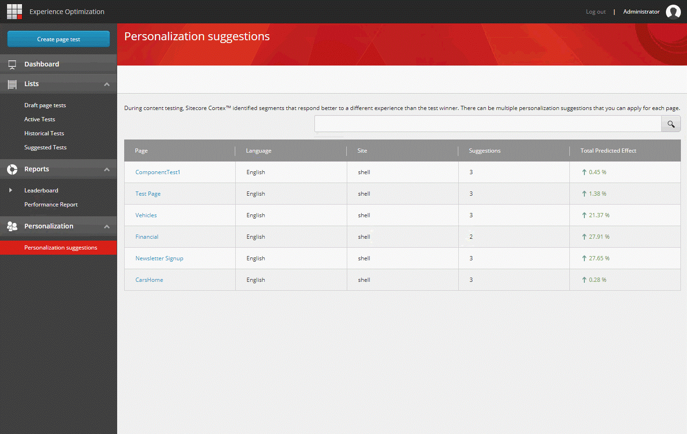

######################################################
全ページのパーソナライゼーションの提案の概要を知る
######################################################

エクスペリエンスの最適化では、Sitecore CortexTM があなたの Sitecore インスタンスに対して検出した、適用されていないすべてのパーソナライゼーション提案の概要を見ることができます。

1. パーソナライゼーション提案の包括的なリストを表示するには、[エクスペリエンスの最適化]の[パーソナライゼーション]で、[パーソナライゼーション提案]をクリックします。編集可能なインスタンス内のすべてのページに対して、Sitecore Cortex が提案する適用されていないパーソナライゼーション最適化のリストが表示されます。

各行は、未適用の提案がある 1 ページを表しています。各行には以下の情報が含まれています。

* パーソナライズの提案があるページ。
* 提案が適用される言語。
* そのページが属するサイト。
* パーソナライズ提案の数
* すべての提案が適用された場合の予測される効果の合計。

2. 行をクリックすると、パーソナライズの提案ダイアログが開き、:doc:`パーソナライズの提案を表示および適用 <view-and-apply-personalization-suggestions-for-a-page>` することができます。

.. tip:: 英語版 https://doc.sitecore.com/users/93/sitecore-experience-platform/en/get-an-overview-of-personalization-suggestions-for-all-pages.html
