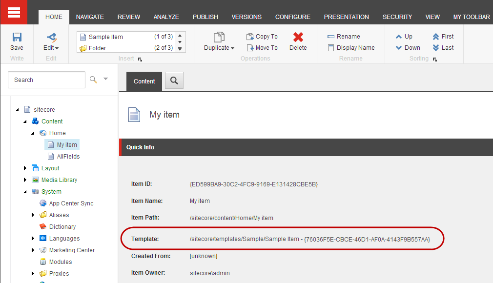
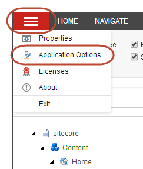
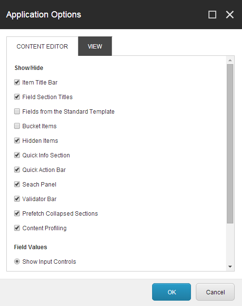

###################################################
アイテムがベースになっているテンプレートを識別する
###################################################

バケッタブルとしてテンプレートを設定したい場合や、RSSフィードを設定したい場合など、アイテムがどのテンプレートをベースにしているのかを知る必要があります。

*******************************************************
アイテムがベースになっているテンプレートを識別する
*******************************************************

コンテンツ エディタの クイック情報 セクションでは、アイテムのベースとなっているテンプレートをすばやく特定できます。

アイテムがベースになっているテンプレートを特定するには、以下の手順に従います。

1. コンテンツ ツリーで、関連する項目をクリックします。

2. コンテンツ領域のコンテンツタブで、上部のクイック情報セクションを展開します。テンプレート フィールドには、アイテムがどのテンプレートに基づいているかが表示されます。

3. テンプレート項目を開くには、テンプレートリンクをクリックします。

******************************************
クイック情報セクションを有効にする
******************************************

[クイック情報] セクションが表示されていない場合は、[アプリケーション オプション] から有効にすることができます。

1. コンテンツ エディタで［システム］メニューの |icon1| をクリックし、［アプリケーション オプション］をクリックします。

2. アプリケーション オプション] ダイアログ ボックスの [表示/非表示] セクションで、[クイック情報セクション] チェックボックスを選択し、[OK] をクリックします。

.. tip:: 英語版 https://doc.sitecore.com/users/93/sitecore-experience-platform/en/identify-the-template-that-an-item-is-based-on.html
