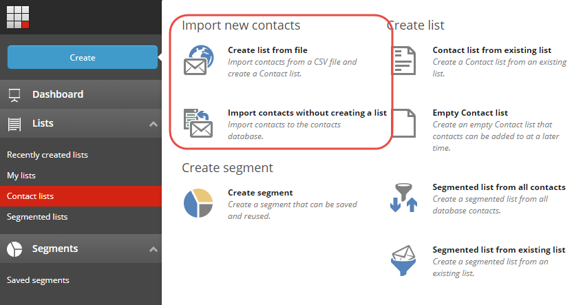
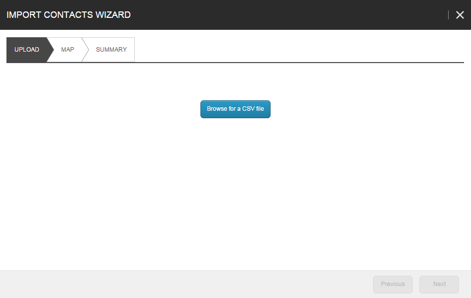
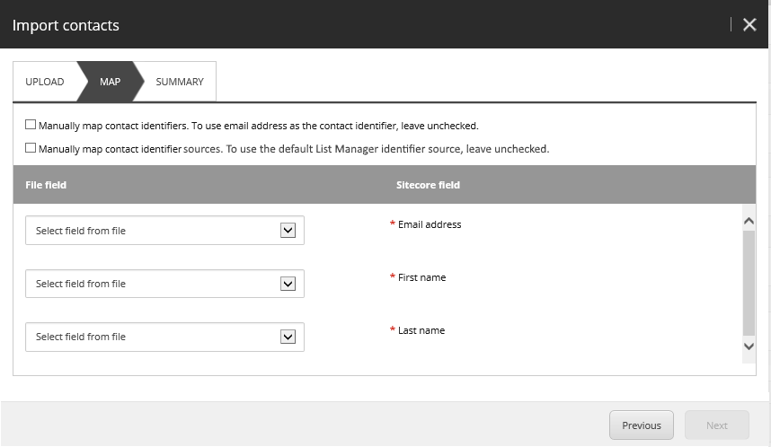
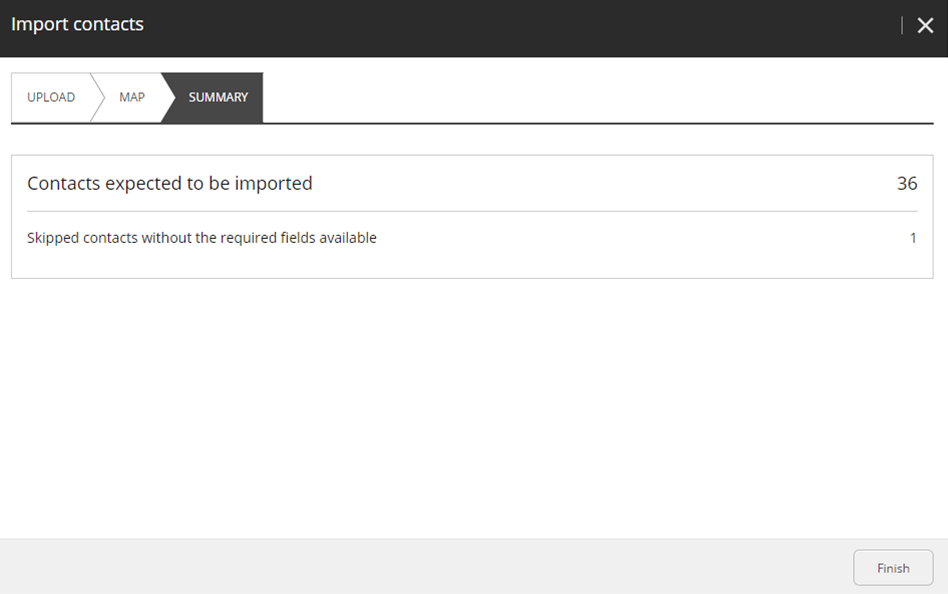
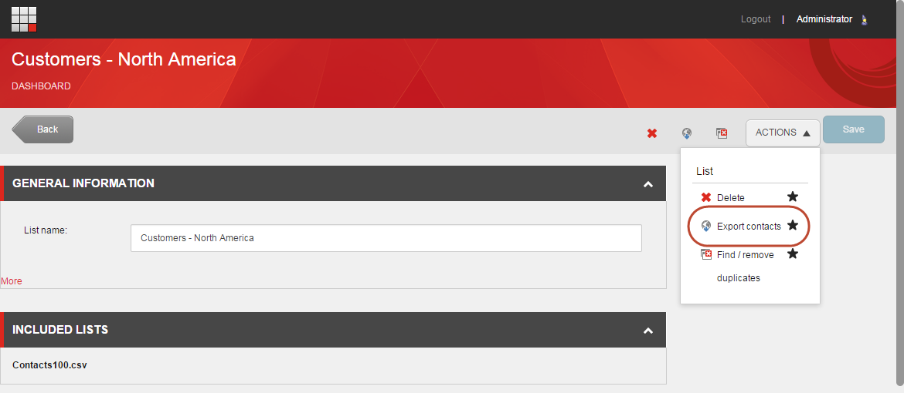

###################################################################
リストからの連絡先のインポートとエクスポート
###################################################################

サードパーティのシステム（CRMシステムなど）から連絡先をSitecoreに転送したい場合や、マーケティング会社から新しいリードのリストを購入した場合、これらの連絡先をCSVファイルから直接リストマネージャーのリストにインポートすることができます。

同様に、連絡先をSitecoreからサードパーティのシステムに転送したり、連絡先のバックアップを作成したい場合は、リストに含まれる連絡先をエクスポートすることができます。

***********************
識別子を使った作業
***********************

Sitecoreは、コンタクトの識別子とソースの組み合わせを使用して、コンタクトをユニークなものとして識別します。この識別子の組み合わせにより、システムはコンタクトを複数のシステム間で同じものとして識別したり、例えばTwitterやLinkedInなどでコンタクトを識別したり、同じユーザー名を使用している2つのコンタクトを区別したりすることができます。

連絡先のリストをインポートする前に、連絡先識別子の戦略を作成することが重要です。例えば、連絡先の生年月日や郵便番号をファーストネームと組み合わせて使用すると、メールアドレスだけよりも適切な連絡先識別子になります。連絡先の識別子として電子メール アドレスを使用すると、連絡先が複数の電子メール アドレスを使用している場合、データベースに複数回表示される可能性があります。

.. note:: 連絡先の識別子と識別子のソースは、大文字と小文字を区別する。また、識別子のソースには特殊文字を含めることはできません。

**********************
連絡先のインポート
**********************

リスト マネージャでは、連絡先をインポートする方法がいくつかあります。

* 連絡先を連絡先データベースにインポートします。
* 連絡先をインポートして、新しい連絡先リストに追加します。
* 連絡先をインポートして、既存の連絡先リストに追加する。

.. note:: SitecoreがCSVファイル内の特殊文字を認識するためには、ファイルをUTF-8でエンコードする必要があります。さらに、Sitecoreは区切り文字としてカンマのみをサポートしています。

新しい連絡先をインポートするには

1. リストマネージャーで、[作成]をクリックし、表示されるメニューの[新しい連絡先のインポート]セクションで、[インポート]をクリックします。

    * リストを作成せずに連絡先をインポートして、CSVファイルからAnalyticsデータベースに連絡先をインポートします。
    * ファイルからリストを作成すると、CSVファイルから連絡先をインポートし、新しい連絡先リストに連絡先を含めることができます。

.. note:: CSVファイルの1行目がヘッダーになっていて、インポートされていません。

2. 連絡先のインポート ウィザードで、[アップロード] タブの [CSV ファイルを参照] をクリックします。

3. 「開く」ダイアログボックスで、新しい連絡先のCVSファイルをクリックし、「開く」をクリックします。

.. note:: 一度に1つのファイルしかインポートできません。別のファイルをアップロードする場合は、削除をクリックしてアップロード可能なファイルを削除する必要があります。

4. ファイルのアップロードをクリックし、ファイルがアップロードされたら、次へをクリックします。

5. Mapタブで、ファイル内のフィールドをSitecoreで利用可能なフィールドにマッピングします。

    * 必要なSitecoreの各フィールドについて、[File field]ドロップダウンメニューで、CSVファイル内の同等のフィールドを選択します。

* 連絡先の識別子として電子メール アドレスを使用したくない場合は、[手動で連絡先の識別子をマップする] チェックボックスを選択し、表示される識別子で、連絡先の一意の識別子として使用するインポート ファイルのフィールドを選択します。

* 連絡先の識別子ソースとしてリストマネージャーを使用しない場合は、[手動で連絡先の識別子ソースをマップする] チェックボックスを選択し、表示される識別子ソースで、連絡先の識別子ソースとして使用するインポートファイル内のフィールドを選択します。

6. フィールドのマッピングが完了したら、[次へ] をクリックします。

7. [サマリー] タブで、インポート設定が正しいことを確認し、[完了] をクリックします。

.. note:: [更新された連絡先] には、インポートファイル内の連絡先の数が表示されますが、すでにデータベースにあるため、欠落している情報のみが更新されます。

リストを作成せずに連絡先をインポートをクリックすると、連絡先がデータベースに追加されます。

8. [ファイルからリストを作成] をクリックすると、インポートした連絡先が含まれた新しい連絡先リストが開きます。新しいリストの名前を変更して、[保存] をクリックします。

.. note:: インポートする連絡先の数によっては、すべての連絡先をインポートしてインデックスを作成するのに時間がかかる場合があります。すべての連絡先が含まれている場合は、システム通知が表示されます。

**************************
連絡先のエクスポート
**************************

連絡先は、セグメント化されたリストまたは連絡先リストのいずれかからCSVファイルにエクスポートできます。

.. note:: 連絡先のリストをエクスポートすると、エクスポートされたファイルには識別子と識別子のソースが含まれます。そのため、リストを再度リストマネージャーにインポートする際には、識別子のソースをマッピングすることを忘れないようにしなければなりません。このようにして、既存の連絡先が適切に更新され、Sitecore が新しい連絡先を作成しないようにすることができます。

リストから連絡先をエクスポートするには

1. リストマネージャーで、エクスポートしたい連絡先を含むリストを探して開きます。

2. リストページで、「アクション」をクリックし、「連絡先のエクスポート」をクリックします。

3. ダウンロードしたCSVファイルをローカルコンピュータのデフォルトのダウンロードフォルダから探します。

.. tip:: 英語版 https://doc.sitecore.com/users/93/sitecore-experience-platform/en/import-and-export-contacts-from-a-list.html