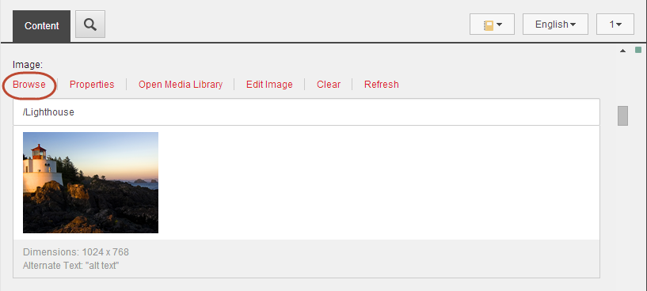
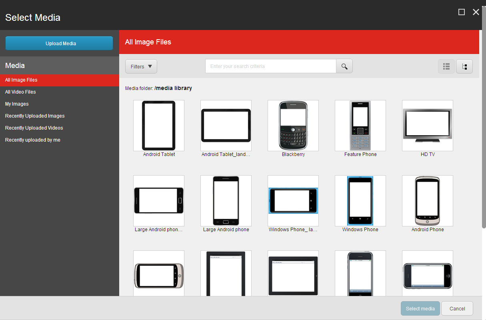
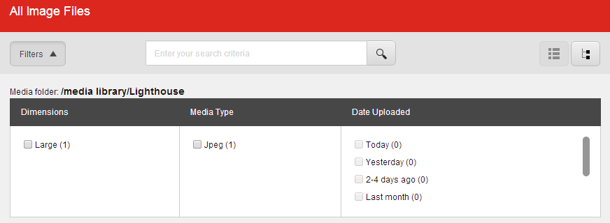
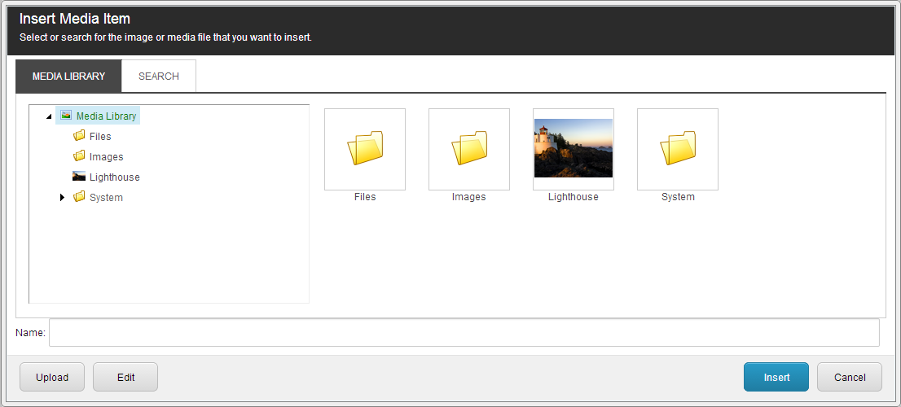
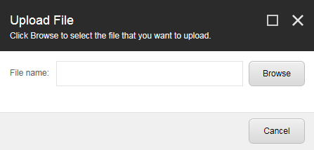

###########################################
画像の挿入
###########################################

コンテンツエディタやエクスペリエンスエディタでは、画像フィールドやリッチテキストフィールドに、さまざまなタイプのメディア（一般的には画像）を挿入することができます。これらのメディアアイテムには、画像、アニメーション、フィルムクリップ、サウンドファイルなどがあります。

*******************************
画像フィールドに画像を挿入する
*******************************

画像フィールドに画像を挿入または変更するには

1. コンテンツ エディタまたはエクスペリエンス エディタで、編集する項目またはページに移動します。

  * [コンテンツ エディタ] で [コンテンツ] タブをクリックして、画像を挿入する画像フィールドを探し、[参照] をクリックします。

* エクスペリエンス エディタで、画像を挿入する画像フィールドをクリックし、表示されるフローティング ツールバーで [画像の選択] をクリックします。 [画像の選択] |icon1| アイコンが表示されます。

2. [メディアの選択］ダイアログボックスには、選択したフィールドで利用可能なメディア ライブラリのすべてのアイテムが表示されます。

メディアの選択ダイアログボックスの項目は、特定の順序でリストアップされていないので、検索機能やメニューの定義済みリストを使用して画像を探します。

* 「メディア」メニューでは、リンクを使用して、「すべての画像ファイル」、「すべての動画ファイル」、「私の画像」、「最近アップロードされた画像」、「最近アップロードされた動画」の完全なリストをすばやく表示できます。
* 画像の特定のメタデータに従って表示されるメディア項目をフィルタするには、[フィルタ] ドロップダウン矢印をクリックして、必要なフィルタを選択します。括弧内の数字は、フィルタで使用できるアイテムの数を示します。

* 特定のアイテムを検索するには、検索フィールドに検索語を入力します。
* コンテンツツリーをナビゲートして使用する画像を見つけるには、右上隅のツリービューアイコン |icon2| をクリックします。リストビューに戻るには、リストビュー |icon3| をクリックします。

3. 使用する画像を選択し、「メディアの選択」をクリックすると、新しい画像が画像フィールドに挿入されます。

.. note:: 使用する画像がない場合は、[メディアをアップロード] をクリックして、 `新しい画像をメディアライブラリにアップロード <upload-a-file-to-the-media-library>`_ します。

**************************************************************
エクスペリエンスエディタのテキストフィールドに画像を挿入する
**************************************************************

エクスペリエンス エディタでページ上のテキスト フィールドに直接画像を挿入するには

1. エクスペリエンス エディタで、メディア アイテムを挿入するリッチ テキスト フィールドに移動します。
2. フィールドをクリックし、表示されるフローティング ツールバーで [画像の挿入] をクリックします。

.. note:: フローティング ツールバーに [画像の挿入] ボタンが表示されない場合は、[その他] ドロップダウン矢印をクリックします。

3. [メディアの選択］ダイアログボックスには、選択したフィールドで利用可能なメディア ライブラリのすべてのアイテムが表示されます。

メディアの選択ダイアログボックスの項目は、特定の順序でリストアップされていないので、検索機能やメニューの定義済みリストを使用して画像を探します。

* [メディア]メニューでは、リンクを使用して、「すべての画像ファイル」、「すべての動画ファイル」、「私の画像」、「最近アップロードされた画像」、「最近アップロードされた動画」の完全なリストをすばやく表示できます。
* 画像の特定のメタデータに従って表示されるメディア項目をフィルタするには、[フィルタ] ドロップダウン矢印をクリックして、必要なフィルタを選択します。括弧内の数字は、フィルタで使用できるアイテムの数を示します。

* 特定のアイテムを検索するには、検索フィールドに検索語を入力します。
* コンテンツツリーをナビゲートして使用する画像を見つけるには、右上隅のツリービューアイコン |icon2| をクリックします。リストビューに戻るには、リストビュー |icon3| をクリックします。

4. 使用する画像を選択し、「メディアの選択」をクリックすると、新しい画像が画像フィールドに挿入されます。

使用する画像がない場合は、[メディアをアップロード] をクリックして、`新しい画像をメディアライブラリにアップロード <upload-a-file-to-the-media-library>`_ します。

**********************************************
リッチテキストエディタに画像を挿入する
**********************************************

リッチ テキスト エディタで画像やその他のタイプのメディア アイテムを挿入するには、次の手順に従います。

1. コンテンツエディタまたはエクスペリエンスエディタで、メディアアイテムを挿入するテキストフィールドに移動します。
2. リッチテキストエディタを開き、[Insert Sitecore Media]をクリック |icon4| します。
3. [メディアアイテムの挿入］ダイアログボックスが開きます。

イメージがすでにメディアライブラリにある場合は、挿入するイメージを探して選択し、[挿入]をクリックします。イメージを見つけるには、［メディア ライブラリ］タブのコンテンツ ツリーをナビゲートするか、［検索］タブでアイテムを検索します。

4. 画像がメディア ライブラリにない場合は、[アップロード] をクリックします。
5. [ファイルのアップロード］ダイアログボックスで［参照］をクリックし、使用する画像ファイルを選択します。

6. [開く］ダイアログで［開く］をクリックして、イメージファイルをメディアライブラリにアップロードします。
7. 画像ファイルがコンテンツ エディタで開きます。新しい画像を保存して［メディア項目の挿入］ダイアログボックスに戻るには、［保存/閉じる］をクリックします。
8. テキスト フィールドに画像を挿入するには、[挿入] をクリックします。

.. note:: [キャンセル］をクリックすると、［メディア アイテムの挿入］ダイアログ ボックスは閉じられますが、 新しいアイテムはメディア ライブラリに残ります。

.. tip:: 英語版 https://doc.sitecore.com/users/93/sitecore-experience-platform/en/insert-an-image.html

