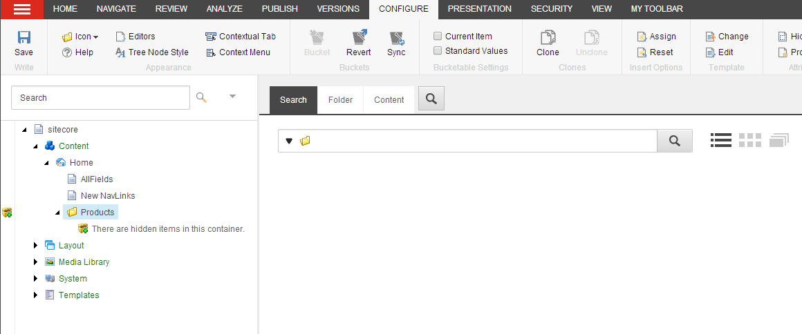

####################################
アイテム バケット
####################################

アイテムバケットを使用すると、コンテンツツリー内の大量のアイテムを管理することができます。アイテムバケットとは、無数のアイテムを隠しておいても、それらのアイテムを簡単に取得して作業することができるコンテナのことです。バケットアイテムを見つける唯一の方法は、Sitecoreの検索エンジンを使用することです。

コンテンツツリーが大きくなると、アイテムを見つけるのが難しくなり、パフォーマンスが低下することがあります。例えば、無数の製品を販売しているウェブサイトや、メディアファイルを使用しているウェブサイトの場合、アイテムを作成し続けると、コンテンツツリーは管理しきれなくなります。代わりにアイテムバケットを使ってアイテムを保存すれば、コンテンツツリーにアイテムを表示することなく、1つのコンテナに無制限にアイテムを保存することができます。

アイテムバケットを使用すると、以下のような多くの利点があります。

* アイテムバケット内のすべてのコンテンツアイテムは自動的に論理的な形式で整理され、検索エンジンのパフォーマンスを向上させます。
* 1つのアイテムバケットに何百万ものコンテンツアイテムを入れても、UIの速度を落としたり、コンテンツツリーを混雑させたりすることはありません。
* アイテムバケットは必要な数だけ持つことができます。これにより、アイテムバケットを論理的なコンテナに分割することができます。

********************************
アイテムバケツにアイテムを貯める
********************************

アイテムバケットには、通常のアイテムとバケット可能なアイテムの両方を格納することができます。

* 通常のアイテム（構造化されたアイテム）はアイテムバケットに格納され、コンテンツツリーに表示され、先祖や子孫との親子関係を維持します。これらのアイテムは、アイテム・バケットをサポートしないテンプレートに基づいています。
* バケット可能なアイテム（構造化されていないアイテム）は、コンテンツ・ツリーに隠されており、親子関係は維持されません。これらのアイテムは、アイテム・バケットをサポートするテンプレートに基づいています。

.. important:: 通常のアイテムとバケツ可能なアイテムの両方をアイテムバケツに格納してはいけません。これは不必要な複雑さをもたらす可能性があります。

アイテムバケットにアイテムを格納すると、アイテム間の親子関係がなくなり、代わりにアイテムが作成された日時に応じてフォルダ構造で整理されます。したがって、アイテムバケット機能は、主に階層的に保存する必要のないコンテンツアイテムを保存するために設計されています。

.. note:: Sitecore開発者は、Sitecoreソリューションを設定して、アイテムバケット内のアイテムを、例えばグローバルに一意な識別子(GUID)によって、異なる方法で整理することができます。

アイテムをアイテムバケットにするかどうかを決めるには、アイテムの階層をコンテンツツリーに残す必要があるかどうかを決める必要があります。アイテムのサブアイテムを特定の方法で保存する必要がない場合や、アイテム数が多い場合は、アイテムバケットにすると良いでしょう。

*******************************
アイテムバケットを同期させる
*******************************

アイテムバケット内のアイテムのバケット可能設定を変更するたびに、アイテムバケットを同期させて、すべてのアイテムがバケット可能かどうかに応じて非表示または表示されるようにする必要があります。

アイテムバケットを同期する必要があるのは、以下の場合です。

* アイテムバケツに保存されている通常のアイテムを、バケツ可能なアイテムにする。
* バケツ可能なアイテムを通常のアイテムにする。
* テンプレートをバケツ可能なアイテムにする。
* バケツ可能なテンプレートを通常のテンプレートに変更する。
* アイテムバケツからアイテムを削除する。

*******************************
隠しアイテムを探す
*******************************

バケット可能なアイテムがアイテムバケットに格納されている場合、デフォルトではコンテンツツリーに非表示になっています。つまり、アイテムバケットに格納されているバケット可能なアイテムを操作したい場合は、Sitecoreの検索機能を使って検索結果のリストから検索して開く必要があります。

アイテムをアイテムバケットに変換すると、編集ペインに「検索」タブが表示され、ここでアイテムバケット内のすべてのアイテムを検索することができます。"隠れたバケット可能なアイテム "なのか "通常のアイテム "なのかを問わず、アイテムバケット内のすべてのアイテムを検索することができます。Sitecoreには、検索フィルターや検索操作、ファセットなどが用意されており、探しているコンテンツアイテムを見つけやすくなっています。

*******************************
隠しアイテムを見る
*******************************

アイテムバケットに隠されているバケット可能なアイテムを表示する必要がある場合は、コンテンツエディタで「表示」タブをクリックし、「表示」グループで「バケット」チェックボックスを選択します。

ただし、アイテムバケットを扱う場合は、バケットのチェックボックスをクリアする必要があります。これにより、システムがコンテンツ ツリー内のすべてのアイテムを不必要にロードしてパフォーマンスが低下するのを防ぐことができます。隠されたコンテンツ項目は、アイテムバケットごとに利用できる検索タブで検索することで、まだ作業することができます。

.. tip:: 英語版 https://doc.sitecore.com/users/93/sitecore-experience-platform/en/item-buckets.html

.. toctree::
    :hidden:
    :maxdepth: 1
    
    convert-an-item-into-an-item-bucket
    make-an-item-a-bucketable-item
    save-a-search-query-for-an-item-bucket
    