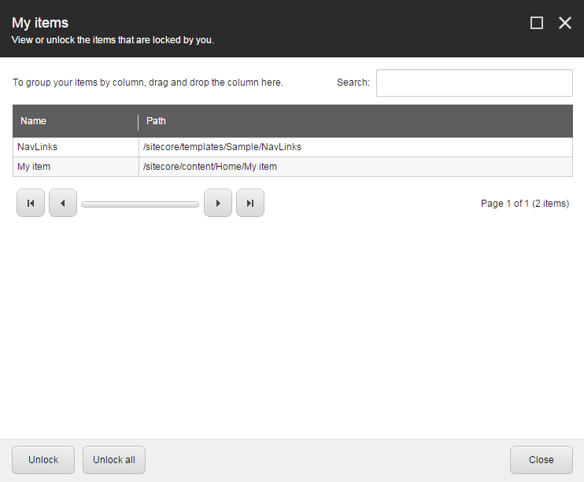

###################################################
アイテムのロックとロック解除
###################################################

Sitecoreでは、他のユーザーが同じアイテムを同時に編集できないように、現在編集中のアイテムのバージョンをロックすることができます。編集したいアイテムが既にロックされている場合、編集することはできず、閲覧のみが可能です。アイテムの編集が完了したら、他のユーザーが再びアイテムを利用できるようにするには、アイテムのロックを解除する必要があります。

Sitecoreのインストールの設定によっては、編集する前にアイテムをロックするように促されることがあります。(管理者または開発者は、アイテムのロックを設定することができます。)

Sitecoreの管理者は、他のユーザーのロックされたアイテムを編集する権限を持つことができます。そのため、管理者と別のユーザーが同時にアイテムを編集することができます。あるユーザーがアイテムに変更を保存した後、別のユーザーが同じアイテムに変更を保存した場合、以前に保存した変更を上書きするかどうかを尋ねる通知が表示されます。

.. important:: アイテムをロックしても公開されないようにすることはできません。あるアイテムで作業をしていて、それを公開しないようにしたい場合は、そのアイテムの公開制限を設定する必要があります。

******************************
ロックをかける
******************************

アイテムを手動でロックするには

1. コンテンツ エディタまたはエクスペリエンス エディタで、編集する項目またはページに移動します。

  * コンテンツ エディタで、[ホーム] タブの [編集] をクリックしてアイテムをロックします。

.. image:: images/15eafd353df40f.png
   :align: center
   :width: 400px
   :alt: ロックをかける

.. note:: コンテンツ ツリーでは、クイック アクションを使用して、ロックしたアイテムの概要を簡単に確認することができます。コンテンツ ツリーの左を右クリックして、[マイ ロックされたアイテム] を選択します。

  * エクスペリエンス エディタの [ホーム] タブの [編集] グループで [ロック] をクリックします。

2. アイテムの編集が終わったら、再度アイテムのロックを解除するようにしてください。

******************************
アイテムのロックを解除する
******************************

多数のアイテムをロックして編集していると、そのアイテムを見失ってしまうことがあります。Sitecoreは、誰がロックしたか、誰がロックしたか、すべてのアイテムを記録しています。このようにして、1つ以上のアイテムを同時に簡単にロック解除することができます。

.. note:: アイテムをアンロックすると、関連するコンテンツもアンロックされます。

アイテムのロックを解除するには

1. 自分でロックされているアイテムのリストを表示したり、1つまたは複数のアイテムのロックを解除したりするには、次の手順に従います。

  * コンテンツ エディタの [レビュー] タブの [ロック] グループで [マイ アイテム] をクリックします。

* エクスペリエンス エディターで、[ホーム]タブの[編集]グループで[マイアイテム]をクリックします。

.. note:: リボンのマイアイテムボタンの横にある数字は、ロックしたアイテムの数を示しています。

2. [マイアイテム] ダイアログ ボックスで、ロックを解除するアイテムを選択し、[ロックの解除] をクリックします。すべてのアイテムを同時にロック解除するには、[すべてのロックを解除] をクリックします。

.. tip:: 英語版 https://doc.sitecore.com/users/93/sitecore-experience-platform/en/lock-and-unlock-an-item.html
