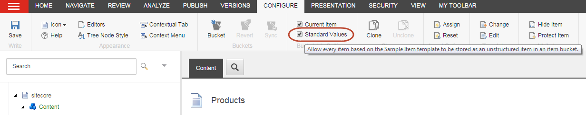

###################################################
アイテムをバケツ可能なアイテムにする
###################################################

アイテムをバケット可能なアイテムにして、アイテムバケットに入れた場合にアイテムを非表示にする方法があります。以下の方法があります。

* 個々のアイテムをバケットに入れられるようにする。
  一度に1つのアイテムだけをバケットに入れることができます。この方法では、他のアイテムに影響を与えるようなテンプレートの変更は行いません。
* アイテムがベースになっているテンプレートをバケット可能にする。
  テンプレートをバケット可能にすると、このテンプレートをベースにしたアイテムがアイテムバケットに配置された場合、すべてのアイテムが非表示アイテムとして保存されます。これを有効にするには、各アイテムバケットを同期させる必要があります。

***********************************************************
個々のアイテムをバケットに入れることができるようにする
***********************************************************

個々のアイテムをバケット可能なアイテムにするには

1. コンテンツ エディタで、アイテム バケットに隠したいアイテムを選択します。
2. [構成] タブの [バケット可能な設定] グループで、[現在のアイテム] チェックボックスを選択します。

.. image:: images/15eafd35700cdb.png
   :align: center
   :width: 400px
   :alt: 個々のアイテムをバケットに入れることができるようにする

3. バケット可能な設定をアイテム バケットで有効にするには、アイテム バケットを同期させる必要があります。コンテンツ ツリーで、アイテムが保存されているアイテム バケットを選択し、バケット グループで [同期] をクリックします。
   これで処理が完了し、アイテムがアイテム バケットにある場合は非表示になります。

.. note:: アイテムバケットに配置されているバケット可能なアイテムを開きたい場合は、アイテムバケットをクリックし、Sitecoreの :doc:`検索機能<searching>` を使用してアイテムを探して開く必要があります。

*********************************
バケット型テンプレートを作る
*********************************

似たようなアイテムが大量にあって、それがアイテムバケットに入っていると非表示になってしまう場合は、それらのアイテムをベースにしたテンプレートをバケット可能にすることができます。

コンテンツエディタでテンプレートをバケット可能にするには、以下の手順に従います。

1. コンテンツ エディタで、バケット可能なテンプレートにしたいテンプレートをベースにしたアイテムの1つに移動します。
2. [設定] タブの [バケット可能な設定] グループで [標準値] チェックボックスを選択し、選択したアイテムのテンプレートをベースにしたすべてのアイテムをバケット可能なテンプレートにします。

.. note:: バケット可能にしたいテンプレートの名前を確認するには、「標準値」のチェックボックスにカーソルを合わせると、表示されるツールチップにテンプレートの名前が表示されます。

3. コンテンツ ツリーで、このテンプレートに基づいたアイテムを含むアイテム バケットを選択し、バケット グループで [同期] をクリックします。
4. これで、このテンプレートに基づいているアイテムがアイテム バケットにある場合、すべてのアイテムが非表示になります。
5. このテンプレートに基づいたアイテムを含むすべてのアイテム バケットを同期します。これにより、それらの構造が更新され、コンテンツ ツリーでバケット可能なアイテムが非表示になります。

.. note:: このテンプレートに基づいてアイテムバケットではないフォルダにアイテムを作成した場合、これらのアイテムは通常のアイテムと同じように扱われ、コンテンツ ツリーに表示されます。

**************************************************************************
テンプレートマネージャを使用してバケット可能なテンプレートを作成する
**************************************************************************

あるいは、バケット可能にしたいテンプレートの名前がわかっている場合は、テンプレートマネージャを開いて、そこからバケット可能なテンプレートを作成することができます。

Template Managerでテンプレートをバケット可能にするには

1. Template Managerを開くには、Sitecore Desktopで、Sitecoreのスタートボタンをクリックしてから、Template Managerをクリックします。
2. コンテンツツリーで、バケット可能にしたいテンプレートに移動します。テンプレートを展開し、_Standard Values アイテムを選択します。
3. [構成] タブの [バケット可能な設定] グループで、[現在のアイテム] チェックボックスを選択します。
   コンテンツ ツリーで、このテンプレートに基づいたアイテムを含むアイテム バケットを選択し、バケット グループで、同期をクリックします。
4. これで、このテンプレートに基づいているすべてのアイテムがアイテム バケット内にある場合は非表示になります。
5. このテンプレートに基づいたアイテムを含むアイテムバケットをすべて同期します。これにより、コンテンツ ツリー内のバケット可能なアイテムが非表示になります。

.. note:: このテンプレートに基づいてアイテムバケットではないフォルダにアイテムを作成した場合、これらのアイテムは通常のアイテムと同じように扱われ、コンテンツ ツリーに表示されます。

*********************************************************************
アイテムやアイテムのテンプレートをバケットに入れられないようにする
*********************************************************************

バケットに入れられるアイテムや、そのアイテムの元になっているテンプレートをバケットに入れられないようにしたい場合は、まず検索機能を使ってアイテムのバケットの中からアイテムを探す必要があります。

バケット可能なアイテムまたはアイテムのテンプレートをバケット不可にするには、検索機能を使用してアイテムを検索します。

1. アイテムを検索するには、アイテムが保存されているアイテム バケットを選択し、[検索] タブの検索フィールドに、アイテムを識別する単語を入力します。
2. 検索結果で、そのアイテムをクリックして開きます。
3. リボンの [構成] タブの [BucketableSettings] グループで、[現在のアイテム] のチェックボックスをオフにします。

  * [現在のアイテム] のチェックボックスをオフにして、アイテムをバケット可能な状態にします。
  * [標準値] のチェックボックスをオフにして、テンプレートをバケット可能なものにします。

4. バケット可能な設定をアイテムのバケットで有効にするには、アイテムが保存されているアイテムのバケットを選択し、[構成] タブの [バケット] グループで [同期] をクリックします。

同期が完了すると、同期したアイテムまたはテンプレートに基づいたすべてのアイテムが、同期したアイテム バケットに通常のアイテムとして表示されます。

.. note:: テンプレートをバケット不可にした場合は、変更したテンプレートを元にアイテムを含む各アイテムバケットを同期させる必要があります。

バケット可能なテンプレートを通常のテンプレートに戻すには、テンプレートマネージャで変更することもできます。

*********************************************************************************
テンプレートマネージャを使用して、テンプレートをバケット化できないようにする
*********************************************************************************

バケット可能なテンプレートをバケット不可にするには

1. テンプレートマネージャを開くには、Sitecore Desktopで、Sitecore Start |icon1| ボタンをクリックし、Template Managerをクリックします。

2. コンテンツツリーで、変更するテンプレートに移動します。

3. テンプレートを展開し、_標準値アイテムを選択します。

4. [構成] タブの [バケット可能な設定] グループで、[現在のアイテム] のチェックボックスをオフにして、バケット可能なテンプレートを通常のテンプレートに変更します。

5. コンテンツ エディタで、このテンプレートに基づいたアイテムを含むアイテム バケットを選択し、[構成] タブの [バケット] グループで [同期] をクリックしてアイテム バケットを同期させます。

同期が完了すると、このテンプレートに基づいているすべてのアイテムが、同期したアイテム バケットに通常のアイテムとして表示されます。

変更したテンプレートに基づいたアイテムを含むアイテム バケットごとに同期する必要があります。

.. tip:: 英語版 https://doc.sitecore.com/users/93/sitecore-experience-platform/en/make-an-item-a-bucketable-item.html
