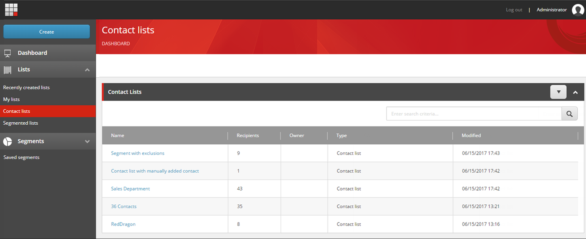
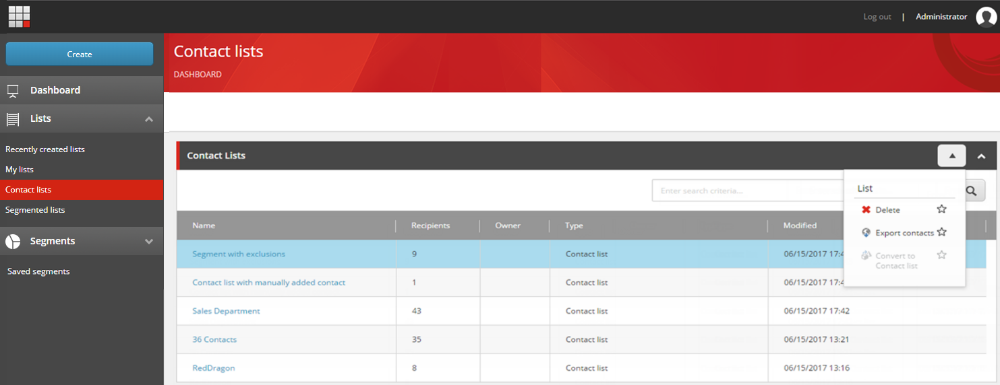

####################################
リストの管理
####################################

リストマネージャー を開くと、ダッシュボードに Sitecore で利用可能なリストの概要が表示されます。

リストマネージャー メニューの Lists セクションで、メニューアイテムをクリックすると、すべてのリストが表示されます。

* 最近作成したリスト - 最近作成したリストを上から順に表示します。

* 自分のリスト - ログインしているユーザーが作成したリスト、またはログインしているユーザーが所有者として指定されているリストを表示します。

* 連絡先リスト - すべての連絡先リストを表示します。

* セグメント化されたリスト - セグメント化されたリストをすべて表示します。

* 保存されたセグメント - 保存されたセグメントをすべて表示します。

これらのリストのそれぞれから、リストの名前をクリックして開くことができます。さらに、たとえば、リストを削除したりエクスポートしたりする場合は、リストの行をクリックしてからドロップダウン矢印をクリックすることができます。クリックしたリストの種類に応じて、ドロップダウン メニューでさまざまなオプションが有効になります。オプションは次のとおりです。

* リスト

    * 削除 - リストを削除します。
    * 連絡先をエクスポート - リストに含まれる連絡先をCSVファイルにエクスポートします。
    * 連絡先リストに変換 - セグメント化されたリストを連絡先リストに変換します。

.. tip:: 英語版 https://doc.sitecore.com/users/93/sitecore-experience-platform/en/manage-lists.html