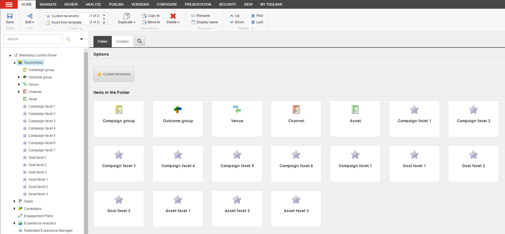

####################################
マーケティング タクソノミー
####################################

タクソノミーとは、情報を識別して整理するために使用できる階層構造のことです。Sitecore Experience Platformでは、キャンペーン、ゴール、イベントなどのマーケティング活動を分類するためにタクソノミーを使用することができます。マーケティングコントロールパネルで、これらのアイテムにタクソノミータグを適用することができます。

マーケティングタクソノミーの基本的なタイプは以下の4つです。

* チャネル
* キャンペーングループ
* アセット
* ベニュー

マーケティングタクソノミーによって、ウェブサイトの活動をより詳細に追跡することができ、コンタクトがコンテンツとどのように相互作用しているかについてより深い洞察を得ることができます。この情報は、マーケティング戦略の最適化と改善に役立ちます。

*************************************
マーケティングタクソノミーの利用
*************************************

タクソノミータグは、あなたのマーケティング活動を整理するための明確で一貫性のある方法を提供します。タクソノミータグでコンテンツをタグ付けすることで、コンタクトがコンテンツとどのように相互作用したかを追跡することができます。コンテンツにタグを付けたら、 :doc:`エクスペリエンスアナリティクス <experience-analytics>` を使用して、キャンペーングループや個々のキャンペーン活動のトラフィック、エンゲージメントの価値、訪問1回あたりの価値を測定することができます。また、トラフィックとエンゲージメントのレベルがマーケティングチャネル全体でどのように変化しているかについてのレポートを表示することもできます。

また、マーケティングタクソノミーを使用して、キャンペーングループ、インタラクション会場、またはコンタクトがウェブサイトを訪問するために使用するチャネルに基づいて、コンポーネントの条件付きレンダリングを実装するパーソナライゼーションルールを作成することもできます。これにより、コンタクトのウェブサイトへの訪問を取り巻く詳細に基づいた、ターゲットを絞った関連性の高いコンテンツをコンタクトに提供することができます。

*************************************
カスタムタクソノミーの作成
*************************************

Sitecore XPにはチャネル、キャンペーン、アセットのタクソノミーが含まれていますが、ビジネスニーズに応じてカスタムマーケティングタクソノミーを定義することもできます。これらのカスタムタクソノミーを使用することで、ロケーション、チャネル、および異なるタイプのキャンペーンを整理することができ、キャンペーン活動を追跡して整理する方法をよりコントロールできるようになります。

:doc:`カスタムマーケティングタクソノミー <create-and-implement-a-custom-marketing-taxonomy>` は、マーケティングコントロールパネルとキャンペーンクリエーターで作成することができます。

マーケティングタクソノミーを使用して、キャンペーン、目標、アセットの側面を記述するカスタムファセットを作成することもできます。これらのファセットを使用してマーケティング活動を特定し、xAnalyticsでコンタクトがこれらの活動とどのように相互作用しているかを追跡することができます。

.. tip:: 英語版 https://doc.sitecore.com/users/93/sitecore-experience-platform/en/marketing-taxonomies.html

.. toctree::
    :hidden:
    :maxdepth: 1

    create-and-implement-a-custom-marketing-taxonomy
    deploy-marketing-definitions-and-taxonomies
    classify-a-media-item-as-a-digital-marketing-asset
    channels
    venues